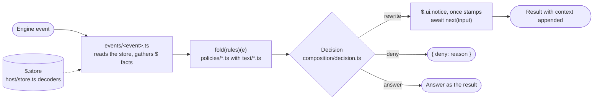

# [FUNCTION_HOOKS]

`function-hooks@rasm` is a plugin of the `rasm` marketplace at `.claude/plugins/`, one hooks module (`hooks/register.ts`) loaded under `CLAUDE_CODE_ENABLE_FUNCTION_HOOKS=1` in the `env` block of `.claude/settings.json`. Hooks `($, e, next)` run inside the Claude Code process on a typed event and answer a typed result, with no shell spawned and no stdin JSON or exit code. `claude --plugin-dir .claude/plugins/function-hooks` loads the directory in place of the installed copy under `~/.claude/plugins/cache/`.

## [01]-[LAYOUT]

```text
function-hooks/
├── .claude-plugin/
│   └── plugin.json           # Manifest with name, description, and userConfig rows with type and default
├── hooks/
│   ├── hooks.json            # Names register.ts as the one module the loader reads
│   ├── register.ts           # Reads options once and registers every event file in engine lifecycle order
│   ├── composition/          # Carriers as case records, the dispatch every file uses in place of a branch
│   │   ├── option.ts         # Option with its constructors and data-last operations, the one if
│   │   └── decision.ts       # Decision with rewrite, deny, and answer, when over a refinement, fold over rules
│   ├── text/                 # Operations from text to data or text, no engine type and no policy row
│   │   ├── argv.ts           # Argv leaves of a shell command with source spans
│   │   ├── lines.ts          # Non-empty lines of a child's output or a reply, and the first of them
│   │   └── path.ts           # Reads of a file path or a command word
│   ├── host/                 # Boundary to the engine
│   │   ├── store.ts          # Store namespaces, key builders, row types, and decoders from unknown values
│   │   ├── options.ts        # Options narrowed once from host-validated values
│   │   └── tools.d.ts        # Served tool input merged into McpToolInputs, and ops the generated types omit
│   ├── policies/             # One table per subject as const satisfies a row type, and the rules over it
│   │   ├── git.ts            # GIT rows with their refinements, the guard, and the paths it tests
│   │   ├── shell.ts          # SHELL rows over parsed leaves and the rewrites over them
│   │   ├── paths.ts          # PATHS rows over file tools by path and content
│   │   ├── tools.ts          # TOOLS, FAMILIES, SERVERS, FETCH, and DESCRIBE rows with their rules
│   │   ├── secrets.ts        # Secret pairs from the store, redaction and restoration
│   │   ├── agents.ts         # AGENTS and OFFERS rows, the spawn rule
│   │   ├── findings.ts       # Finding rows, open-question block, close tool, status line, and batches
│   │   ├── kinds.ts          # KINDS rows, evidence rule, classifier prompt, and field decoder
│   │   ├── roslyn.ts         # Roslyn requests and reply lines over an edited C# file
│   │   └── scan.ts           # SCAN rows over an edited path, one command per row and the lines it yields
│   ├── events/               # One adapter per engine event, <event>.ts in kebab case
│   └── */<module>.spec.ts    # Vitest spec beside each module that has one
├── skills/
│   └── authoring/            # Skill function-hooks:authoring, the approach main briefs and judges by
├── agents/
│   └── hook-builder.md       # Agent function-hooks:hook-builder, dispatched by main per scope
├── package.json              # Workspace membership, language tag, and targets
├── tsconfig.json             # Declarations header config with allowImportingTsExtensions for relative .ts imports
└── vitest.config.ts          # Vitest configuration that gives the project its test target
```

## [02]-[COMPOSITION]

Every event takes one path from the engine to its result:



## [03]-[STORE]

`NAMESPACES` in `host/store.ts` names every key prefix, and each key has one writer. Stamp rows are read by presence, every other row through its `decode<Row>`, and `findings/<id>` and `scan/<id>` rows past the window are pruned at start:

| [INDEX] | [KEY]                      | [ROW]      | [WRITER]                          | [READER]                                                  |
| :-----: | :------------------------- | :--------- | :-------------------------------- | :-------------------------------------------------------- |
|  [01]   | `secrets`                  | `Secrets`  | Seeded outside the plugin         | `prompt.submit`, `tool.call`                              |
|  [02]   | `session/<session>`        | `Session`  | `session.start`                   | `tool.call`, `skill.prompt`, timer, every `$.process.run` |
|  [03]   | `injected/<session>/<key>` | `Stamp`    | `tool.call`                       | `tool.call`                                               |
|  [04]   | `loaded/<session>/<skill>` | `Stamp`    | `skill.prompt`                    | `tool.call`                                               |
|  [05]   | `snapshot/<session>/<vm>`  | `Stamp`    | `tool.call`, recording tools      | `tool.call`                                               |
|  [06]   | `dns/<session>/<domain>`   | `Stamp`    | `tool.call`, recording tools      | `tool.call`                                               |
|  [07]   | `prompt/<session>`         | `Notice`   | `prompt.submit`                   | `tool.call`                                               |
|  [08]   | `findings/<id>`            | `Finding`  | `turn.complete`, `close`          | `close`, timer                                            |
|  [09]   | `summary`                  | `Summary`  | `turn.complete`, `close`, start   | `prompt.context`, `ui.render`                             |
|  [10]   | `notice`                   | `Notice`   | Timer, refused spawn              | `ui.render`, its button deletes it                        |
|  [11]   | `cleaned`                  | `Cleaned`  | `close`                           | `session.start`, timer, `close`                           |
|  [12]   | `dispatch/<batchId>`       | `Dispatch` | Timer                             | `agent.spawn`, timer                                      |
|  [13]   | `skill/<skill>`            | `Skill`    | `skill.prompt`                    | Cleaning pass over the skills part alone                  |
|  [14]   | `scan/<id>`                | `Scan`     | `tool.call`, a written edit       | `skill.prompt`, telemetry block                           |
|  [15]   | `roslyn/<session>`         | `Stamp`    | `tool.call`, a written `.cs` file | `tool.call`, wait before a server read                    |

`Session.env` is the answer of `mise env --json` in the session's working directory: PATH with mise installs first and the `mise.toml` `[env]` rows. Every `$.process.run` passes it as `init.env`, and a child resolves the same binaries and values as the agent shell does through `CLAUDE_ENV_FILE`. Both channels run `mise` from the launch PATH of `claude`, and a launch without it fails `session.start` with `$.process.run(mise) failed to start: ENOENT` in the debug file beside the settings hook's `mise: command not found`.

## [04]-[OPTIONS]

`userConfig` in `plugin.json` declares each option with its type and default, the host validates values before the module loads, and `options(raw)` in `host/options.ts` narrows them once. Values sit under `pluginConfigs[<plugin key>].options` in user settings, the `--settings` flag, or managed settings, and Claude Code ignores the key in project settings. The key is the plugin id `function-hooks@rasm` for the installed copy and the manifest `name` (or `<name>@inline`) for a `--plugin-dir` load. Refusals, rewrites, redaction, and routing context are always on, and each option turns on one behavior:

| [INDEX] | [OPTION]         | [DEFAULT] | [BEHAVIOR]                                                                    |
| :-----: | :--------------- | :-------- | :---------------------------------------------------------------------------- |
|  [01]   | `packageManager` | `pnpm`    | Command that replaces `npm` in a Bash call                                    |
|  [02]   | `speak`          | `false`   | Speaks a summary of each answer at `turn.complete`                            |
|  [03]   | `classify`       | `false`   | Classifies each answer at `turn.complete` and writes one `findings/<id>` row  |
|  [04]   | `dispatch`       | `false`   | Sets the status line, draws the band, serves the `close` tool, runs the timer |

## [05]-[POLICIES]

Each policy file holds its tables and the rules over them, the layout names each file's subject, and rows with behavior beyond their reason line follow.

The dependency row of `PATHS` reads names an Edit drops from a manifest, the catalog, `Directory.Packages.props`, or `pyproject.toml`. `recordSearches` builds one `rg` search per name over sibling records of its language and every `README.md`, run in the hook body before the call. Names another record holds get a context line naming their holders, and a name held nowhere is a removal with no line.

`sleep` rows of `SHELL` drop a top-level `sleep <duration>` leaf with its joining operator before the call runs, one leaf per re-read, with a context line naming the wait forms: `run_in_background: true` with its completion notification, and the `until` loop under the Monitor tool. Calls of sleep leaves alone are refused. Sleeps inside a loop, conditional, brace group, case body, or a parenthesized group feeding a pipe are refused naming those wait forms and `expect -c` for a program that prompts on a terminal. Sleeps beside a pipe stay.

`mise` rows of `SHELL` rewrite a `mise x` or `mise exec` leaf to the command after its tool specs, with a context line naming the replaced form. Leaves that name no command are refused, and `mise which <a> <b>` runs as one call per name.

The same-bytes row of `SHELL` drops color env prefixes, `NX_DAEMON=false`, and color flags a run proved byte-identical, with no context line because the same bytes run. Every other `NX_DAEMON` value is refused, because the Nx client reads `false` and unset alone as off under `useDaemonProcess: false` in `nx.json`, and the daemon's outputs watcher logs every event under `.cache/` into a log that never rotates. A `-bl:<path>.binlog` switch takes the `-{}` stamp with a context line.

`commandCeiling` raises a foreground call with a slow leaf (`nx run`, `run-many`, `affected`, `dotnet build`, `dotnet test`, `ast-grep test`, `claude -p`, `act`, `uv sync`, `pnpm install`) to `timeout: 600000` with no context line when the call sets none or a smaller one. `nx run rasm:workflow` runs with `run_in_background: true` and a context line naming its completion notification.

`ast-grep` rows rewrite `scan -r <file>` on a rule under `tools/ast-grep/rules/` or `rewrites/` to `--filter '^<id>$'` with the file stem as id, with `--error=<id>` under `rewrites/`, because `scan -r` loads no `utilDirs`. Unqualified ids after `test` become `--filter '^<id>$'`, because `test` takes no positional. `-l` on `scan` drops, because `scan` reads each rule's `language` field.

## [06]-[EVENTS]

`hooks/events/` holds one file per engine event, and a file with no rows is the slot for its first hook. `ui.press` has none because the hide button's `onPress` sits in `ui-render.ts`. Files with a hook:

| [INDEX] | [EVENT]          | [HOOK]                                                                                                          |
| :-----: | :--------------- | :-------------------------------------------------------------------------------------------------------------- |
|  [01]   | `session.start`  | Session row and the prune, then under `dispatch` the status line, served tool, and timer                        |
|  [02]   | `prompt.submit`  | Redaction of secret values to their ids and the `prompt/<session>` row                                          |
|  [03]   | `prompt.context` | Open-question block from the `summary` row                                                                      |
|  [04]   | `tool.describe`  | Skill line and `DESCRIBE` line, one per line, before the tool's own description                                 |
|  [05]   | `tool.call`      | Fold of the rules, decision mapped onto the result, record `Write` answered via `sh -c`, then arms after `next` |
|  [06]   | `agent.offer`    | One matched hook per `OFFERS` row, and the table holds none                                                     |
|  [07]   | `agent.spawn`    | Brief of the spawned type and the newest batch's lines appended to the prompt                                   |
|  [08]   | `skill.prompt`   | Stamps of the loaded skill, under `ast-grep` the tree facts and hit telemetry                                   |
|  [09]   | `turn.complete`  | Summary and classifier over each answered turn, each under its option, after `next`                             |
|  [10]   | `ui.render`      | Under `dispatch`, the `AbovePrompt` band on the terminal with no survey, the notice and the `summary` count     |

## [07]-[CHECKS]

`function-hooks:check` runs `lint` and `test` without the declarations, because Vitest erases the type-only `claude-code` imports. `typecheck` reads the generated declarations under `.claude/types/`, gitignored and written by `pnpm exec nx run rasm:harness` with the installed copy, and `uv run --only-group eng python -m eng.scripts.harness proof <row> '<prompt>'` proves one hook row. `claude plugin validate .claude/plugins/function-hooks` lists the registered events and every `$` call the module makes, and its `version` warning is accepted because the version resolves from the source commit.

## [08]-[KNOWN_ISSUES]

Defects of the installed RoslynCodeLens.Mcp and Claude Code releases, each with the release change that retires it:

| [INDEX] | [KIND] | [FACT]                                                                                                                       |
| :-----: | :----- | :--------------------------------------------------------------------------------------------------------------------------- |
|  [01]   | issue  | `AnalyzerRunner.cs` calls `WithAnalyzers(analyzers, options: null)`, and `.editorconfig` analyzer options do not apply       |
|  [02]   | issue  | `IDE0055` reports the brace style under Roslyn's defaults                                                                    |
|  [03]   | leaves | Release attaches `project.AnalyzerOptions`, then the `IDE0055` row of `WRONG_DIAGNOSTICS` in `policies/roslyn.ts` leaves     |
|  [04]   | issue  | `AnalyzerAllowlist.cs` hardcodes `~/.nuget/packages`, `SECURITY.md` names `NUGET_PACKAGES` and `globalPackagesFolder` unread |
|  [05]   | issue  | `.cache/nuget/packages` analyzers load under `analyzerPolicy: all` in the trust file alone                                   |
|  [06]   | leaves | Release honors `globalPackagesFolder`, then the policy narrows to `strict`                                                   |
|  [07]   | issue  | Load line lists `session.authorize` and `flag.value`, and `/plugin-types` omits both, anthropics/claude-code#92469           |
|  [08]   | issue  | One build constant gates both, `$.session.authorize()` answers `null` and `$.flag` is `undefined`, no hook reads either      |
|  [09]   | leaves | Release declares them, then `UndeclaredOpEventOf` and its value type leave `host/tools.d.ts` for the generated file          |
