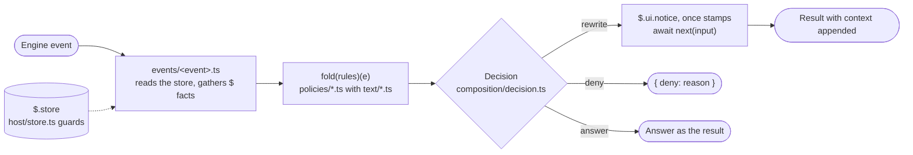

# [FUNCTION_HOOKS]

`function-hooks@rasm` is a plugin of the `rasm` marketplace at `.claude/plugins/`, one hooks module (`hooks/register.ts`) loaded under `CLAUDE_CODE_ENABLE_FUNCTION_HOOKS=1` in the `env` block of `.claude/settings.json`. Hooks `($, e, next)` run inside the Claude Code process on a typed event and answer a typed result, with no shell spawned and no stdin JSON or exit code. `claude --plugin-dir .claude/plugins/function-hooks` loads the directory in place of the installed copy under `~/.claude/plugins/cache/`.

## [01]-[LAYOUT]

```text
function-hooks/
├── .claude-plugin/
│   └── plugin.json           # Manifest with name, description, and userConfig rows with type and default
├── hooks/
│   ├── hooks.json            # Names register.ts as the one module the loader reads
│   ├── register.ts           # Reads options once and registers every event file in engine lifecycle order
│   ├── composition/
│   │   └── decision.ts       # Decision union of rewrite, deny, and answer, when over a refinement, fold over rules
│   ├── text/                 # Operations from text to data or text, no engine type and no policy row
│   │   ├── argv.ts           # Argvs of a shell command with source spans, through substitutions, shells, and interpreters
│   │   ├── lines.ts          # Non-empty lines of a child's output or a reply, and the first of them
│   │   └── path.ts           # Reads of a file path or a command word
│   ├── host/
│   │   ├── store.ts          # Store namespaces, key builders, row types, and the guards that read a stored value
│   │   └── options.ts        # Options narrowed once from host-validated values
│   ├── policies/             # One table per subject as const satisfies a row type, and the rules over it
│   │   ├── git.ts            # GIT rows with their refinements, the guard, and the paths it tests
│   │   ├── shell.ts          # SHELL rows over parsed argvs, the rewrites over them, and the command bounds
│   │   ├── paths.ts          # PATHS rows over file tools by path and content
│   │   ├── tools.ts          # TOOLS, FAMILIES, SERVERS, FETCH, and DESCRIBE rows with their rules
│   │   ├── secrets.ts        # Redaction and restoration over the secrets row
│   │   ├── agents.ts         # AGENTS briefs by subagent type
│   │   ├── findings.ts       # Finding rows, the summary, the open-question block, the batch, and its prompt
│   │   ├── kinds.ts          # KINDS rows, evidence rule, classifier prompt, and field decoder
│   │   ├── roslyn.ts         # Roslyn requests and reply lines over an edited C# file
│   │   └── scan.ts           # SCAN rows over an edited path, one command per row and the lines it yields
│   ├── events/               # One adapter per hooked engine event, <event>.ts in kebab case
│   └── */<module>.spec.ts    # Vitest spec beside each policy, text, host, and composition module
├── skills/
│   └── authoring/            # Skill function-hooks:authoring, the approach main briefs and judges by
├── agents/
│   └── hook-builder.md       # Agent function-hooks:hook-builder, dispatched by main per scope
├── package.json              # Workspace membership, language tag, and targets
├── tsconfig.json             # Declarations header config with allowImportingTsExtensions for relative .ts imports
└── vitest.config.ts          # Vitest configuration that gives the project its test target
```

## [02]-[COMPOSITION]

Every event takes one path from the engine to its result:



## [03]-[STORE]

`NAMESPACES` in `host/store.ts` names every key prefix, and each key has one writer. Stamp rows hold the clock value of their write and are read by presence, every other row through its guard, and `findings/<id>` and `scan/<id>` rows past the window are pruned at start:

| [INDEX] | [KEY]                      | [ROW]          | [WRITER]                                   | [READER]                                     |
| :-----: | :------------------------- | :------------- | :----------------------------------------- | :------------------------------------------- |
|  [01]   | `secrets`                  | `StringRecord` | Seeded outside the plugin                  | `prompt.submit`, `tool.call`                 |
|  [02]   | `session/<session>`        | `StringRecord` | `session.start`                            | `tool.call`, `skill.prompt`                  |
|  [03]   | `injected/<session>/<key>` | `number`       | `tool.call`                                | `tool.call`                                  |
|  [04]   | `loaded/<session>/<skill>` | `number`       | `skill.prompt`                             | `tool.call`                                  |
|  [05]   | `snapshot/<session>/<vm>`  | `number`       | `tool.call`, recording tools               | `tool.call`                                  |
|  [06]   | `dns/<session>/<domain>`   | `number`       | `tool.call`, recording tools               | `tool.call`                                  |
|  [07]   | `prompt/<session>`         | `Notice`       | `prompt.submit`                            | `tool.call`                                  |
|  [08]   | `findings/<id>`            | `Finding`      | `turn.complete`, `session.start` settle    | `session.start`, `turn.complete`             |
|  [09]   | `summary`                  | `Summary`      | `session.start`, `turn.complete`           | `prompt.context`, `ui.render`                |
|  [10]   | `notice`                   | `Notice`       | `session.start`, a refused or failed spawn | `ui.render`, its button deletes it           |
|  [11]   | `cleaned`                  | `Cleaned`      | `session.start` settle of a part batch     | `session.start`                              |
|  [12]   | `dispatch/<batchId>`       | `Dispatch`     | `session.start`, deleted by its settle     | `session.start`, held for the due window     |
|  [13]   | `skill/<skill>`            | Load stamp     | `skill.prompt`                             | Cleaning pass over the skills part alone     |
|  [14]   | `scan/<id>`                | `Scan`         | `tool.call`, a written edit                | `skill.prompt`, telemetry block              |
|  [15]   | `roslyn/<session>`         | `number`       | `tool.call`, a written `.cs` file          | `tool.call`, wait before a compilation read  |

`session/<session>` is the answer of `mise env --json` in the session's working directory: PATH with mise installs first and the `mise.toml` `[env]` rows. Every `$.process.run` passes it as `init.env`, and a child resolves the same binaries and values as the agent shell does through `CLAUDE_ENV_FILE`. Both channels run `mise` from the launch PATH of `claude`, and a launch without it fails `session.start` with `$.process.run(mise) failed to start: ENOENT` in the debug file beside the settings hook's `mise: command not found`.

## [04]-[OPTIONS]

`userConfig` in `plugin.json` declares each option with its type and default, the host validates values before the module loads, and `options(raw)` in `host/options.ts` narrows them once. Values sit under `pluginConfigs[<plugin key>].options` in user settings, the `--settings` flag, or managed settings, and Claude Code ignores the key in project settings. The key is the plugin id `function-hooks@rasm` for the installed copy and the manifest `name` (or `<name>@inline`) for a `--plugin-dir` load. Refusals, rewrites, redaction, and routing context are always on, and each option turns on one behavior:

| [INDEX] | [OPTION]         | [DEFAULT] | [BEHAVIOR]                                                                                     |
| :-----: | :--------------- | :-------- | :--------------------------------------------------------------------------------------------- |
|  [01]   | `packageManager` | `pnpm`    | Command that replaces `npm` in a Bash call                                                     |
|  [02]   | `speak`          | `false`   | Speaks a summary of each answer at `turn.complete`                                             |
|  [03]   | `classify`       | `false`   | Classifies each answer at `turn.complete` and writes one `findings/<id>` row                   |
|  [04]   | `dispatch`       | `false`   | Spawns the orchestrator over the open findings or a due part at session start, draws the band  |

## [05]-[POLICIES]

Each policy file holds its tables and the rules over them, the layout names each file's subject, and rows with behavior beyond their reason line follow.

Refusals are for destructive actions and for a binary read whose line would follow the dump: the git guard, a shared snapshot update, and a `.binlog` read. Every other correction is a rewrite with a context line naming the change, or a context line alone.

The manifest row of `PATHS` names the dependency rows an Edit adds to or drops from a manifest, the catalog, `Directory.Packages.props`, or `pyproject.toml`, and the sibling records a dropped name can remain in.

`sleep` rows of `SHELL` drop every top-level `sleep <duration>` argv with its joining operator, with a context line naming the wait forms: `run_in_background: true` with its completion notification, and the `until` loop under the Monitor tool. A sleep alone, or inside a loop, conditional, brace group, case body, or subshell, runs as written with that line once per session. Sleeps beside a pipe stay.

`mise` rows of `SHELL` rewrite a `mise x` or `mise exec` argv to the command after its tool specs, and drop an `eval "$(mise env)"` argv, each with a context line naming the replaced form. Argvs that name no command or hold an option before it, and an `eval` of the environment alone, run as written with a line once per session, as does a preview flag.

Package rows of `SHELL` drop a version pin from `uv add`, `pnpm add`, and `dotnet add package`, and an `NX_DAEMON` assignment other than `false`, because the Nx client reads `false` and unset alone as off under `useDaemonProcess: false` in `nx.json`, and the daemon's outputs watcher logs every event under `.cache/` into a log that never rotates.

`commandTimeout` moves a `timeout <duration>` prefix to the Bash `timeout` parameter. `commandCeiling` raises a foreground call with a slow argv (`nx run`, `run-many`, `affected`, `dotnet build`, `dotnet test`, `ast-grep test`, `claude -p`, `act`, `uv sync`, `pnpm install`) to `timeout: 600000` with no context line when the call sets none or a smaller one, and `nx run rasm:workflow` runs with `run_in_background: true` and a context line naming its completion notification.

`ast-grep` rows rewrite `scan -r <file>` on a rule under `tools/ast-grep/rules/` or `rewrites/` to `--filter '^<id>$'` with the file stem as id, with `--error=<id>` under `rewrites/`, because `scan -r` loads no `utilDirs`. Unqualified ids after `test` become `--filter '^<id>$'`, because `test` takes no positional. `-l` on `scan` drops, because `scan` reads each rule's `language` field, and `typescript` on `run` becomes `tsx`.

## [06]-[EVENTS]

`hooks/events/` holds one file per hooked engine event, and an event with no hook has no file:

| [INDEX] | [EVENT]          | [HOOK]                                                                                                       |
| :-----: | :--------------- | :----------------------------------------------------------------------------------------------------------- |
|  [01]   | `session.start`  | Session row and the prune, then under `dispatch` one spawn over a batch, settled by its report after the start       |
|  [02]   | `prompt.submit`  | Redaction of secret values to their ids and the `prompt/<session>` row                                       |
|  [03]   | `prompt.context` | Open-question block from the `summary` row                                                                   |
|  [04]   | `tool.describe`  | Skill line and `DESCRIBE` line, one per line, before the tool's own description                              |
|  [05]   | `tool.call`      | Fold of the rules, decision mapped onto the result, record `Write` answered via `sh -c`, then arms after `next` |
|  [06]   | `agent.spawn`    | Brief of the spawned type appended to the prompt                                                             |
|  [07]   | `skill.prompt`   | Stamps of the loaded skill, under `ast-grep` the tree facts and hit telemetry                                 |
|  [08]   | `turn.complete`  | Summary and classifier over each answered turn, each under its option, after `next`                          |
|  [09]   | `ui.render`      | Under `dispatch`, the `AbovePrompt` band on the terminal with no survey, the notice and the `summary` count   |

## [07]-[CHECKS]

`pnpm exec nx run function-hooks:test` runs the specs without the declarations, because Vitest erases the type-only `claude-code` imports, and `nx run rasm:lint .claude/plugins/function-hooks` runs Biome and the ast-grep families over the tree. `function-hooks:typecheck` reads the generated declarations under `.claude/types/`, gitignored and written by `pnpm exec nx run rasm:harness` with the installed copy, and `uv run --only-group eng python -m eng.scripts.harness proof <row> '<prompt>'` proves one hook row. `claude plugin validate .claude/plugins/function-hooks` lists the registered events and every `$` call the module makes, and its `version` warning is accepted because the version resolves from the source commit.

## [08]-[KNOWN_ISSUES]

Defects of the installed RoslynCodeLens.Mcp release, each with the release change that retires it:

| [INDEX] | [KIND] | [FACT]                                                                                                                       |
| :-----: | :----- | :--------------------------------------------------------------------------------------------------------------------------- |
|  [01]   | issue  | `AnalyzerRunner.cs` calls `WithAnalyzers(analyzers, options: null)`, and `.editorconfig` analyzer options do not apply       |
|  [02]   | issue  | `IDE0055` reports the brace style under Roslyn's defaults                                                                    |
|  [03]   | leaves | Release attaches `project.AnalyzerOptions`, then the `IDE0055` row of `WRONG_DIAGNOSTICS` in `policies/roslyn.ts` leaves     |
|  [04]   | issue  | `AnalyzerAllowlist.cs` hardcodes `~/.nuget/packages`, `SECURITY.md` names `NUGET_PACKAGES` and `globalPackagesFolder` unread |
|  [05]   | issue  | `.cache/nuget/packages` analyzers load under `analyzerPolicy: all` in the trust file alone                                   |
|  [06]   | leaves | Release honors `globalPackagesFolder`, then the policy narrows to `strict`                                                   |
