# [<architecture-title-token>]

<domain-map-lead-2-3-sentences>

## [01]-[CHARTER]

- <owning-subject-owns-invariant-law>
- The resolver mints every content key and owns the one-key-per-content invariant.

## [02]-[TOPOLOGY]

```text codemap
core/
├── resolver.py       # mints content keys; owns the resolve dispatch
├── registry.py       # holds the descriptor registry and admission law
└── shape/            # the shape sub-domain owners
    ├── fold.py       # folds shape ops through one entry
    └── codec.py      # decodes shape wire bytes at the seam
```

## [03]-[SEAMS]

```mermaid
---
config:
  theme: base
  look: classic
  layout: elk
  flowchart:
    curve: linear
    padding: 25
  themeVariables:
    darkMode: true
    fontFamily: "SF Mono, Menlo, Cascadia Mono, Segoe UI Mono, Consolas, monospace"
    useGradient: false
    dropShadow: "none"
    background: "#282A36"
    primaryColor: "#44475A"
    primaryTextColor: "#F8F8F2"
    primaryBorderColor: "#BD93F9"
    lineColor: "#FF79C6"
    textColor: "#F8F8F2"
    clusterBkg: "#21222C"
    clusterBorder: "#D6BCFA"
    edgeLabelBackground: "#21222C"
    labelBackgroundColor: "#21222C"
    titleColor: "#D6BCFA"
  themeCSS: ".nodeLabel{font-size:13px;font-weight:500}.edgeLabel{font-size:12px;font-weight:500}.cluster-label .nodeLabel{font-size:13.5px;font-weight:700;letter-spacing:.08em}.edge-thickness-normal{stroke-width:2px}.node rect,.node circle,.node polygon,.node path,.node .outer-path{stroke-width:1.5px;filter:none!important}.cluster rect{stroke-width:1px!important;stroke-dasharray:5 4!important;filter:none!important}.marker path{transform:scale(.8);transform-origin:5px 5px}.edgeLabel rect{transform-box:fill-box;transform-origin:center;transform:scale(1.1,1.2)}"
---
flowchart LR
    accTitle: Unit seam registry
    accDescr: Home unit owners exchanging kinded shapes with a data counterpart and a consuming shell, edge rails colored by kind and nodes classed by seam direction.
    subgraph core[CORE UNIT]
        Resolver[Resolver]
        Registry[Registry]
    end
    DataStore[(data store)]
    Shell([app shell])
    Registry -->|"[SHAPE]: Descriptor"| Resolver
    Resolver <-->|"[WIRE]: RowBatch"| DataStore
    Resolver -->|"[RECEIPT]: ResolveReceipt"| Shell
    linkStyle 1 stroke:#FFB86C,color:#F8F8F2
    linkStyle 2 stroke:#50FA7B,color:#F8F8F2
    classDef primary fill:#44475A,stroke:#FF79C6,color:#F8F8F2
    classDef data fill:#FFB86CBF,stroke:#FFB86C,color:#282A36
    classDef annotation fill:#21222C,stroke:#6272A4,color:#F8F8F2
    class Resolver,Registry primary
    class DataStore data
    class Shell annotation
```


