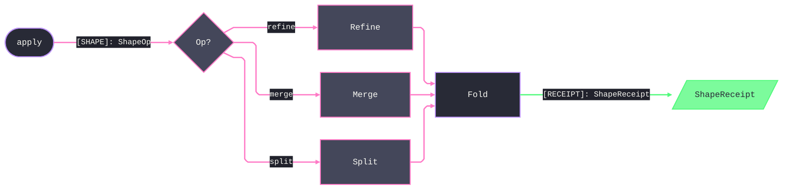

# [<pkg-token>_<page-token>]

<page-telos-lead-one-paragraph: the owner's charter in owning voice — the capability it owns, the piece it plays in the unit's system, and the boundary it holds; never the doc-set, realization status, or a sibling recap.>

<page-composition-lead-one-paragraph: the settled facts a rebuild composes without re-derivation — reused axes and their owning pages, seam obligations and frozen wire names, admission and receipt rails, modality and policy rows the page binds; present only when the page carries them, never process narration or restated higher law.>

## [01]-[INDEX]

- [01]-[<cluster-token>]: <route-hook-mechanism-owner>
- [02]-[SHAPE_FOLD]: the shape-op fold, its case vocabulary, and the content-keyed receipt

## [02]-[<cluster-token>]

- Owner: <owner-mint-and-invariant>
- Cases: <cases-bounded-vocabulary-earned>
- Entry: <entry-polymorphic-earned>
- Auto: <auto-internalized-machinery-earned>
- Receipt: <receipt-typed-case-earned>
- Packages: <packages-admitted-composed>
- Growth: <growth-one-row-rule>
- Boundary: <boundary-refusal>

```<lang> signature
<owner-signature-transcription>
```

## [03]-[SHAPE_FOLD]

- Owner: `ShapeFold` mints the one shape-op entry and owns op dispatch
- Cases: `ShapeOp` cases Refine, Merge, and Split
- Entry: `apply` discriminates single, batch, and stream by input shape
- Receipt: `ShapeReceipt.contribute` folds evidence into the run
- Packages: `shape-core` for the refinement kernel
- Growth: a new op is one `ShapeOp` case plus one dispatch arm
- Boundary: this owner refuses wire decode, deferred to the codec seam

```python signature
class ShapeFold:
    def apply(self, op: ShapeOp) -> Result[ShapeReceipt, ShapeFault]: ...
```



## [04]-[RESEARCH]

<!-- source-only: research row template:
[TOKEN]-[OPEN|BLOCKED]: <exact question>; <verification route>.
[SPLIT_MEMBER]-[OPEN]: does `shape-core` expose `split_all`; verify against the member rail.
-->

(none)
