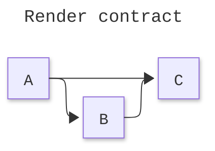
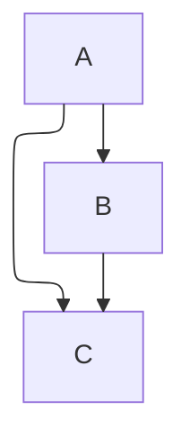

# [CONFIG]

Frontmatter is the only live channel a fence configures itself through: the block on line 1 selects the layout engine, look, per-type config, and accessibility directives the diagram type admits, while the host owns everything a fence can only request.

## [01]-[FRONTMATTER]

An opening `---` on line 1 of the fence body carries `title:` and `config:`, closing with `---` before the diagram header. `%%{init:...}%%` directives are deprecated — frontmatter is the current channel.



- Keys are case-sensitive; a misspelled key silently no-ops, and malformed YAML kills the whole diagram.
- Precedence runs Mermaid defaults, then site `initialize()`, then diagram frontmatter as the highest.
- `secure`, `securityLevel`, `startOnLoad`, `maxTextSize`, `suppressErrorRendering`, and `maxEdges` are blocked from frontmatter by the secure config model — they resolve through `initialize()` alone.
- Root keys with render impact: `htmlLabels` (supersedes deprecated `flowchart.htmlLabels`), `markdownAutoWrap`, `fontFamily`, `deterministicIds`/`deterministicIDSeed`, `handDrawnSeed`, `themeCSS`.
- Every diagram type nests its own block — `flowchart:`, `sequence:`, `er:`, `architecture:`, `kanban:`, and the rest — carrying that type's own keys.

Frontmatter requests capability; the host provides it. `layout: elk`, icon packs, zenuml, and tidy-tree each need a registered loader — the CLI registers ELK and zenuml itself, a browser must register the rest.

## [02]-[LAYOUT]

Direction `LR|RL|TB|BT` rides the header for flowchart, ER, class, and state; sequence is implicitly vertical.

| [INDEX] | [LAYOUT]       | [SCOPE]                                              |
| :-----: | :------------- | :-------------------------------------------------- |
|  [01]   | `dagre`        | default shared renderer for graph-shaped types      |
|  [02]   | `elk`          | flowchart family and swimlane; loader required       |
|  [03]   | `tidy-tree`    | mindmap hierarchy; loader required                   |
|  [04]   | `cose-bilkent` | force-directed graph layout                         |



- ELK serves the flowchart family — a flowchart takes it through `layout: elk` or `flowchart.defaultRenderer: elk`, and swimlane through `flowchart.defaultRenderer: elk`.
- Sequence, state, ER, and chart types reject or ignore ELK — drop the dead key rather than ship it.
- Architecture never uses ELK; it lays out through cytoscape fcose under `architecture.*` knobs.
- The shared-renderer default edge curve moved `basis` -> `rounded` at 11.13.0+ — restore splines with `flowchart.curve: basis`.
- `flowchart TD` with `dagre-d3` is rejected by the detector — legacy dagre-d3 needs `graph TD`, current flowchart takes `dagre-wrapper` or `elk`.

ELK tuning nests under `elk:`:

| [INDEX] | [KEY]                   | [VALUES]                                                                         |
| :-----: | :---------------------- | :------------------------------------------------------------------------------- |
|  [01]   | `mergeEdges`            | `true` \| `false`                                                                |
|  [02]   | `nodePlacementStrategy` | `SIMPLE` \| `NETWORK_SIMPLEX` \| `LINEAR_SEGMENTS` \| `BRANDES_KOEPF`             |
|  [03]   | `cycleBreakingStrategy` | `GREEDY` \| `DEPTH_FIRST` \| `INTERACTIVE` \| `MODEL_ORDER` \| `SCC_CONNECTIVITY` |
|  [04]   | `forceNodeModelOrder`   | `true` \| `false` (11.10.0+)                                                     |
|  [05]   | `considerModelOrder`    | `NONE` \| `NODES_AND_EDGES` \| `PREFER_EDGES` \| `PREFER_NODES` (11.10.0+)        |

## [03]-[LOOK]

`look` selects `classic`, `handDrawn`, or `neo`; state and sequence accept `look: neo` at 11.14.0+, and `handDrawnSeed` pins hand-drawn jitter. Schema themes are `default`, `base`, `dark`, `forest`, `neutral`, `neo`, `neo-dark`, `redux`, `redux-dark`, `redux-color`, and `redux-dark-color`. Theme selection and `themeVariables` palette work ride the same frontmatter `config:` block, owned by the theming reference — only `base` accepts `themeVariables`.

## [04]-[ACCESSIBILITY]

`accTitle:` (one line) and `accDescr:` (one line, or `accDescr { ... }` for a block) follow the diagram header and generate the SVG `<title>`/`<desc>` with aria attributes. `accDescr` states the relation the diagram encodes, not a roster of its nodes. `block` and `mindmap` mis-handle the directives — omit them there rather than emit broken nodes.

## [05]-[RENDER_ENVIRONMENT]

`mmdc` renders a fence to a file, deriving format from the output extension:

```bash
mmdc -i input.mmd -o output.svg
mmdc -i input.mmd -o output.png -b transparent
mmdc -i input.md -o rendered.md -a ./artefacts -j 4
mmdc -i - -o - -e svg
```

- `--theme` exposes only `default`, `forest`, `dark`, and `neutral`; `base` plus `themeVariables` and every schema theme require `--configFile` JSON.
- `--iconPacks @iconify-json/<pack>` fetches over the network — an icon-bearing diagram needs network access or a cached pack.
- The CLI loads KaTeX and FontAwesome CSS, registers ELK and zenuml, and waits on `document.fonts` before render.

A schema theme or `themeVariables` reaches the CLI only through `--configFile`, since `--theme` cannot select it:

```json
{
  "theme": "base",
  "look": "neo",
  "layout": "elk",
  "flowchart": { "defaultRenderer": "elk" }
}
```

A sandboxed or root CI passes Puppeteer launch args through `--puppeteerConfigFile`:

```json
{ "args": ["--no-sandbox", "--disable-setuid-sandbox"] }
```

## [06]-[TRAPS]

- `xychart` point labels render only on `line`; the syntax parses on `bar` but the labels are silently ignored.
- Packet `themeVariables` are inert — the docs carry them only in a commented-out block.
- TreeView icons need registered packs; an unregistered icon renders as `?`.
- Flowchart image shapes distort the node box without `constraint: on`.
- Sequence actor links and menus die under strict-security or sandboxed hosts.
- Sankey CSV must have exactly three columns; blank lines are permitted only without comma separators.
- `architecture.randomize: false` is not determinism — `architecture.seed` is the lock.
- Architecture `align row|column` fails when declared order contradicts a directional-edge constraint.
