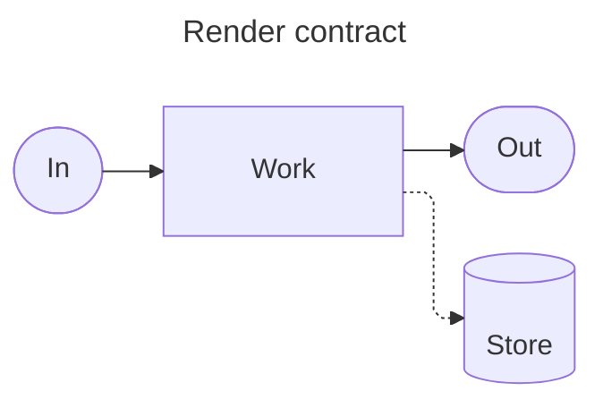
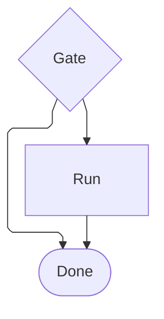

# [CONFIG]

Frontmatter is the only live channel a fence configures itself through: the block on line 1 selects the layout engine, per-type config, and accessibility directives the diagram type admits, while the host owns everything a fence can only request.

## [01]-[FRONTMATTER]

An opening `---` on line 1 of the fence body carries `title:` and `config:`, closing with `---` before the diagram header; frontmatter is the configuration channel, never a `%%{init:...}%%` directive.



- Keys are case-sensitive; a misspelled key silently no-ops, and malformed YAML kills the whole diagram.
- Fence delimiters stay at column one.
- Precedence runs Mermaid defaults, then site `initialize()`, then diagram frontmatter.
- `secure`, `securityLevel`, `startOnLoad`, `maxTextSize`, `suppressErrorRendering`, and `maxEdges` are blocked from frontmatter by the secure config model — they resolve through `initialize()` alone; `look`, `theme`, `themeVariables`, and `themeCSS` are not on that list, so a fence that chooses an appearance owns it outright.
- Root keys with render impact: `htmlLabels`, `markdownAutoWrap`, `deterministicIds`/`deterministicIDSeed`, `handDrawnSeed`.
- Root `htmlLabels: false` renders labels as native SVG `<text>` for flowchart, class, and state — the machine-parseable form a pure-SVG consumer needs; per-diagram `flowchart.htmlLabels` is deprecated, and the root key wins over it.
- Config block holds one key order on every fence: `layout`, root render keys, then per-type blocks.
- A committed flowchart fence opens on the standing block — `config:` carrying `layout: elk` and a `flowchart:` block with `curve: linear` and `padding: 25`; root render keys and `elk:` placement keys tune it, and every other family carries only its own type block.
- Diagram padding is `25` universally — `flowchart.padding: 25` and every family's equivalent breathing-room knob take the same value, so no fence crowds its viewport edge.
- Every diagram type nests its own block — `flowchart:`, `sequence:`, `er:`, `architecture:`, `kanban:`, `treemap:` with `showValues` and `valueFormat`, and the rest — carrying that type's own keys.

Frontmatter requests capability; the host grants it. `layout: elk`, icon packs, zenuml, and tidy-tree each need a registered loader — the CLI registers ELK, zenuml, and `@mermaid-js/layout-tidy-tree` itself, a browser must register the rest.

## [02]-[LAYOUT]

Flowchart fences declare `layout: elk`; every remaining family routes to the engine that owns it. Direction `LR|RL|TB|BT` rides the header for flowchart, ER, class, and state; sequence is implicitly vertical.

| [INDEX] | [FAMILY]                    | [ENGINE]                                                             |
| :-----: | :-------------------------- | :------------------------------------------------------------------- |
|  [01]   | flowchart family            | `elk`                                                                |
|  [02]   | swimlane                    | layered orthogonal layout consuming `flowchart.defaultRenderer: elk` |
|  [03]   | architecture                | fcose under `architecture:` knobs                                    |
|  [04]   | mindmap                     | `cose-bilkent`; root `layout` may select a registered `tidy-tree`    |
|  [05]   | sequence, state, ER, charts | type-owned; `layout: elk` needs a registered loader with no fallback |



- A flowchart takes ELK through `layout: elk` or `flowchart.defaultRenderer: elk`; swimlane consumes only the `flowchart.defaultRenderer: elk` route into its own layout.
- Dagre is the engine's unset-layout behavior, never this corpus's declaration; `flowchart TD` with `dagre-d3` is rejected by the detector, and legacy `graph TD` under `dagre-d3` exists only as an engine boundary fact.
- ELK routes orthogonally on its own and overrides the curve selector with a fixed rounded joint over its bend points, so `flowchart.curve` never shapes an ELK route; the corpus still declares `flowchart.curve: linear` because it holds the elbow posture wherever a host lacks the ELK loader and falls back to dagre.
- Unified state, class, and ER renderers pass `layout: elk` through when a host registers the loader and hard-require it when the loader is missing; flowchart alone falls back to dagre, so portability seats the declaration on flowchart alone.

ELK tuning nests under `elk:`:

| [INDEX] | [KEY]                   | [VALUES]                                                                            |
| :-----: | :---------------------- | :---------------------------------------------------------------------------------- |
|  [01]   | `mergeEdges`            | `true` \| `false`                                                                   |
|  [02]   | `nodePlacementStrategy` | `SIMPLE` \| `NETWORK_SIMPLEX` \| `LINEAR_SEGMENTS` \| `BRANDES_KOEPF`               |
|  [03]   | `cycleBreakingStrategy` | `GREEDY` \| `DEPTH_FIRST` \| `INTERACTIVE` \| `MODEL_ORDER` \| `GREEDY_MODEL_ORDER` |
|  [04]   | `forceNodeModelOrder`   | `true` \| `false`                                                                   |
|  [05]   | `considerModelOrder`    | `NONE` \| `NODES_AND_EDGES` \| `PREFER_EDGES` \| `PREFER_NODES`                     |

ELK engine facts, each carrying its authoring rule:

- `mergeEdges: true` fuses edges sharing a routing corridor into a common trunk — merged edges lose their own `--x`/`--o` end markers, so only a mono-rail diagram may declare it.
- `nodeSpacing` and `rankSpacing` are inert under ELK — density tunes through `nodePlacementStrategy` and the split move, never those keys.
- An edge may target a subgraph id, landing its arrowhead on the cluster boundary — the grammar reference owns the fan-to-foundation recipe built on it.
- A cluster-target skip edge can make ELK's cycle breaking re-rank the top stratum to the bottom, and `cycleBreakingStrategy: MODEL_ORDER` never rescues a cluster-edge cycle — the repair is declaration order and an invisible `~~~` rank pin between a top-stratum member and a lower-stratum member.
- A nested subgraph title wider than its content overflows the parent — a subgraph title stays shorter than its member row.
- `subGraphTitleMargin` displaces edge labels — the key stays out of ELK diagrams.
- An inner subgraph `direction` holds while the block is closed and drops the moment any member links outside it — the containers rule owned by the grammar reference.
- An invisible `~~~` link renders visible and an open link grows a phantom arrowhead — rank control under ELK rides `considerModelOrder` and `forceNodeModelOrder`, and every edge declares its ends.
- A self-referential edge lands misplaced — a self-loop routes through an explicit intermediate node.
- Interactive link tooltips are dead under ELK — the label carries the fact.

Architecture layout is fcose, tuned under `architecture:` — `nodeSeparation`, `idealEdgeLengthMultiplier`, `edgeElasticity`, `numIter` — with `seed` as the deterministic lock and `align row|column {ids}` as the placement constraint; `randomize: false` alone never guarantees identical renders.

## [03]-[ACCESSIBILITY]

`accTitle:` (one line) and `accDescr:` (one line, or `accDescr { ... }` for a block) follow the diagram header and generate the SVG `<title>`/`<desc>` with aria attributes. `accDescr` states the relation the diagram encodes, not a roster of its nodes. Several families mis-serve the directives — `block`, `sankey`, `venn`, and `mindmap` reject them at parse, `kanban` mis-handles them as columns and `ishikawa` as spurious head nodes, and `timeline` and `eventmodeling` parse both while emitting neither — so there the relation sentence sits beside the fence.

## [04]-[RENDER_ENVIRONMENT]

`mmdc` renders a fence to a file, deriving format from the output extension:

```bash template
mmdc -i input.mmd -o output.svg
mmdc -i input.mmd -o output.png -b transparent -s 1.5 -w 1600 -H 900
mmdc -i input.md -o rendered.md -a ./artefacts -j 4
mmdc -i - -o - -e svg
```

- Format derives from the output extension (`.svg`, `.png`, `.pdf`); `-b` sets background, `-s` a fractional raster scale, `-w`/`-H` the viewport, `-j` parallel jobs in markdown mode.
- `--theme` exposes only `default`, `forest`, `dark`, and `neutral`; `base` with `themeVariables` and every schema theme require `--configFile` JSON.
- `--iconPacks @iconify-json/<pack>` fetches over the network; `iconPacksNamesAndUrls` in the CLI config maps pack names to `file://` or internal URLs, so a deterministic render never touches unpkg.
- CLI loads KaTeX and FontAwesome CSS, registers ELK and zenuml, and waits on `document.fonts` before render.

A schema theme or `themeVariables` reaches the CLI only through `--configFile`, since `--theme` cannot select it:

```json copy-safe
{
    "theme": "base",
    "layout": "elk",
    "flowchart": { "defaultRenderer": "elk" }
}
```

A sandboxed or CI render pins `executablePath` through `--puppeteerConfigFile` to the machine's `PUPPETEER_EXECUTABLE_PATH`. Launch args carry `--use-mock-keychain` and `--password-store=basic` so a throwaway-profile render never reaches the macOS keychain; `--no-sandbox` and `--disable-dev-shm-usage` are the headless-CI defaults. A headless-safe Chromium build is the pin, never the branded `/Applications/Google Chrome.app`, which a sandboxed headless caller aborts at `_RegisterApplication`.

```json copy-safe
{
    "executablePath": "$PUPPETEER_EXECUTABLE_PATH",
    "args": ["--no-sandbox", "--disable-dev-shm-usage", "--use-mock-keychain", "--password-store=basic"]
}
```

A fully offline deterministic render pins every input: the toolchain pins the CLI, `executablePath` pins the browser, `iconPacksNamesAndUrls` pins icons, images ride `file://` or `data:`, and the config file locks the identity surface:

```json copy-safe
{
    "theme": "base",
    "deterministicIds": true,
    "deterministicIDSeed": "mermaid-corpus",
    "handDrawnSeed": 1001,
    "architecture": { "randomize": false, "seed": 1001 }
}
```

- SVG output carries labels in `foreignObject` HTML that downstream SVG consumers drop — PNG is the portable export.
- Repeated runs are not byte-identical, so render comparison keys on raster output, never SVG hashes; `deterministicIds` stabilizes internal SVG ids, and ids are diagram-prefixed, so CSS targeting exact ids moves to suffix or semantic selectors.
- Markdown-mode fence detection misses a fence whose info string carries irregular whitespace.

