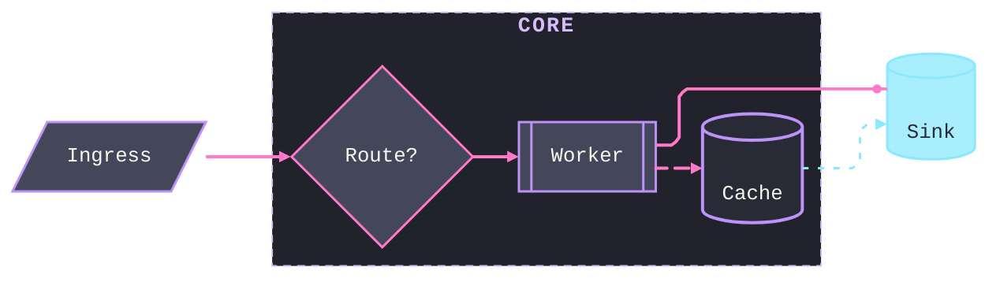

# [STYLING]

The engine's full styling grammar — every link form, node shape, container, and style statement under one ruled precedence. Color assignment rides the palette layer; this reference owns the mechanical surface.

## [01]-[EDGES]

The flowchart endpoint matrix is the stroke family crossed with the endpoint marker. Every cell is a working link; an open form omits the arrowhead, a marker on the left mirrors the right.

| [INDEX] | [STROKE]  | [OPEN]    | [POINT]    | [CIRCLE]   | [CROSS]    | [POINT_BOTH] | [CIRCLE_BOTH] | [CROSS_BOTH] |
| :-----: | :-------- | :-------- | :--------- | :--------- | :--------- | :----------- | :------------ | :----------- |
|  [01]   | Normal    | `A --- B` | `A --> B`  | `A --o B`  | `A --x B`  | `A <--> B`   | `A o--o B`    | `A x--x B`   |
|  [02]   | Thick     | `A === B` | `A ==> B`  | `A ==o B`  | `A ==x B`  | `A <==> B`   | `A o==o B`    | `A x==x B`   |
|  [03]   | Dotted    | `A -.- B` | `A -.-> B` | `A -.-o B` | `A -.-x B` | `A <-.-> B`  | `A o-.-o B`   | `A x-.-x B`  |
|  [04]   | Invisible | `A ~~~ B` | —          | —          | —          | —            | —             | —            |

Extra dash, equals, or dot characters raise the minimum rank span; the renderer may still lengthen a link to satisfy layout, and the span caps at 10. With a middle label the extra characters sit right of the label: `A -- text ---> B`.

| [INDEX] | [NORMAL]    | [THICK]     | [DOTTED]     |
| :-----: | :---------- | :---------- | :----------- |
|  [01]   | `A --> B`   | `A ==> B`   | `A -.-> B`   |
|  [02]   | `A ---> B`  | `A ===> B`  | `A -..-> B`  |
|  [03]   | `A ----> B` | `A ====> B` | `A -...-> B` |

Labels attach as a pipe pair or a middle segment on any stroke family:

| [INDEX] | [FORM]               | [SYNTAX]           |
| :-----: | :------------------- | :----------------- |
|  [01]   | Pipe on arrow        | `A -->\|text\| B`  |
|  [02]   | Middle on arrow      | `A -- text --> B`  |
|  [03]   | Pipe on open link    | `A ---\|text\| B`  |
|  [04]   | Middle on open link  | `A -- text --- B`  |
|  [05]   | Middle on dotted     | `A -. text .-> B`  |
|  [06]   | Middle on thick      | `A == text ==> B`  |
|  [07]   | Bidirectional thick  | `A <== text ==> B` |
|  [08]   | Bidirectional dotted | `A <-. text .-> B` |

A closing `o` or `x` fused to the next id is lexed as an edge marker, not the id's first character.

| [INDEX] | [WRITTEN] | [PARSED_AS]        | [FIX]                      |
| :-----: | :-------- | :----------------- | :------------------------- |
|  [01]   | `A---oB`  | circle end, id `B` | `A--- oB` or capitalize id |
|  [02]   | `A---xB`  | cross end, id `B`  | `A--- xB` or capitalize id |

An edge id names one edge for behavior metadata: `A e1@--> B` then a metadata block on the id.

| [INDEX] | [METADATA]               | [EFFECT]                                                                     |
| :-----: | :----------------------- | :--------------------------------------------------------------------------- |
|  [01]   | `e1@{ animate: true }`   | Toggles edge animation.                                                      |
|  [02]   | `e1@{ animation: fast }` | Fast preset; `slow` is the slow preset.                                      |
|  [03]   | `e1@{ curve: <value> }`  | Per-edge spline from the documented curve set, overriding the diagram curve. |

The metadata block owns only animate, animation, and curve; stroke width, dash, and label color ride `linkStyle` or an edge-id class — `class e1 edgeError` styles the id's stroke, width, dash, and label through the class system, the engine deriving the arrowhead from the resolved stroke. When an edge is modified more than once the last modification wins.

| [INDEX] | [FORM]                  | [EFFECT]                                  |
| :-----: | :---------------------- | :---------------------------------------- |
|  [01]   | `linkStyle N ...`       | Styles the edge at 0-based parse index N. |
|  [02]   | `linkStyle 1,2,7 ...`   | One style across the listed indices.      |
|  [03]   | `linkStyle default ...` | Styles every edge.                        |

The `linkStyle` property set is `stroke`, `stroke-width`, `stroke-dasharray`, `color`, and `fill`; a non-default edge that declares no `fill` gets `fill:none` injected. The built-in `animate`/`animation` metadata survives alongside an edge class, and a class-borne animation payload adds no second animation over it. A dash animation rides a class rather than the id — `classDef animate stroke-dasharray:9\,5,animation:dash 25s linear infinite` bound by `class e1 animate`, the dasharray comma escaped as `\,`.

Sequence lines carry no `linkStyle`; the stroke shape is the arrow token itself, and grouped backgrounds live in containers.

| [INDEX] | [FAMILY]      | [SOLID]   | [DOTTED]   |
| :-----: | :------------ | :-------- | :--------- |
|  [01]   | Line          | `A->B`    | `A-->B`    |
|  [02]   | Arrow         | `A->>B`   | `A-->>B`   |
|  [03]   | Cross         | `A-xB`    | `A--xB`    |
|  [04]   | Async         | `A-)B`    | `A--)B`    |
|  [05]   | Bidirectional | `A<<->>B` | `A<<-->>B` |

Activation shorthand fuses to the arrow: `A->>+B` opens an activation, `B-->>-A` closes it; every `+` balances a `-`.

State transitions take four forms and carry no per-transition style route — style the states, never the edge: `s1 --> s2`, labeled `s1 --> s2: label`, entry `[*] --> s1`, exit `s1 --> [*]`.

ER relation lines encode strength through the stroke: `--` is identifying, `..` is non-identifying, as in `CUSTOMER \|\|--o{ ORDER : places` against `CUSTOMER \|\|..o{ ORDER : places`.

Class relations pair an endpoint marker with a solid `--` or dashed `..` line.

| [INDEX] | [RELATION]  | [SYNTAX]                  |
| :-----: | :---------- | :------------------------ |
|  [01]   | Inheritance | `Animal <\|-- Duck`       |
|  [02]   | Composition | `Vehicle *-- Wheel`       |
|  [03]   | Aggregation | `Department o-- Employee` |
|  [04]   | Association | `Student --> Course`      |
|  [05]   | Dependency  | `Order ..> Payment`       |
|  [06]   | Realization | `Service ..\|> Impl`      |
|  [07]   | Solid link  | `A -- B`                  |
|  [08]   | Dashed link | `A .. B`                  |

A reverse form places the marker on the opposite end (`Duck --\|> Animal`); the grammar admits a marker on both ends of one line — `Animal <\|--\|> Zebra`, `A *--o B`, `C <..> D` — and a lollipop interface reads `bar ()-- foo`.

## [02]-[SHAPES]

`A@{ shape: <name> }` selects a registered shape by canonical short name or a public alias; the alias resolves to the canonical name, and an unknown name is rejected. This registry is the vocabulary.

| [INDEX] | [SHAPE]      | [ALIASES]                                                        | [ROLE]                |
| :-----: | :----------- | :--------------------------------------------------------------- | :-------------------- |
|  [01]   | `rect`       | `proc`, `process`, `rectangle`                                   | process               |
|  [02]   | `rounded`    | `event`                                                          | rounded event         |
|  [03]   | `stadium`    | `terminal`, `pill`                                               | terminal point        |
|  [04]   | `fr-rect`    | `subprocess`, `subproc`, `framed-rectangle`, `subroutine`        | subprocess            |
|  [05]   | `cyl`        | `db`, `database`, `cylinder`                                     | database              |
|  [06]   | `datastore`  | `data-store`                                                     | data store            |
|  [07]   | `circle`     | `circ`                                                           | start                 |
|  [08]   | `bang`       | none                                                             | bang                  |
|  [09]   | `cloud`      | none                                                             | cloud                 |
|  [10]   | `diam`       | `decision`, `diamond`, `question`                                | decision              |
|  [11]   | `hex`        | `hexagon`, `prepare`                                             | prepare conditional   |
|  [12]   | `lean-r`     | `lean-right`, `in-out`                                           | data input/output     |
|  [13]   | `lean-l`     | `lean-left`, `out-in`                                            | data input/output     |
|  [14]   | `trap-b`     | `priority`, `trapezoid-bottom`, `trapezoid`                      | priority action       |
|  [15]   | `trap-t`     | `manual`, `trapezoid-top`, `inv-trapezoid`                       | manual operation      |
|  [16]   | `dbl-circ`   | `double-circle`                                                  | stop                  |
|  [17]   | `text`       | none                                                             | text block            |
|  [18]   | `notch-rect` | `card`, `notched-rectangle`                                      | card                  |
|  [19]   | `lin-rect`   | `lined-rectangle`, `lined-process`, `lin-proc`, `shaded-process` | lined process         |
|  [20]   | `sm-circ`    | `start`, `small-circle`                                          | start                 |
|  [21]   | `fr-circ`    | `stop`, `framed-circle`                                          | stop                  |
|  [22]   | `fork`       | `join`                                                           | fork/join             |
|  [23]   | `hourglass`  | `collate`                                                        | collate               |
|  [24]   | `brace`      | `comment`, `brace-l`                                             | comment               |
|  [25]   | `brace-r`    | none                                                             | comment right         |
|  [26]   | `braces`     | none                                                             | braces both sides     |
|  [27]   | `bolt`       | `com-link`, `lightning-bolt`                                     | com link              |
|  [28]   | `doc`        | `document`                                                       | document              |
|  [29]   | `delay`      | `half-rounded-rectangle`                                         | delay                 |
|  [30]   | `h-cyl`      | `das`, `horizontal-cylinder`                                     | direct access storage |
|  [31]   | `lin-cyl`    | `disk`, `lined-cylinder`                                         | disk storage          |
|  [32]   | `curv-trap`  | `curved-trapezoid`, `display`                                    | display               |
|  [33]   | `div-rect`   | `div-proc`, `divided-rectangle`, `divided-process`               | divided process       |
|  [34]   | `tri`        | `extract`, `triangle`                                            | extract               |
|  [35]   | `win-pane`   | `internal-storage`, `window-pane`                                | internal storage      |
|  [36]   | `f-circ`     | `junction`, `filled-circle`                                      | junction              |
|  [37]   | `notch-pent` | `loop-limit`, `notched-pentagon`                                 | loop limit            |
|  [38]   | `flip-tri`   | `manual-file`, `flipped-triangle`                                | manual file           |
|  [39]   | `sl-rect`    | `manual-input`, `sloped-rectangle`                               | manual input          |
|  [40]   | `docs`       | `documents`, `st-doc`, `stacked-document`                        | multi-document        |
|  [41]   | `st-rect`    | `procs`, `processes`, `stacked-rectangle`                        | multi-process         |
|  [42]   | `bow-rect`   | `stored-data`, `bow-tie-rectangle`                               | stored data           |
|  [43]   | `cross-circ` | `summary`, `crossed-circle`                                      | summary               |
|  [44]   | `tag-doc`    | `tagged-document`                                                | tagged document       |
|  [45]   | `tag-rect`   | `tagged-rectangle`, `tag-proc`, `tagged-process`                 | tagged process        |
|  [46]   | `flag`       | `paper-tape`                                                     | paper tape            |
|  [47]   | `odd`        | none                                                             | odd                   |
|  [48]   | `lin-doc`    | `lined-document`                                                 | lined document        |

The classic bracket forms are shorthands over that registry.

| [INDEX] | [SHORTHAND]   | [SHAPE]    |
| :-----: | :------------ | :--------- |
|  [01]   | `A[Text]`     | `rect`     |
|  [02]   | `A(Text)`     | `rounded`  |
|  [03]   | `A([Text])`   | `stadium`  |
|  [04]   | `A[[Text]]`   | `fr-rect`  |
|  [05]   | `A[(Text)]`   | `cyl`      |
|  [06]   | `A((Text))`   | `circle`   |
|  [07]   | `A>Text]`     | `odd`      |
|  [08]   | `A{Text}`     | `diam`     |
|  [09]   | `A{{Text}}`   | `hex`      |
|  [10]   | `A[/Text/]`   | `lean-r`   |
|  [11]   | `A[\Text\]`   | `lean-l`   |
|  [12]   | `A[/Text\]`   | `trap-b`   |
|  [13]   | `A[\Text/]`   | `trap-t`   |
|  [14]   | `A(((Text)))` | `dbl-circ` |

Icon and image nodes are special shapes carrying their own parameter set; the icon pack registers at the host, never in the fence.

| [INDEX] | [ICON_KEY] | [VALUES]                                                 |
| :-----: | :--------- | :------------------------------------------------------- |
|  [01]   | `icon`     | Registered icon name such as `fa:user`.                  |
|  [02]   | `form`     | `square`, `circle`, `rounded`; omitted renders unframed. |
|  [03]   | `label`    | Text label.                                              |
|  [04]   | `pos`      | `t` or `b`; default bottom.                              |
|  [05]   | `h`        | Height; default and minimum 48.                          |

| [INDEX] | [IMAGE_KEY]  | [VALUES]                                                 |
| :-----: | :----------- | :------------------------------------------------------- |
|  [01]   | `img`        | Image URL.                                               |
|  [02]   | `label`      | Text label.                                              |
|  [03]   | `pos`        | `t` or `b`; default bottom.                              |
|  [04]   | `w`          | Image width.                                             |
|  [05]   | `h`          | Image height.                                            |
|  [06]   | `constraint` | `on` or `off`; default off, `on` preserves aspect ratio. |

A metadata block also accepts `label` to override the bracket text, and the `text` shape renders a borderless label-only node.

## [03]-[CONTAINERS]

Containers style through the id, never the title, and each type admits a bounded route.

| [INDEX] | [CONTAINER]        | [STYLE_ROUTE]                                                     | [UNSTYLEABLE]                        |
| :-----: | :----------------- | :---------------------------------------------------------------- | :----------------------------------- |
|  [01]   | Flowchart subgraph | `style id`, `class id`, `classDef` by id; inner `direction`       | title text                           |
|  [02]   | State composite    | class on plain states; composite class lands in the DOM           | `[*]` markers; composite fill/stroke |
|  [03]   | Sequence `box`     | named color, `rgb(...)`, `rgba(...)`, `transparent`, or text-only | —                                    |
|  [04]   | Sequence `rect`    | `rect rgb(...)` or `rect rgba(...)` background                    | named color                          |
|  [05]   | Block              | `class`/`style` by id, nesting                                    | title text                           |
|  [06]   | Architecture group | theme variables `archGroupBorder*`, `archEdge*`                   | in-diagram class/style               |
|  [07]   | Class namespace    | theme only                                                        | individual note/namespace            |

A subgraph names its id and title as `subgraph id [Title]`, nests, and takes an inner `direction`; that inner direction is dropped and inherited from the parent the moment any member node links outside the block. `style id` on the subgraph beats `clusterBkg`, and a class on the subgraph id colors the title text over `titleColor`.

## [04]-[PRECEDENCE]

Node styling resolves in application order, later and more specific winning.

- Theme variables and theme CSS set the diagram defaults.
- `classDef default` sets the fallback class where the type supports it — verified for flowchart, ER, and requirement.
- A named `classDef` layers through `class` or `:::` assignments; among conflicting classes on one node the later `classDef` definition wins, never the assignment order. The `classDef` declares at diagram root after the nodes it styles — declared above them it renders unstyled.
- Inline `style id ...` is the direct override and wins last — the engine emits it as an inline `!important` declaration; its property set is `fill`, `stroke`, `stroke-width`, `color`, and `stroke-dasharray`.
- `classDef` rules emit with `!important`, so a `themeCSS` rule without `!important` loses to any class on the same node.

Class assignment splits by family — flowchart binds one class per statement, ER admits a comma list on one node.

| [INDEX] | [FAMILY]  | [FORM]                | [SYNTAX]                        |
| :-----: | :-------- | :-------------------- | :------------------------------ |
|  [01]   | Flowchart | One class inline      | `A:::name`                      |
|  [02]   | Flowchart | One class across many | `class A,B name`                |
|  [03]   | ER        | Comma class list      | `CUSTOMER:::important,external` |

A flowchart node takes one class per statement: stacked `A:::a:::b` raises a parse error, and `class N a,b` binds the single literal class token `a,b` rather than two classes.

Edge styling resolves along a parallel chain: theme line variables, then `linkStyle default`, then positional `linkStyle N`, a repeated index resolving last-wins. A class on an edge id rides the edge group yet never beats a same-edge `linkStyle` stroke; edge metadata `e1@{ animate }`, `e1@{ animation }`, and `e1@{ curve }` owns behavior alone; `style e1 ...` on an edge id renders and silently no-ops; and a `linkStyle` on a `~~~` edge writes inline stroke that overrides the invisible class, turning the rank edge visible, so a rank-only edge never takes `linkStyle`.

## [05]-[TYPE_MATRIX]

Each diagram type accepts a bounded set of styling statements; `yes` is verified acceptance, `no` is no verified route, and the local mechanism is the type's own styling surface.

| [INDEX] | [TYPE]       | [CLASSDEF] | [TRIPLE_COLON] | [STYLE] | [LINKSTYLE] | [LOCAL]                                        |
| :-----: | :----------- | :--------: | :------------: | :-----: | :---------: | :--------------------------------------------- |
|  [01]   | Flowchart    |    yes     |      yes       |   yes   |     yes     | edge-id + shape metadata                       |
|  [02]   | Sequence     |     no     |       no       |   no    |     no      | `box`/`rect` backgrounds                       |
|  [03]   | State        |    yes     |      yes       |   yes   |     no      | composite-state classes                        |
|  [04]   | Class        |    yes     |      yes       |   yes   |     no      | relation arrows + lollipops                    |
|  [05]   | ER           |    yes     |      yes       |   yes   |     no      | identifying `--` vs non-`..`                   |
|  [06]   | Gantt        |     no     |       no       |   no    |     no      | config section + `todayMarker`                 |
|  [07]   | Pie          |     no     |       no       |   no    |     no      | ordinal `pie1`–`pie12` vars                    |
|  [08]   | Quadrant     |    yes     |      yes       |   no    |     no      | point-local `color`/`radius`                   |
|  [09]   | Timeline     |     no     |       no       |   no    |     no      | `cScale0`–`cScale11` vars                      |
|  [10]   | Mindmap      |     no     |      yes       |   no    |     no      | host classes + `::icon(...)`                   |
|  [11]   | Kanban       |     no     |       no       |   no    |     no      | task metadata + config keys                    |
|  [12]   | GitGraph     |     no     |       no       |   no    |     no      | `git0`–`git7` + label vars                     |
|  [13]   | Requirement  |    yes     |      yes       |   yes   |     no      | direct requirement/element style               |
|  [14]   | Architecture |     no     |       no       |   no    |     no      | `arch*` vars + `align`/`seed`                  |
|  [15]   | Block        |    yes     |       no       |   yes   |     no      | id `class`/`style` + nesting                   |
|  [16]   | Sankey       |     no     |       no       |   no    |     no      | config link-color strategy                     |
|  [17]   | XY chart     |     no     |       no       |   no    |     no      | config plot palette                            |
|  [18]   | Radar        |     no     |       no       |   no    |     no      | nested `radar` + `cScale` vars                 |
|  [19]   | Treemap      |    trap    |      trap      |   no    |     no      | ordinal `cScale`/`cScalePeer` + section stamps |
|  [20]   | Packet       |     no     |       no       |   no    |     no      | `.packet*` `themeCSS` class stamp              |
|  [21]   | Journey      |     no     |       no       |   no    |     no      | `fillType0`–`fillType7` vars                   |
|  [22]   | C4           |     no     |       no       |   no    |     no      | `Update*Style` calls                           |

The silent traps live where syntax parses but styling does not apply or applies destructively: mindmap `:::` classes must be supplied by the host, so in-diagram `classDef` never defines them; block `:::` has no verified route; state styling reaches plain states while a composite class parses and lands in the DOM with its fill and stroke non-portable and `[*]` markers unstyleable; treemap `classDef` emits inline `!important` fills that lock out every stylesheet correction, so a themed treemap carries no classes and rides its ordinal range plus section stamps; and the nested packet theme-variable block half-applies, so packet styling rides its `themeCSS` classes.

## [06]-[FLOORS]

Every family ships at or above its floor — the minimum styling below which its render is naked. A family whose engine admits no color route states that bound beside the fence instead of shipping a dead theme block.

| [INDEX] | [FAMILY]      | [FLOOR]                                                                                                                                                              |
| :-----: | :------------ | :------------------------------------------------------------------------------------------------------------------------------------------------------------------- |
|  [01]   | flowchart     | base vars + three or more canonical classes + explicit rail on every non-primary edge + `fontFamily`                                                                 |
|  [02]   | sequence      | actor/signal/activation/note vars + one `box` or `rect` grouping around each `alt`/`par`/`critical` region                                                           |
|  [03]   | state         | general vars + dormant `recessed`, fault `error`, terminal `boundary` classes; nominal states ride the primary default                                               |
|  [04]   | class         | general vars + `classText` + classes separating the aggregate or interface from leaf types + the gold note chip                                                      |
|  [05]   | ER            | attribute banding + `lineColor` + `tertiaryColor` + classes: root `primary`, junction `recessed`, ref `external`                                                     |
|  [06]   | gantt         | `section*`/`task*`/`active*`/`crit*`/`excludeBkgColor`/`todayLineColor`/`gridColor` + `axisFormat` with `tickInterval` + the Lavender `.sectionTitle` stamp          |
|  [07]   | mindmap       | no in-fence class route — host-registered classes or engine depth colors, the bound stated beside the fence                                                          |
|  [08]   | timeline      | `cScale0`–`cScale11` + Foreground `cScaleLabel0`–`cScaleLabel11` + the `.node-bkg` fill-opacity stamp with per-section borders + the attribute-hook wayfinding stamp |
|  [09]   | kanban        | full `cScale`/`cScaleLabel` ranges (columns index from `section-1`) + `background`/`nodeBorder` cards + the container-title stamp + priority-line remaps             |
|  [10]   | gitGraph      | `git0`–`git7` + `gitBranchLabel*` + `commit*`/`tag*` incl. `tagLabelBorder` + canvas `primaryColor` + the 2px `.arrow` and `.75` commit-dot stamps                   |
|  [11]   | requirement   | `requirement*`/`relation*` + `edgeLabelBackground` + classes separating requirement from element + the arrow-scale stamp                                             |
|  [12]   | C4            | `c4:` config color keys + `UpdateRelStyle` on every relation + the boundary/title/marker/image `themeCSS` hooks                                                      |
|  [13]   | architecture  | `archEdgeColor`/`archEdgeArrowColor`/`archGroupBorderColor` + per-group icon + full `align` grid + `architecture.seed` + the icon re-fill stamp                      |
|  [14]   | pie           | `pie1`–`pie12` + `pieOpacity: 1` + per-slice `nth-of-type` translucent fills with full strokes + Foreground section/legend text                                      |
|  [15]   | quadrant      | neutral quadrant fills + Lavender quadrant text + per-point classes + the `.data-point` fill-opacity stamp                                                           |
|  [16]   | sankey        | `theme: base` frontmatter + `nodeColors` mapped to palette hexes + `labelStyle: legacy` + the `.link` blend stamp + Foreground `.node-labels`                        |
|  [17]   | xychart       | nested `xyChart` block + `plotColorPalette` + the `.bar-plot-0` translucency stamp + outside data labels capped by `.plot text`                                      |
|  [18]   | radar         | nested `radar` block + `cScale0`–`cScale11` + distinct per-curve data + margins clearing the axis labels                                                             |
|  [19]   | treemap       | full `cScale`/`cScalePeer`/Foreground `cScaleLabel` ranges + the dark-section and label-cap stamps; `classDef` banned                                                |
|  [20]   | packet        | the `.packetBlock`/`.packetLabel`/`.packetByte`/`.packetTitle` `themeCSS` stamp — one hue family, wash-tier fills                                                    |
|  [21]   | journey       | translucent `fillType0`–`fillType7` + `actor0`–`actor5` + `faceColor` + `journey.titleFontFamily`/`titleColor` + the face/mouth/axis stamps                          |
|  [22]   | venn          | per-set `style` rows (fill, fill-opacity, stroke, color) + labeled unions + the title and set-label size stamps                                                      |
|  [23]   | eventmodeling | `em*` fill/stroke pairs + `emSwimlaneBackground*` + the `.em-box span`/`code` and `.em-swimlane text` stamps                                                         |
|  [24]   | wardley       | nested `wardley` block + `wardleyEvolutionColor`; the family emits no stylesheet, so text metrics stay engine-owned and the user need models as a component          |
|  [25]   | cynefin       | nested `cynefin` block with wash-tier domain fills, Red cliff, Lavender captions + the item chip stamps + `seed`                                                     |
|  [26]   | treeView      | config `labelColor`/`lineColor`/`labelFontSize` + the highlight (yellow-law chip) and Cyan description stamps                                                        |
|  [27]   | ishikawa      | global vars only — `lineColor` and `mainBkg` carry the whole surface; the bound stated beside the fence                                                              |
|  [28]   | swimlane      | the flowchart floor + `theme: base` + lane `style` emphasis + the container-title stamp on lane labels                                                               |
|  [29]   | railroad      | the `railroad:` config block — gold-law terminals, Selection nonterminals, Comment rails, pink endpoint dots, Lavender rule names                                    |

## [07]-[CONSISTENCY_LAWS]

Review binds these laws on every committed fence; the values each law spends — hexes, stamps, rail styles — live with their owner, and a law here never redefines them.

- Edge-rail law: every semantic edge carries an explicit rail from the six-rail set the palette layer owns, bound positionally through `linkStyle` or insertion-stably through an edge-id class; only a plain forward hop inherits the default, every fault edge is Red, and every edge insertion recounts positional indices.
- Weight law: every stroke spends the palette layer's one weight ladder — `2px` standing edge, `3px` fault and emphasis, `1.5px` dashed and node border, `1px` container — so weight alone lifts an important hop above a routine one; the arrowhead rides the `.marker path` scale the family stamp carries, never the line weight.
- Animation law: `animate: true` marks the one called-out flow — the hot path or the edge feeding a callout node — never decoration; the engine stills it under reduced motion, and a second competing animation dilutes the first. A static export freezes the animation's dash keyframe, so the edge prints dashed and collides with the trace rhythm — a fence whose proof or destination is a raster leaves `animate` off and carries the emphasis on weight or a callout instead.
- Container law: a container recesses and its boundary reads — a flowchart `subgraph`, state composite, and class namespace fill Darker `#21222C` under a `1px` dashed Lavender boundary with a Lavender title at the 13.5px/700 container-title stamp, a nested region steps one tone lighter so its members read as raised within it, and a sequence `alt`/`par`/`break`/`critical` region wraps in a `rect` or `box` background; a white or naked container is the defect, and every fill and stroke traces to the role map. The stamp binds every titled container the engine draws — cluster, composite, namespace, kanban column, swimlane lane, gantt section, treemap section, C4 boundary, architecture group.
- Render-flat law: every shape renders flat and solid-bordered — `look: classic`, `useGradient: false`, `dropShadow: "none"`, and the `filter:none!important` belt in every node-bearing `themeCSS` string kill the engine's gradient borders and halo at all four layers, and no fence, string, or template reintroduces a gradient reference or a node filter.
- Terminus law: every terminus mark rides its line's color — Pink arrowheads, start discs, terminal rings, and lollipop rings on control flow, cardinality marks on the relation stroke — at the palette layer's one marker scale and one circle scale, so no circle reads as a stray dot, no circle shoulders its label, and no head outweighs its line; an engine that leaves a marker unfilled takes an explicit fill-and-stroke stamp, so no arrowhead renders grey anywhere.
- Crossing law: no edge crosses a node — a block raster links only adjacent cells, an architecture fence aligns every rank both ways, a C4 fence homes externals in their own boundary, and a layout that cannot clear its nodes splits the figure.
- Label-placement law: an edge or relationship label never sits bare on its stroke — the recessed backing chip masks the line it crosses, offsets clear collision hot spots, and a label the engine strands away from its edge is dropped in favor of the rail's color semantics.
- Elbow law: edges route orthogonally with sharp elbows wherever the family admits routing control — ELK owns flowchart bends, the swimlane layout owns lane hops, ports and aligns own the architecture grid — and soft splines survive only where the engine owns the curve outright.
- classDef-completeness law: a flowchart, state, ER, class, or requirement diagram ships every class its semantics demand — an aggregate root, junction, fault, or dormant state rendering identical to its neighbors is the defect.
- Translucency law: every semantically colored shape composites the two-tier alpha table — dark-ink chips at 75%, light-ink surfaces at their measured alphas, washes below — under a full-opacity border of the same hue; an opaque accent fill is the defect the alpha table exists to prevent.
- Typography law: the ruled mono stack and the micro-scale `themeCSS` stamps reach every committed fence, emphasis rides a callout node or color rather than a markdown `**bold**` span that renders chunky in mono, and no canvas text renders below the theming floor.
- Backing law: label backings ride Darker `#21222C`, one step recessed below the canvas — a subtle recessed chip masks the stroke it crosses without the bright pill a Selection backing paints, and a backing equal to the canvas reads as a hole.
- Ordinal-completeness law: a type reading an ordinal palette defines the full engine range the base block carries, so no band derives to `primaryColor` mud.
- Single-home law: the palette layer carries every token role, the micro-scale stamps, and the canonical class and rail sets; this reference carries the mechanical grammar and the per-family floors; an extended fence demonstrates the keys it consumes and never privately defines a role.

## [08]-[SCOPE]

Styling that is part of the diagram grammar travels with the fence text: `classDef`, `class`, `style`, `linkStyle`, edge metadata, C4 update calls, and sequence `box`/`rect`. Frontmatter `themeVariables` and `themeCSS` travel with the fence when the renderer honors Mermaid frontmatter, and only the `base` theme reads `themeVariables`. Host `initialize(...)` styling and page CSS stay with the host and never travel with the diagram.
