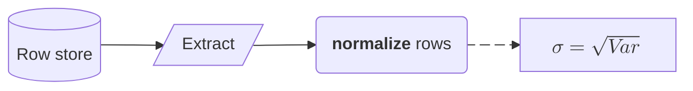
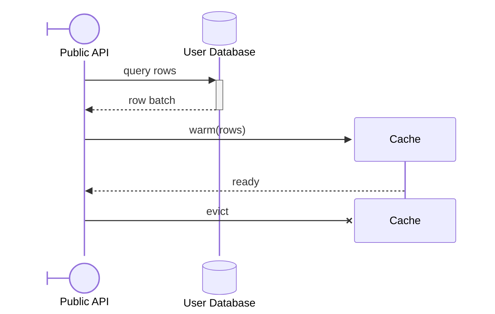
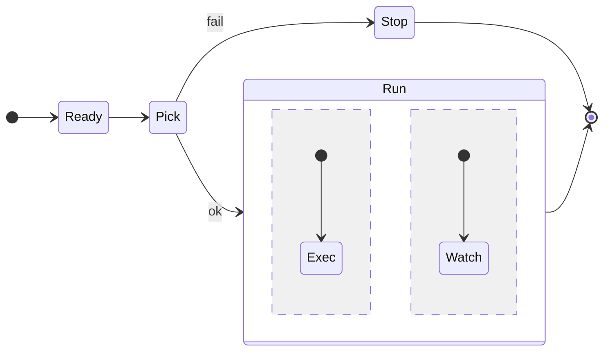
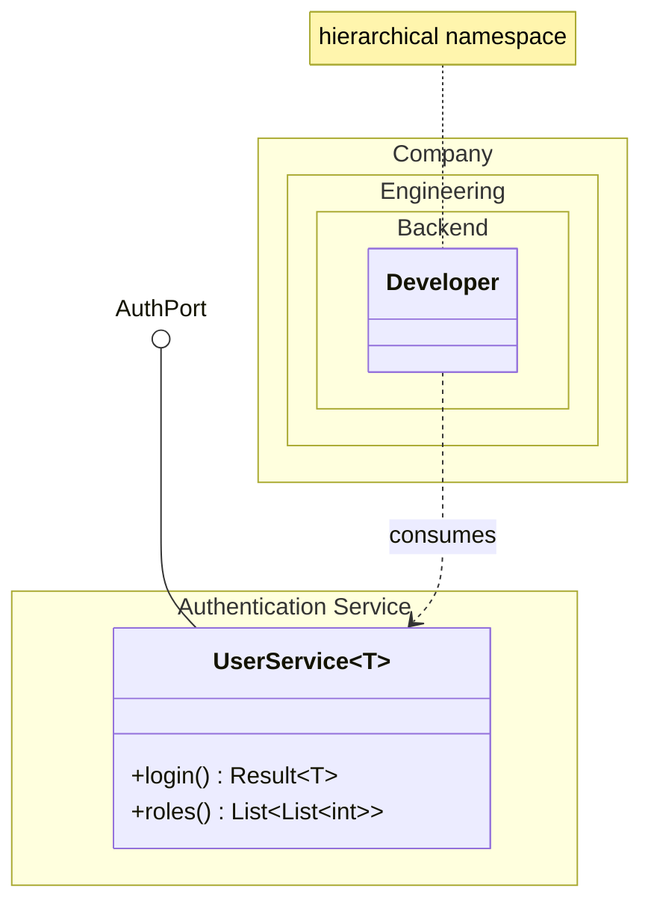

# [SYNTAX_CORE]

Advanced and version-gated grammar for flowchart, sequence, state, class, and ER; baseline node, edge, marker, and visibility syntax is assumed, never restated.

## [01]-[FLOWCHART]

`A@{ shape: name }` (`11.3.0+`) selects any registered node shape and aliases resolve to one canonical name (`database` = `cyl`); the renderer owns the full registry, and the high-value subset follows.

| [INDEX] | [SHAPE]      | [ROLE]                  |
| :-----: | :----------- | :---------------------- |
|  [01]   | `rect`       | process step            |
|  [02]   | `rounded`    | soft event              |
|  [03]   | `stadium`    | terminal                |
|  [04]   | `fr-rect`    | subprocess call         |
|  [05]   | `cyl`        | database cylinder       |
|  [06]   | `datastore`  | shared data store       |
|  [07]   | `diam`       | decision branch         |
|  [08]   | `hex`        | conditional prepare     |
|  [09]   | `lean-r`     | input data              |
|  [10]   | `lean-l`     | output data             |
|  [11]   | `docs`       | stacked document        |
|  [12]   | `st-rect`    | stacked process         |
|  [13]   | `notch-rect` | card                    |
|  [14]   | `bow-rect`   | stored data             |
|  [15]   | `delay`      | half-rounded delay      |
|  [16]   | `h-cyl`      | direct access storage   |
|  [17]   | `lin-cyl`    | disk storage            |
|  [18]   | `tri`        | extract triangle        |
|  [19]   | `cross-circ` | crossed-circle summary  |
|  [20]   | `f-circ`     | filled-circle junction  |
|  [21]   | `brace`      | comment brace           |
|  [22]   | `bolt`       | communication link      |
|  [23]   | `flag`       | paper tape              |

An edge ID names one edge for animation and curve, never stroke: `A e1@--> B` then `e1@{ animate: true }` or `e1@{ animation: fast }` (`11.6.0+`); per-edge curves are `11.10.0+` through `e1@{ curve: linear }`. Curve values are `basis`, `bumpX`, `bumpY`, `cardinal`, `catmullRom`, `linear`, `monotoneX`, `monotoneY`, `natural`, `step`, `stepAfter`, `stepBefore`. Stroke and color stay on `linkStyle`; dash animation rides a class — `classDef animate stroke-dasharray:9\,5,animation:dash 25s linear infinite` bound by `class e1 animate`.

Icon and image shapes are `11.3.0+`: `A@{ icon: "fa:user", form: "square", label: "User", pos: "t", h: 60 }` and `B@{ img: "<url>", w: 80, h: 60, constraint: "on" }`; `form` is `square`, `circle`, or `rounded` and `pos` is `t` or `b`; `constraint: on` preserves aspect ratio by deriving width from height. An icon resolves only against a pack registered at the renderer, never in frontmatter. `A --> B & C` fans one source to many; `~~~` is an invisible rank-only link; extra dashes (`---->`) lengthen rank distance. Markdown strings and KaTeX (flowchart and sequence only) compose on the same node:



`markdownAutoWrap: false` stops auto-wrap on markdown labels; edge labels take math as `|"$$\sqrt{x+3}$$"|`. `@{ label: "text" }` overrides the bracket text, and the `text` shape renders a borderless label-only node.

[GOTCHAS]:
- Subgraph `direction` is ignored when any member links outside; the subgraph inherits the parent direction.
- Reserved IDs `end`, `default`, `subgraph`, `class`, `graph` need quoting or capitalization.
- A leading `o` or `x` on an ID collides with edge-end syntax; a space inside `A [txt]` breaks the node.
- `classDef` declared above its nodes renders unstyled — declare it at diagram root, after nodes.
- Escape commas in `stroke-dasharray` as `9\,5`.

## [02]-[SEQUENCE]

Typed participants carry a UML stereotype (`type` values `boundary`, `control`, `database`) and alias; the JSON form and an `as` alias combine:



Lifecycle uses `create participant X`, the aliased variant `create actor D as Donald`, and `destroy X` mid-diagram. Grouping boxes wrap participants: `box Purple Name ... end`, or `box transparent Name`. Parallel and conditional blocks are `par ... and ... end`, `critical ... option ... end`, and `break ... end`. `autonumber` accepts a decimal start and increment (`11.15.0+`): `autonumber 10.5 0.25`. Actor menus attach interactive links, live in interactive renderers only: `link Alice: Dashboard @ <url>` and `links Alice: {"Dashboard": "<url>"}`. KaTeX renders in participant names and messages.

[GOTCHAS]:
- Balance every `+` activation with a `-` deactivation.
- Wrap message text containing `end` in parentheses as `(end)`; `<br/>` breaks a message line.
- Actor menus are dead in sandboxed or static hosts.
- Sequence ignores `layout` and `direction`; `look: neo` applies `11.14.0+`.

## [03]-[STATE]

Composite states nest a per-composite `direction`, and a `--` separator splits concurrency regions inside one composite:



Pseudostates are `<<choice>>`, `<<fork>>`, and `<<join>>`. `state "long text" as S` aliases a spaced label. Click directives are `11.7.0+`.

[GOTCHAS]:
- `classDef` never applies to `[*]` or to a composite state, inside or out.
- `end` and `state` are reserved words; declare `classDef` at diagram root.
- State layout ignores ELK; `look: neo` lands `11.14.0+`.

## [04]-[CLASS]

Generics use `~T~` and nest as `List~List~int~~`; commas inside a generic declaration are unsupported. Nested namespaces and namespace labels are `11.15.0+`, and `class.hierarchicalNamespaces: false` flattens dotted paths:



Lollipop interfaces are `bar ()-- foo` (`11.4.0+`). `note for Shape "text"` attaches a note, and `direction RL` reorients. Two hyperlink forms carry tooltips: `link Shape "<url>" "tooltip"` renders a static anchor, `click Shape href "<url>" "tooltip"` fires only in interactive renderers.

[GOTCHAS]:
- A generic suffix drops in references — two classes differing only by generic collide.
- Notes and namespaces take themes but are not individually styleable.
- A member-less `class Foo` renders empty members hidden under the unified renderer (`11.4.0+`).

## [05]-[ER]

Nullable attribute types are `11.16.0+` (`string? middleName`); array types are `string[] parts`; entity aliases quote spaced names; compound keys chain as `PK, FK`:

```mermaid
erDiagram
    direction LR
    p["Person"] {
        string driversLicense PK "license number"
        string? middleName
        string[] parts
        string carRegistration PK, FK
    }
    a["Customer Account"] {
        string email UK
    }
    p only one to zero or more a : holds
```

Word-alias cardinalities map onto the crow's-foot markers, and `to` versus `optionally to` names the identifying versus non-identifying join. Quoted entity and attribute text takes markdown and Unicode, and a multi-line attribute label breaks with `<br/>` (`11.1.0+`).

| [INDEX] | [ALIAS]                        | [MARKER]         |
| :-----: | :----------------------------- | :--------------- |
|  [01]   | `only one` `1`                 | `\|\|` exact one |
|  [02]   | `zero or one` `one or zero`    | `\|o` optional   |
|  [03]   | `zero or more` `many(0)` `0+`  | `}o` many        |
|  [04]   | `one or more` `many(1)` `1+`   | `}\|` required   |

[GOTCHAS]:
- Keys accept only `PK`, `FK`, `UK` — no Unicode or markdown in a key.
- An empty entity block `{ }` is invalid; reserved words are `ONE`, `MANY`, `TO`, `U`, `1`.
- Hand-drawn look and `direction` land `11.6.0+`.
