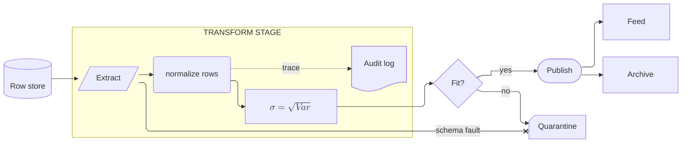
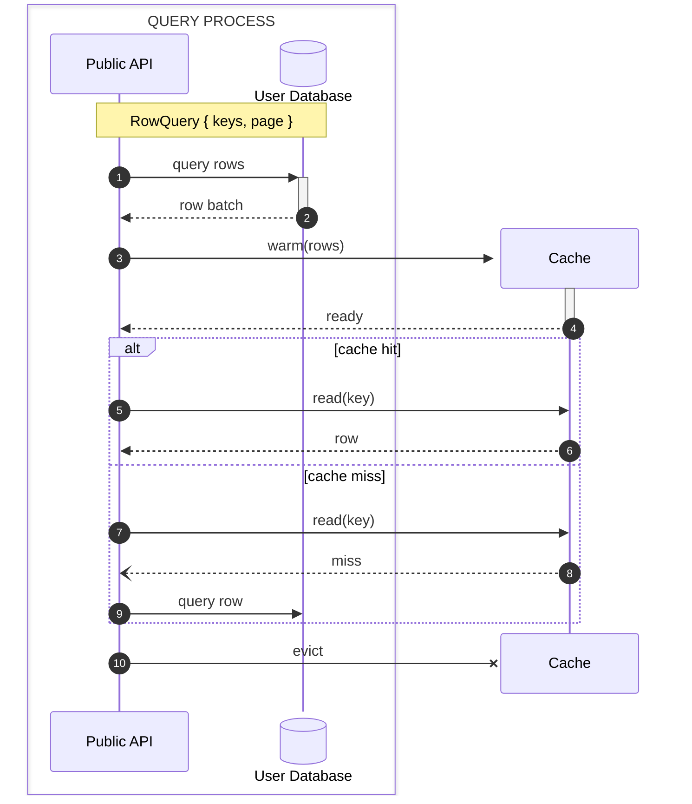
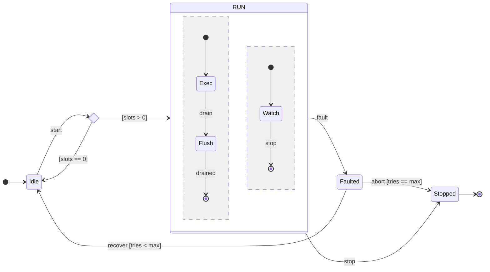
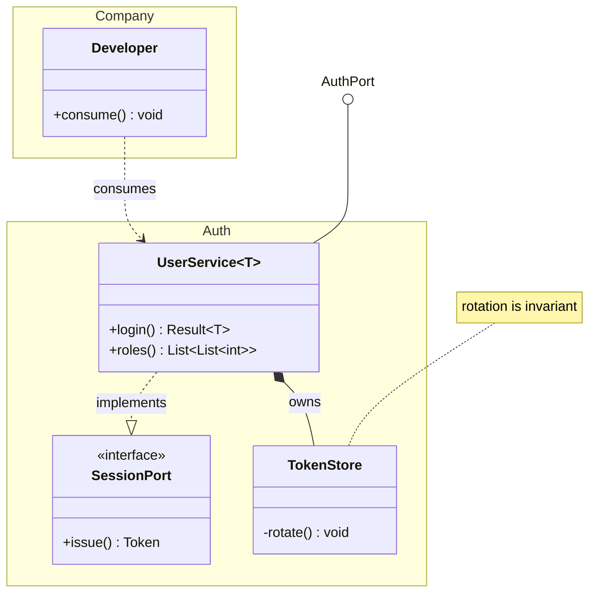
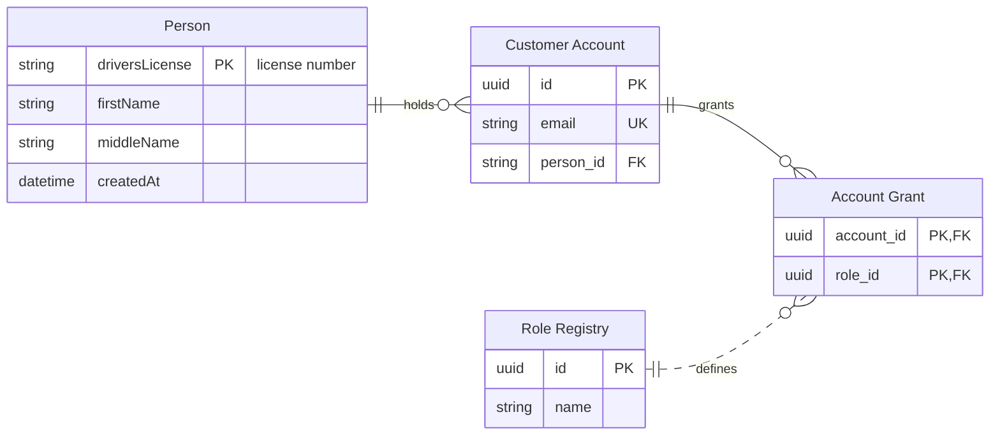

# [SYNTAX_CORE]

Advanced grammar for flowchart, sequence, state, class, and ER; baseline node, edge, marker, and visibility syntax is assumed, never restated.

## [01]-[FLOWCHART]

`@{ shape: name }` form and aliases resolve to canonical names (`database` = `cyl`). Complete shape registry with its aliases is the grammar reference's property.

An edge ID names one edge for behavior metadata: `A e1@--> B` then `e1@{ curve: linear }` selects a per-edge spline overriding the diagram curve. Fan-out, invisible links, and rank-span dashes are the grammar reference's property. `datastore` (alias `data-store`) rides the shape registry as its own persistence shape beside `cyl`.

Icon and image shapes: `A@{ icon: "fa:user", form: "square", label: "User", pos: "t", h: 60 }` and `B@{ img: "<url>", w: 80, h: 60, constraint: "on" }`; `form` is `square`, `circle`, or `rounded` and `pos` is `t` or `b`; `constraint: on` locks aspect ratio, and an image shape distorts its node box without it. An icon resolves only against a pack registered at the renderer, never in frontmatter. Markdown strings and KaTeX (flowchart and sequence only) compose on the same node:

`markdownAutoWrap: false` stops auto-wrap on markdown labels; edge labels take math as `|"$$\sqrt{x+3}$$"|`. `@{ label: "text" }` overrides the bracket text, and the `text` shape renders a borderless label-only node.

[GOTCHAS]:
- Reserved IDs `end`, `subgraph`, `class`, `graph` need quoting or capitalization; `default` is reserved only in `classDef default` and `linkStyle default` position.
- A space inside `A [txt]` breaks the node.
- Markdown strings are inert inside `@{ label: ... }` metadata — backtick labels ride the classic bracket forms.
- Markdown and `$$math$$` in one label break together, and ` ` dies inside a math label — one channel per label.
- `htmlLabels: false` strips backtick text and entity codes.
- A node and an edge sharing one ID silently kills the render.
- KaTeX renders only where the host loads it, and its labels ride `foreignObject` — proof rasters come from the mmdc/Chromium lane, never a pure-SVG rasterizer.

## [02]-[SEQUENCE]

`-)` is the async send and `--)` the async dotted send; the full arrow matrix — line, arrow, cross, async, bidirectional, solid and dotted — is the grammar reference's edge table.

Typed participants carry a UML stereotype (`type` values `boundary`, `control`, `entity`, `database`, `queue`, `collections`) with an alias through exactly one channel — the metadata `alias` key or the `as` clause, never both fused on one declaration. Aliasing, activation, and the create/destroy lifecycle compose:

Lifecycle uses `create participant X`, the aliased `create actor D as Donald`, and `destroy X` mid-diagram. Grouping boxes wrap participants — `box transparent Name ... end` — and `rect` background blocks nest. Async `-)`/`--)` sends terminate in the `-filled-head` marker. Parallel and conditional blocks are `par ... and ... end`, `critical ... option ... end`, and `break ... end`.

`autonumber` accepts a start and increment, decimal included: `autonumber 10.5 0.25`; `autonumber off` halts numbering, a bare `autonumber` resumes. A note takes `:wrap:`/`:nowrap:` as `Note over X:wrap: text`. Actor menus attach interactive links, live in interactive renderers only: `link Alice: Dashboard @ <url>` and `links Alice: {"Dashboard": "<url>"}`. KaTeX renders in participant names and messages.

[GOTCHAS]:
- Balance every `+` activation with a `-` deactivation.
- ` ` breaks a message line.
- Actor menus are dead in sandboxed or static hosts.
- Sequence ignores `layout` and `direction`.

## [03]-[STATE]

Composite states nest a per-composite `direction`, and a `--` separator splits concurrency regions inside one composite:

Pseudostates are `<<choice>>`, `<<fork>>`, and `<<join>>`. `state "long text" as S` aliases a spaced label. A `click` directive attaches an interactive link to a state.

[GOTCHAS]:
- `end` and `state` are reserved words.
- A pseudostate stereotype declared after the state's first edge reference silently drops — the state renders as a plain labeled box; `state X <<choice>>` precedes X's first use.
- State honors `layout: elk` only where the host registers the ELK loader, with no dagre fallback when it is missing — state fences omit the key and stay on the type-owned layout.

## [04]-[CLASS]

Generics use `~T~` and nest as `List~List~int~~`; commas inside a generic declaration are unsupported. A `namespace` groups classes, a bracket label renames it (`namespace Auth["Authentication Service"]`), and `class.hierarchicalNamespaces: false` flattens dotted paths:

Lollipop interfaces are `bar ()-- foo`. `note for Shape "text"` attaches a note, and `direction RL` reorients. Two hyperlink forms carry tooltips: `link Shape "<url>" "tooltip"` renders a static anchor, `click Shape href "<url>" "tooltip"` fires only in interactive renderers.

[GOTCHAS]:
- A generic suffix drops in references — two classes differing only by generic collide.
- A member-less `class Foo` renders empty members hidden under the unified renderer.
- `click` binds to a generic class by its bare name — `UserService`, never `UserService~T~`.

## [05]-[ER]

ER attributes extend `type name key`: `string? middleName` marks a nullable type from mermaid 11.16, `string[] parts` an array, and `PK, FK` a compound key; a backtick-escaped name carries dots, and an entity alias quotes a spaced name. Keyed and commented attributes with a crow's-foot join compose:

Word-alias cardinalities map onto the crow's-foot markers, and `to` versus `optionally to` names the identifying versus non-identifying join. Quoted entity and attribute text takes markdown and Unicode, and a multi-line attribute label breaks with ` `.

| [INDEX] | [ALIAS]                       | [MARKER]         |
| :-----: | :---------------------------- | :--------------- |
|  [01]   | `only one` `1`                | `\|\|` exact one |
|  [02]   | `zero or one` `one or zero`   | `\|o` optional   |
|  [03]   | `zero or more` `many(0)` `0+` | `}o` many        |
|  [04]   | `one or more` `many(1)` `1+`  | `}\|` required   |

[GOTCHAS]:
- Keys accept only `PK`, `FK`, `UK` — no Unicode or markdown in a key.
- An empty entity block `{ }` renders as a title-only entity box; reserved entity ids are `ONE`, `MANY`, and `TO`.
- Hand-drawn look and `direction` apply.
