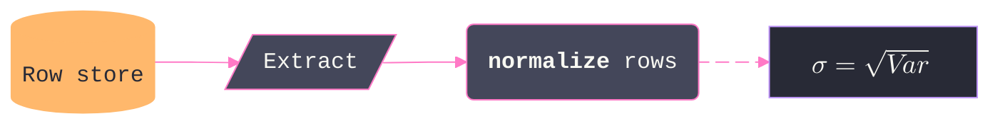
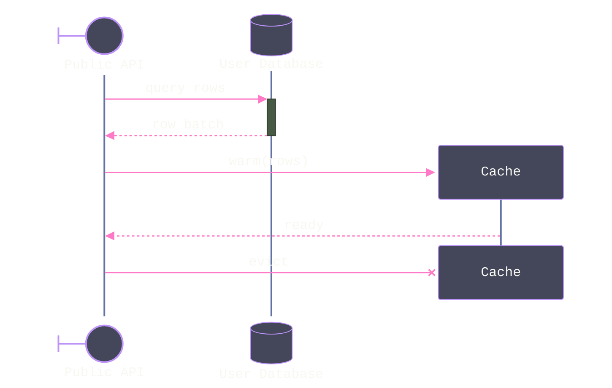
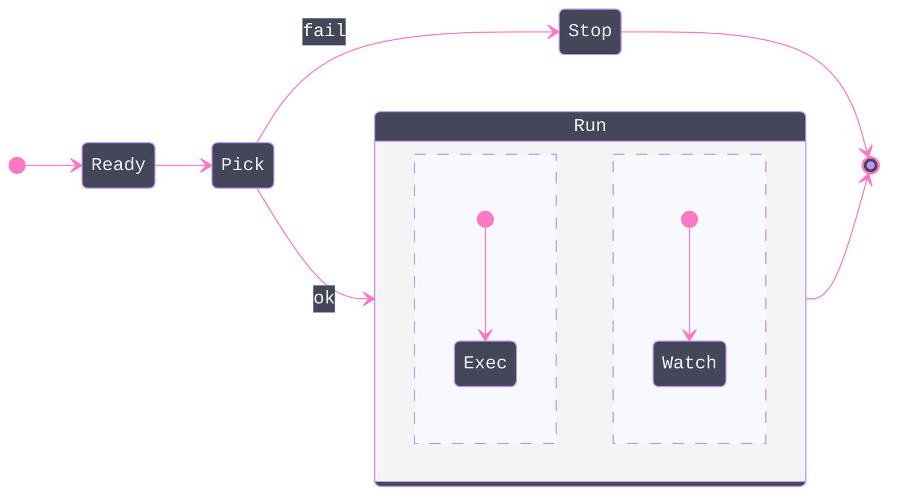
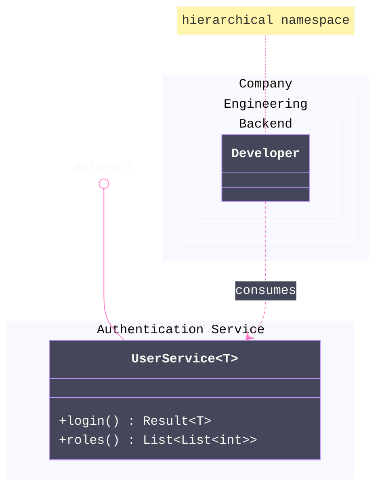

# [SYNTAX_CORE]

Advanced and version-gated grammar for flowchart, sequence, state, class, and ER; baseline node, edge, marker, and visibility syntax is assumed, never restated.

Sections: [01] flowchart - [02] sequence - [03] state - [04] class - [05] ER.

## [01]-[FLOWCHART]

The `@{ shape: name }` form and aliases resolve to canonical names (`database` = `cyl`). The complete shape registry with its aliases is the styling reference's property.

An edge ID names one edge for animation and curve, never stroke: `A e1@--> B` then `e1@{ animate: true }` or `e1@{ animation: fast }`; per-edge curves through `e1@{ curve: linear }`. An edge ID is also a `classDef` target — `classDef pulse stroke:#FF79C6,stroke-dasharray:5 5` then `class e1 pulse` styles the edge stroke through the class system. The curve roster and the `linkStyle` dash-animation mechanics are the styling reference's property. `datastore` joins the shape registry as a persistence-role alias beside `cyl`.

Icon and image shapes: `A@{ icon: "fa:user", form: "square", label: "User", pos: "t", h: 60 }` and `B@{ img: "<url>", w: 80, h: 60, constraint: "on" }`; `form` is `square`, `circle`, or `rounded` and `pos` is `t` or `b`; `constraint: on` preserves aspect ratio by deriving width from height. An icon resolves only against a pack registered at the renderer, never in frontmatter. `A --> B & C` fans one source to many; `~~~` is an invisible rank-only link; extra dashes (`---->`) lengthen rank distance. Markdown strings and KaTeX (flowchart and sequence only) compose on the same node:



`markdownAutoWrap: false` stops auto-wrap on markdown labels; edge labels take math as `|"$$\sqrt{x+3}$$"|`. `@{ label: "text" }` overrides the bracket text, and the `text` shape renders a borderless label-only node.

[GOTCHAS]:
- Reserved IDs `end`, `default`, `subgraph`, `class`, `graph` need quoting or capitalization.
- A space inside `A [txt]` breaks the node.
- Markdown strings are inert inside `@{ label: ... }` metadata — backtick labels ride the classic bracket forms.
- Markdown and `$$math$$` in one label break together, and `<br/>` dies inside a math label — one channel per label.
- `htmlLabels: false` strips backtick text and entity codes.
- A node and an edge sharing one ID silently kills the render.
- KaTeX renders only where the host loads it — hosted markdown renderers vary.

## [02]-[SEQUENCE]

`-)` is the async send and `--)` the async dotted send; the full arrow matrix — line, arrow, cross, async, bidirectional, solid and dotted — is the styling reference's edge table.

Typed participants carry a UML stereotype (`type` values `boundary`, `control`, `entity`, `database`, `queue`, `collections`) and alias; the JSON form and an `as` alias combine:



Lifecycle uses `create participant X`, the aliased variant `create actor D as Donald`, and `destroy X` mid-diagram. Grouping boxes wrap participants: `box Purple Name ... end`, or `box transparent Name`, and `rect` background blocks nest. Parallel and conditional blocks are `par ... and ... end`, `critical ... option ... end`, and `break ... end`. `autonumber` accepts a decimal start and increment: `autonumber 10.5 0.25`, `autonumber off` halts numbering, and a bare `autonumber` resumes it. A note takes a `:wrap:` or `:nowrap:` modifier as `Note over X:wrap: text`. Actor menus attach interactive links, live in interactive renderers only: `link Alice: Dashboard @ <url>` and `links Alice: {"Dashboard": "<url>"}`. KaTeX renders in participant names and messages.

[GOTCHAS]:
- Balance every `+` activation with a `-` deactivation.
- Wrap message text containing `end` in parentheses as `(end)`; `<br/>` breaks a message line.
- Actor menus are dead in sandboxed or static hosts.
- Sequence ignores `layout` and `direction`; `look: neo` applies.

## [03]-[STATE]

Composite states nest a per-composite `direction`, and a `--` separator splits concurrency regions inside one composite:



Pseudostates are `<<choice>>`, `<<fork>>`, and `<<join>>`. `state "long text" as S` aliases a spaced label. A `click` directive attaches an interactive link to a state.

[GOTCHAS]:
- `end` and `state` are reserved words.
- State layout ignores ELK; `look: neo` applies.

## [04]-[CLASS]

Generics use `~T~` and nest as `List~List~int~~`; commas inside a generic declaration are unsupported. Nested namespaces and namespace labels, and `class.hierarchicalNamespaces: false` flattens dotted paths:



Lollipop interfaces are `bar ()-- foo`. `note for Shape "text"` attaches a note, and `direction RL` reorients. Two hyperlink forms carry tooltips: `link Shape "<url>" "tooltip"` renders a static anchor, `click Shape href "<url>" "tooltip"` fires only in interactive renderers.

[GOTCHAS]:
- A generic suffix drops in references — two classes differing only by generic collide.
- Notes and namespaces take themes but are not individually styleable.
- A member-less `class Foo` renders empty members hidden under the unified renderer.
- `style`, `classDef`, and `click` bind to a generic class by its bare name — `UserService`, never `UserService~T~`.

## [05]-[ER]

Nullable attribute types (`string? middleName`); array types are `string[] parts`; entity aliases quote spaced names; compound keys chain as `PK, FK`; a backtick-escaped name or type carries dots and other special characters:

```mermaid
---
config:
  theme: base
  themeVariables:
    darkMode: true
    fontFamily: "SF Mono, Menlo, Cascadia Mono, Segoe UI Mono, Consolas, monospace"
    primaryColor: "#44475A"
    primaryBorderColor: "#BD93F9"
    relationColor: "#FF79C6"
    textColor: "#F8F8F2"
    edgeLabelBackground: "#44475A"
    attributeBackgroundColorOdd: "#282A36"
    attributeBackgroundColorEven: "#21222C"
---
erDiagram
    accTitle: ER attribute grammar demo
    accDescr: A person holding customer accounts, exercising nullable, array, compound-key, and escaped attribute names.
    direction LR
    p["Person"] {
        string driversLicense PK "license number"
        string? middleName
        string[] parts
        datetime `created.at`
        string carRegistration PK, FK
    }
    a["Customer Account"] {
        string email UK
    }
    p only one to zero or more a : holds
```

Word-alias cardinalities map onto the crow's-foot markers, and `to` versus `optionally to` names the identifying versus non-identifying join. Quoted entity and attribute text takes markdown and Unicode, and a multi-line attribute label breaks with `<br/>`.

| [INDEX] | [ALIAS]                       | [MARKER]         |
| :-----: | :---------------------------- | :--------------- |
|  [01]   | `only one` `1`                | `\|\|` exact one |
|  [02]   | `zero or one` `one or zero`   | `\|o` optional   |
|  [03]   | `zero or more` `many(0)` `0+` | `}o` many        |
|  [04]   | `one or more` `many(1)` `1+`  | `}\|` required   |

[GOTCHAS]:
- Keys accept only `PK`, `FK`, `UK` — no Unicode or markdown in a key.
- An empty entity block `{ }` is invalid; reserved words are `ONE`, `MANY`, `TO`, `U`, `1`.
- The hand-drawn look and `direction` apply.
