# [SYNTAX_EXTENDED]

Diagram types beyond the five core types populate this roster — each row carries its working form and the traps that bind it in the numbered section its index names.

## [01]-[REGISTRY]

Pick a type by intent, then its section for the minimal fence and traps; rows run in section order.

| [INDEX] | [TYPE]               | [INTENT]                 |
| :-----: | :------------------- | :----------------------- |
|  [02]   | `mindmap`            | radial hierarchy         |
|  [03]   | `block`              | manual grid layout       |
|  [04]   | `journey`            | phase sentiment          |
|  [05]   | `requirementDiagram` | requirement traceability |
|  [06]   | `pie`                | part-to-whole share      |
|  [07]   | `quadrantChart`      | two-axis position map    |
|  [08]   | `sankey`             | weighted directed flow   |
|  [09]   | `xychart`            | bar or line chart        |
|  [10]   | `radar-beta`         | multivariate profile     |
|  [11]   | `gantt`              | dated schedule           |
|  [12]   | `treemap-beta`       | area-weighted hierarchy  |
|  [13]   | `C4`                 | system landscape views   |
|  [14]   | `architecture-beta`  | infrastructure groups    |
|  [15]   | `packet`             | bit-field layout         |
|  [16]   | `timeline`           | chronological periods    |
|  [17]   | `gitGraph`           | branch and merge history |
|  [18]   | `kanban`             | workflow-stage board     |
|  [19]   | `treeView-beta`      | file-tree hierarchy      |
|  [20]   | `cynefin-beta`       | decision-domain sort     |
|  [21]   | `railroad-*-beta`    | grammar syntax rails     |
|  [22]   | `swimlane-beta`      | laned process flow       |
|  [23]   | `eventmodeling`      | command-event timeline   |
|  [24]   | `venn-beta`          | set-overlap regions      |
|  [25]   | `wardley-beta`       | value-chain evolution    |
|  [26]   | `ishikawa-beta`      | cause-effect fishbone    |

`zenuml` renders sequence exchanges through an external plugin the CLI registers; it carries this registry mention alone. Eight families outrun older hosts — `eventmodeling` parses from mermaid 11.15, `swimlane-beta`, `cynefin-beta`, and the `railroad-*-beta` dialects from 11.16, and `treeView-beta`, `venn-beta`, `wardley-beta`, and `ishikawa-beta` from the post-11.12 line — a host below its floor throws `UnknownDiagramError`.

## [02]-[MINDMAP]

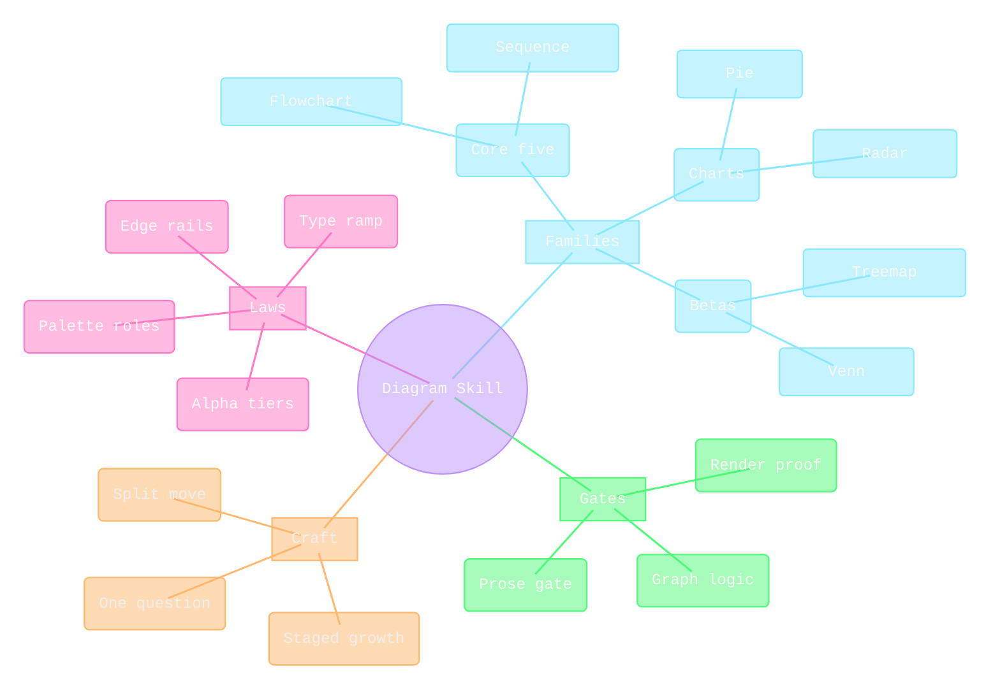

Fence content asserts the skill decomposing into laws, families, gates, and craft to leaf depth; the family mis-handles `accTitle`/`accDescr`, so the relation sentence rides beside the fence. Root leads; consistent indentation sets depth, mixed tabs and spaces are rejected, and explicit edges are invalid. Shapes carry level — `root((...))` circle, `[...]` branch rects, `(...)` rounded topics, bare text leaves. First-level branches take `.section-0`–`.section-N` classes in declaration order, but the engine lightens every `cScale` hue before painting, so canon color rides explicit per-section `themeCSS` overrides on fills, strokes, and `.section-edge-N` strokes; the `.mindmap-node` fill-opacity stamp composites the translucent law, the `.edge` stamp pulls the engine's thick depth-scaled connectors to the standing 2px, and the `[class^='node-line']` kill retires the engine underline strips. Radial layout is cose-bilkent and owns its own edge geometry.

## [03]-[BLOCK]

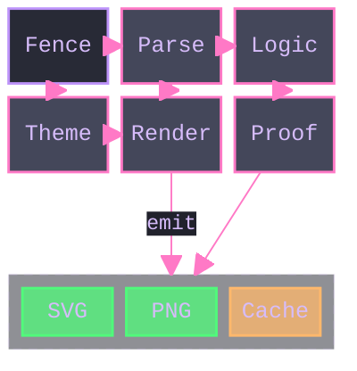

Fence content asserts a two-row render raster feeding a nested proof group; the family rejects `accTitle`/`accDescr` at parse, so the relation sentence rides beside the fence. `block-beta` is the portable keyword; `columns N` precedes a row, a `:n` span widens a block, `space` inserts a filler, and a nested `block:id:span ... end` holds its own `columns`. A block arrow is `blockArrowId<["Label"]>(dir)` with `dir` one of `right`, `left`, `up`, `down`, `x`, `y`, or a compound like `(x, down)`. Links route straight from source center through a midpoint to target center with no obstacle awareness, so a committed raster links only adjacent cells — that placement discipline is the whole of the no-crossing law here. Family stylesheet never reaches its marker children, so the `themeCSS` `.marker path`/`.marker circle` fill-and-stroke stamp is the arrowhead-color floor, and the nested-group rect restyles through `rect.composite` — the engine's own composite paint is a faded gray that never survives review. `classDef`, `class`, and `style` bind by block id.

## [04]-[JOURNEY]

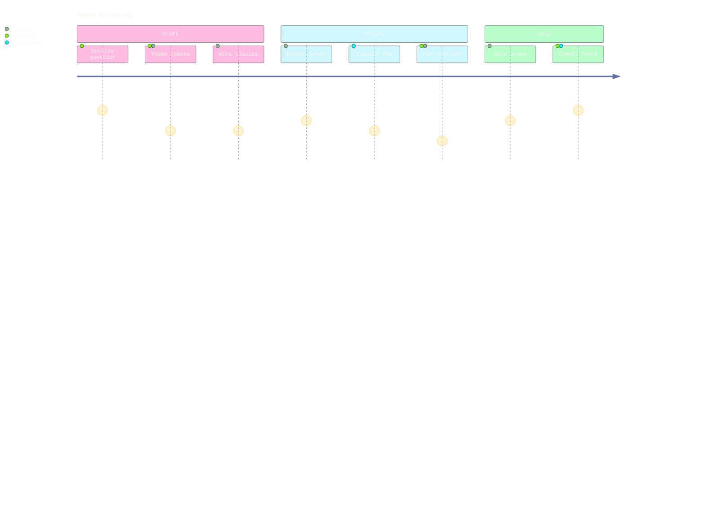

Scores are integers `1` through `5`; a task belongs under a `section`, an actor needs no declaration, and an out-of-range score is invalid. Task and section fills read `fillType0`–`fillType7`, which accept alpha hexes — the translucent tier composites dark enough that Foreground task ink measures, so journey rides the light-ink alpha ladder. Actor dots read the `actor0`–`actor5` theme variables, never the `journey.actorColours` config list, and take their stroke and the −25% radius through `circle[class^='actor-']`. Score faces restyle as translucent gold chips through `.face`, the eye dots re-ink through the `circle[fill='#666']` attribute hook, and the mouth is a filled crescent path — `.mouth` takes `fill`, never `stroke`. Title text reads `journey.titleFontFamily`/`journey.titleColor` config keys — the theme mono stack does not reach it — and the axis line plus its `[id$='-arrowhead']` marker take the Comment wayfinding hue.

## [05]-[REQUIREMENT_DIAGRAM]

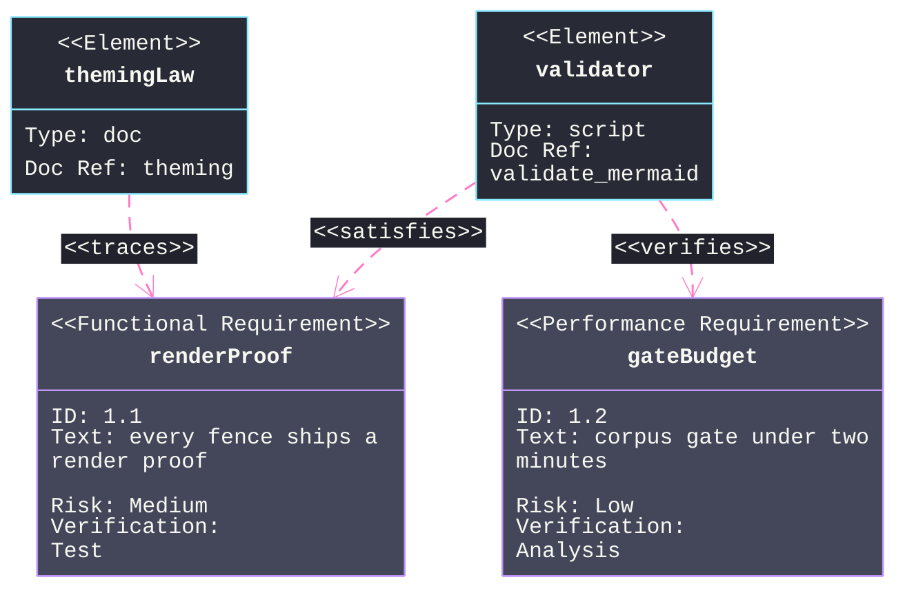

Types are `requirement`, `functionalRequirement`, `interfaceRequirement`, `performanceRequirement`, `physicalRequirement`, `designConstraint`; `risk` takes `Low`/`Medium`/`High` and `verifyMethod` takes `Analysis`/`Inspection`/`Test`/`Demonstration`. Relations `contains`, `copies`, `derives`, `satisfies`, `verifies`, `refines`, `traces` spell both `a - satisfies -> b` and `b <- traces - a`; `contains` draws solid with a plus-circle start marker, every other relation draws dashed with the open-arrow end marker. Box fills theme through `classDef`/`class` and `htmlLabels: false` stacks the body attributes cleanly. Each relation label is a markdown chip whose backing reads `edgeLabelBackground` — the recessed `#21222C` chip masks the stroke it sits on, which is the whole label-off-line law for this family — while `relationLabelBackground` feeds only the SVG-text fallback box. Engine marker `requirement_arrowEnd` is a 20×20 open V that never received the unified scale; the `[id$='requirement_arrowEnd']` stamp anchored at its `refX 20 10` tip pulls it onto the one marker ladder, and `.relationshipLine` carries the trace weight and rhythm.

## [06]-[PIE]

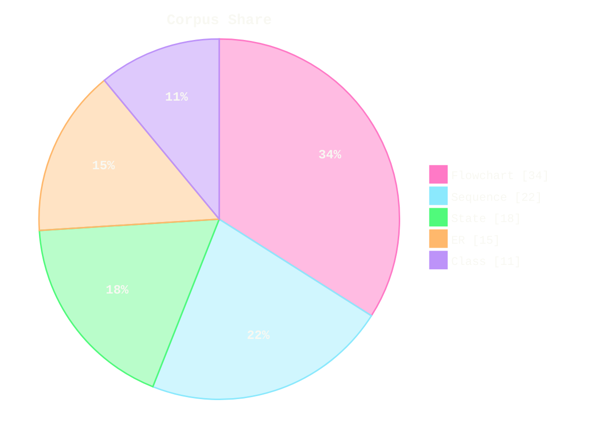

Values sum above `0`, labels are quoted, and `showData` prints values in the legend; donut, legend position, and slice highlight compose on it. `pieOpacity` dims fill and border together, so the translucent-fill law rides per-slice `path.pieCircle:nth-of-type(N)` stamps — alpha in the fill, the same hue at full opacity in the stroke, `pieOpacity: 1` holding the border solid. Slices follow `pie1`–`pie12` in declaration order, so the nth-of-type index and the ordinal share one count. Slice percentages print at 13px bold Foreground through `pieSectionTextSize`/`pieSectionTextColor` and the `.slice` weight stamp — every slice hue sits in the light-ink alpha tier so one ink serves all slices — and `pieOuterStrokeWidth: "0px"` retires the redundant outer ring.

## [07]-[QUADRANT_CHART]

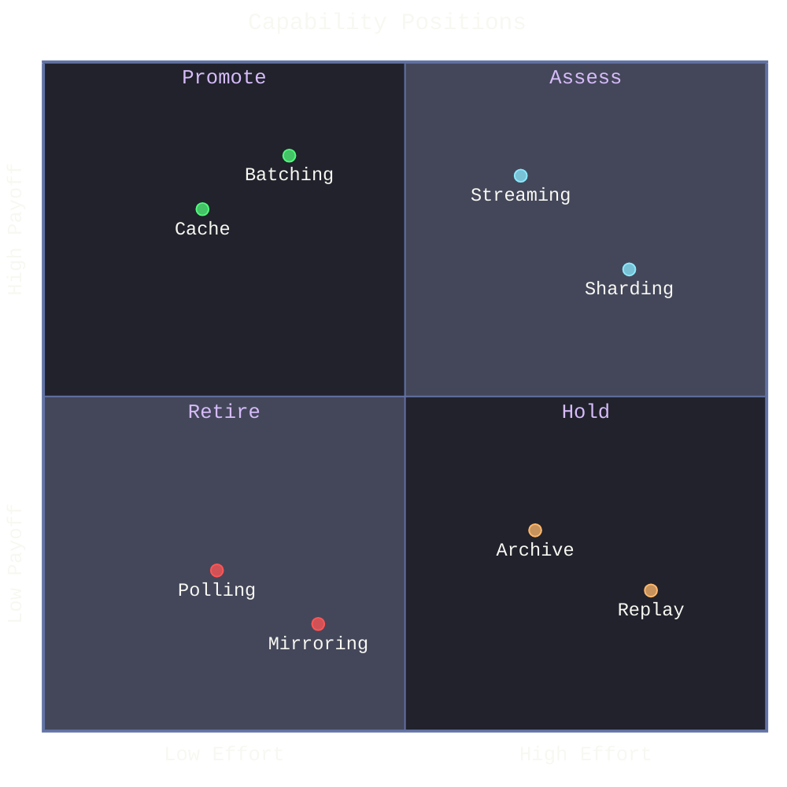

Coordinates bind to `0` through `1` and quadrants number `1` top-right counterclockwise; per-point styling trails the coordinates and `:::class` plus `classDef` reuses it with keys `radius`, `color`, `stroke-color`, `stroke-width` — six-digit hex only, so translucency rides the one `.data-point circle{fill-opacity:.75}` stamp while the class stroke stays full. `pointRadius` and the class radius hold the −25% dot scale, and `pointTextPadding` drops each white label clear below its dot — the dot never blocks its name. Quadrant fills alternate the two neutral surfaces so the plotted hues carry all the semantics, quadrant captions ink Lavender as this family's container titles, and axis text, point labels, and the title ink Foreground.

## [08]-[SANKEY]

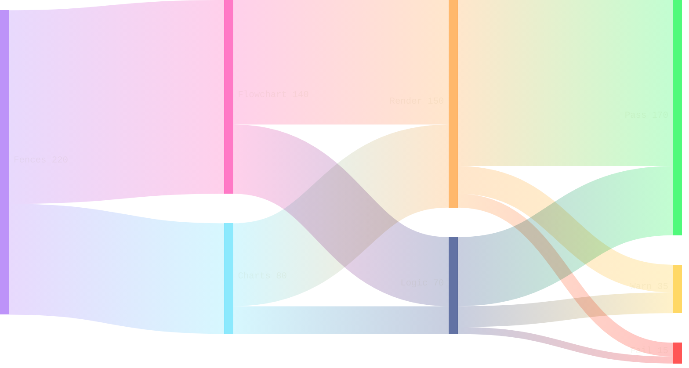

Fence content asserts a corpus splitting through render and logic gates into pass, warn, and fail sinks; the family rejects `accTitle`/`accDescr` at parse, so the relation sentence rides beside the fence. `sankey` is the keyword; the body is strictly three-column CSV `source,target,value` with CSV quoting for embedded commas, and blank lines are permitted only without comma separators. Config carries `linkColor` (`gradient`, `source`, `target`, or a hex), `nodeAlignment`, `showValues`, `prefix`/`suffix`, the geometry knobs, and the `nodeColors` name-to-hex map — a committed sankey maps every node to a palette hex. Default blending applies `mix-blend-mode: multiply`, which erases links into a dark canvas, so the `.link` stamp restores normal blending at a `.35` stroke opacity; `labelStyle` stays `legacy` — the outlined mode strokes a surface-colored halo that mushes on dark — and `.node-labels text` inks Foreground at the label floor.

## [09]-[XYCHART]

```mermaid
---
config:
  theme: base
  look: classic
  xyChart:
    showDataLabel: true
    showDataLabelOutsideBar: true
    titleFontSize: 15
  themeVariables:
    darkMode: true
    fontFamily: "SF Mono, Menlo, Cascadia Mono, Segoe UI Mono, Consolas, monospace"
    useGradient: false
    dropShadow: "none"
    xyChart:
      backgroundColor: "#282A36"
      titleColor: "#F8F8F2"
      dataLabelColor: "#F8F8F2"
      xAxisLabelColor: "#F8F8F2"
      xAxisTitleColor: "#F8F8F2"
      xAxisTickColor: "#6272A4"
      xAxisLineColor: "#6272A4"
      yAxisLabelColor: "#F8F8F2"
      yAxisTitleColor: "#F8F8F2"
      yAxisTickColor: "#6272A4"
      yAxisLineColor: "#6272A4"
      plotColorPalette: "#BD93F9, #FF79C6"
  themeCSS: ".bar-plot-0 rect{fill-opacity:.75;stroke-width:1.5px}.plot text{font-size:11px}"
---
xychart
  accTitle: Corpus growth
  accDescr: Fences added per quarter as bars with the cumulative corpus size as a line overlay.
  title "Corpus Growth"
  x-axis "Quarter" ["Q1", "Q2", "Q3", "Q4", "Q5", "Q6", "Q7"]
  y-axis "Fences" 0 --> 400
  bar [42, 58, 66, 54, 71, 63, 39]
  line [42, 100 "100", 166 "166", 220 "220", 291 "291", 354 "354", 393 "393"]
```

`xychart` is the keyword; `xychart horizontal` flips orientation and each `bar` or `line` array matches the x-axis category count. Bar width derives from the category count against a fixed padding percent — width tunes by adding categories, never by a knob. `showDataLabel` prints the first declared plot's values at a size computed from bar width, so the bar plot declares first, `showDataLabelOutsideBar` lifts the values above the bars, and the `.plot text` stamp caps the computed size at the label floor. Bars carry the translucent law through `.bar-plot-0 rect{fill-opacity:.75;stroke-width:1.5px}` — the engine already strokes each bar in its own hue at width zero. Inline point labels (`50 "50"`, from mermaid 11.16) render on `line` only — the syntax parses on `bar` while the labels silently drop — and ink the line's palette hue; a label omitted on a point suppresses that one chip, which clears the first-category collision when line and bar meet at the origin.

## [10]-[RADAR]

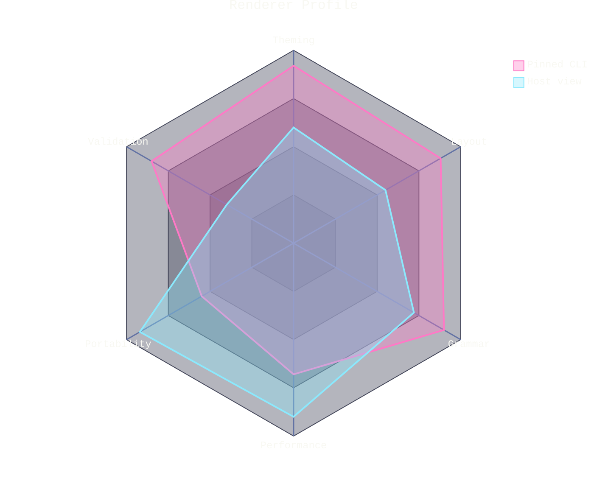

`axis` names the axes, a positional curve `name["Label"]{...}` follows axis order and a keyed curve binds by axis id. Curves fill and stroke `cScale0`–`cScale11` in declaration order with `radar.curveOpacity` on the fill alone, so two curves at `.35` both read while their full-hue 2px strokes hold the border law — identical data across curves cancels into one pale polygon, so each curve carries distinct values, and hues follow the ordinal order so the legend reads as the palette does; the subject-count law is the construction reference's property. `graticule` accepts `polygon` or `circle`, config admits `axisScaleFactor` and `curveTension`, and theme variables nest under `radar:`. Axis labels anchor just outside the chart radius and clip at the viewport edge — the `radar:` config margins own that clearance, and the hardcoded legend position demands short curve labels. Axis lines read `radar.axisColor` while axis text falls through to root `textColor`.

## [11]-[GANTT]

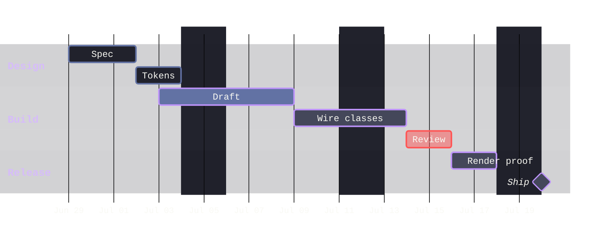

Dates match `dateFormat`, `after`/`until` reference existing IDs, and modifiers are `done`, `active`, `crit`, `milestone`, `vert`; repeated `excludes` and `includes` entries stack. `excludeBkgColor` recesses the excluded bands — left unset it derives a light gray that floods a dark canvas — and `axisFormat` with `tickInterval` own tick legibility; default daily ISO ticks overlap into an unreadable strip. Section titles are this family's lane titles and take the container-title stamp with Lavender ink through `.sectionTitle`; `taskTextDarkColor` joins the Foreground ink set because done bars recess to `#21222C`; `vertLineColor` colors the full-height `vert` gate marker, an `after` list (`after a b`) converges on every named prerequisite, `weekday` anchors the tick grid, and the today rule spans the whole canvas — its `todayMarker` style string carries a translucent stroke so it never blinds what it crosses.

## [12]-[TREEMAP]

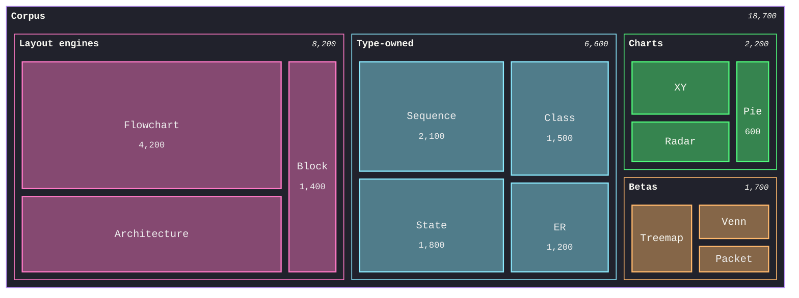

Indentation sets hierarchy and a leaf carries a numeric value; `valueFormat` formats values through d3-format grammar alongside `showValues`. Branch hues assign from `cScale0`–`cScale11` in branch declaration order with `cScalePeer` strokes, so the ordinal roster is the palette surface — `classDef` on a branch emits inline `!important` fills that lock out every stylesheet correction, so a themed treemap carries no classes. Sections recess to `#21222C` through the `.treemapSection` stamp while their full-hue peer borders carry the branch identity, leaves composite the translucent law at `.45` fill-opacity under 1.5px hue borders, and `cScaleLabel0`–`cScaleLabel11` ink Foreground so every label reads over the composited tiles. Section headers take the container-title stamp, section values lift to 12px, and the leaf label/value stamps cap the engine's fit-to-tile sizing at the ramp.

## [13]-[C4]

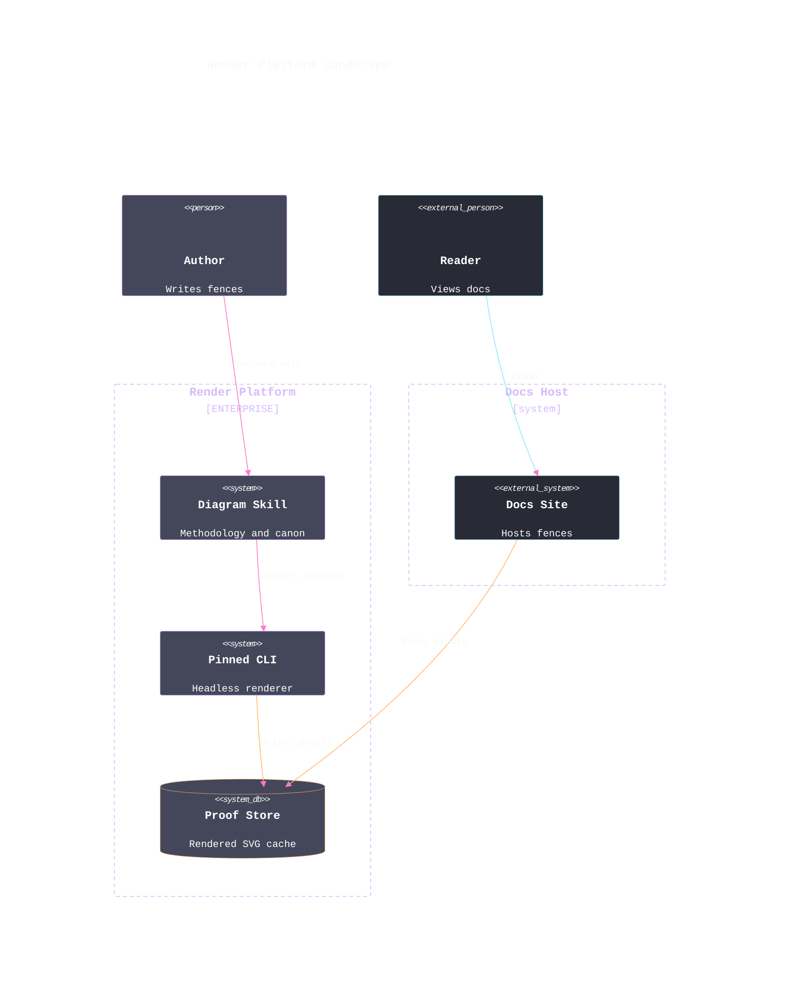

Family coverage spans `C4Context`, `C4Container`, `C4Component`, `C4Dynamic`, `C4Deployment`; an alias exists before `Rel()` and named parameters take `$`. Element colors are config keys — `person_bg_color`, `system_border_color`, `external_system_bg_color`, and kin under `c4:` — so the palette lands without per-element calls, while `UpdateRelStyle` colors each relation and offsets its label clear of boxes with `$offsetX`/`$offsetY`. Fonts are config keys too: every shape family carries a `*FontFamily`/`*FontSize`/`*FontWeight` triplet — element, boundary, and relation text hardcodes its per-family default inline, leaving `themeVariables.fontFamily` to reach only the free diagram title, so the triplets carry the mono stack and the ramp, and the sizes feed the engine's own box measurement. Boundary strokes, boundary titles, and the diagram title hardcode `#444444`, and the `rect[stroke='#444444']`/`text[fill='#444444']` attribute hooks re-ink them Lavender at the container rhythm; the `[id$='-arrowhead']`/`[id$='-arrowend']` markers default black and take canon pink at the unified scale anchored on their ref points. Person sprites are baked raster images — `image{display:none}` retires them and the `<<person>>` stereotype carries the role. Loose shapes pack in rows above every boundary and a third loose shape lands beneath the first where relations cross it, so external systems live in their own `Boundary` and the boundaries pack side by side.

## [14]-[ARCHITECTURE]


`group` and `service` place nodes, a member declares `in group`, edge ports are `T|B|L|R`, a `junction` joins edges, a group-boundary edge takes `{group}`, and an Iconify icon resolves as `pack:name`. Layout is cytoscape fcose: the port pairs plus `align row|column` rows fully determine the grid, so a committed fence aligns every rank both ways and earns orthogonal edges — unaligned members scatter diagonally, and an `align` row fails where its declared order contradicts a directional-edge constraint. Arrowheads are `polygon.arrow` elements filled from `archEdgeArrowColor`, which derives gray unless set; a CSS transform on those polygons erases their placement translate, so arrow size tunes only through `iconSize` (the arrow is one sixth of it). Built-in icons hardcode a blue plate on services and groups alike — the paired `.architecture-service svg rect,.architecture-groups svg rect` stamp re-fills both to Selection — group titles are bare `text` under `.architecture-groups` and take the Lavender container-title stamp there, service labels take the node-label ramp through `.architecture-services text`, `archGroupBorderColor` with the `5 4` dash rhythm draws the Lavender containment, and `architecture.seed` is the deterministic lock. Junction endpoints shift arrow polygons off their lines, so junctions stay grammar for genuine multi-way joins rather than demo decoration.

## [15]-[PACKET]

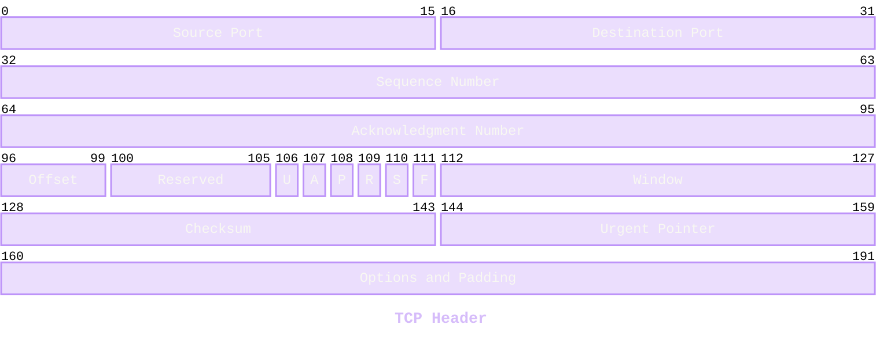

`packet` is the keyword; `start-end: "name"` ranges and `+count: "name"` auto-counted fields mix under an optional `title`, blocks stay contiguous, and `accTitle`/`accDescr` are accepted. Family styling themes through `themeCSS` classes — `.packetBlock` fill and stroke, `.packetLabel`, `.packetByte`, `.packetTitle` — which own the whole surface; the nested `themeVariables.packet` block half-applies (title keys land, block keys re-derive), so the class route is the single styling owner. Fields composite the translucent law as one hue family — a bit layout is one structure, never a rainbow — with Foreground labels, Foreground bit indices at 11px, and the Lavender title at container weight; `bitWidth` and `rowHeight` size the raster.

## [16]-[TIMELINE]

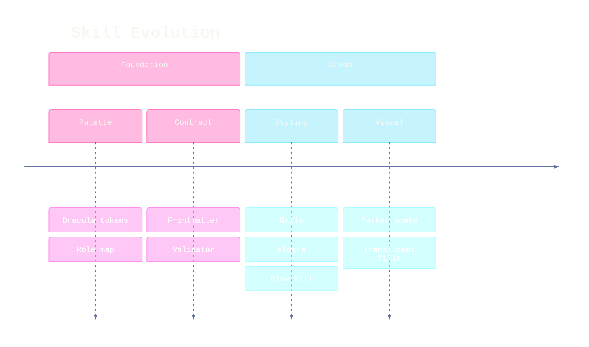

A multi-event row repeats `:`, sections group periods, and timeline takes `LR`/`TD` direction headers. Family parses `accTitle`/`accDescr` while emitting neither into the SVG, so the relation sentence also rides beside the fence. Ordinal fills read `cScale0`–`cScale11`, but theme resolution converts them through hsl and strips alpha, so translucency rides `.node-bkg{fill-opacity:.5}` with per-section full-hue borders — section classes index from `-1`, so the first section is `.section--1` — while `cScaleLabel0`–`cScaleLabel11` carry Foreground ink over the composited fills and the engine underline strips retire through `[class^='node-line']`. Unclassed axis (`line[stroke-width='4']`) and dashed event connectors (`line[stroke-dasharray='5,5']`) restyle by attribute into one Comment wayfinding system at ladder weights, and the single shared `[id$='-arrowhead']` marker takes the same hue — one marker serves the axis and every connector, so the wayfinding layer holds one color.

## [17]-[GITGRAPH]

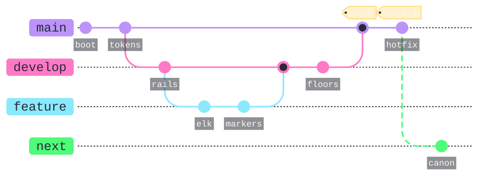

Directions are `LR:`, `TB:`, `BT:`; a branch exists before checkout or merge, commit IDs stay unique, and cherry-picking a merge commit adds `parent:`. Branch rails are `.arrow` paths the engine draws at 8px — the stamp pulls them to the standing 2px — and commit dots scale −25% through one transform on `.commit-bullets circle`, which preserves the merge and highlight ring ratios a radius override collapses. Merge dot cores fill `primaryColor`, so a canvas-valued `primaryColor` renders merges as hollow rings on the branch hue. `rotateCommitLabel: false` keeps commit ids horizontal on their recessed `commitLabelBackground` chips at `commitLabelFontSize`, and the tag is the yellow-law chip stamped through `.tag-label-bkg`/`.tag-label`/`.tag-hole` CSS — the class route holds the translucent gold on hosts that strip theme-variable alpha. Branch rails differentiate by line style as well as hue: `.arrowN` classes index the branch declaration order, and only a genuinely unmerged branch takes the `6 6` planned rhythm — a dashed rail on merged history states a false repository fact. Branch label pills stay opaque brand chips with `gitBranchLabel0`–`gitBranchLabel7` dark ink.

## [18]-[KANBAN]

```mermaid
---
config:
  theme: base
  look: classic
  kanban:
    sectionWidth: 210
    ticketBaseUrl: '<ticket-url>#TICKET#'
  themeVariables:
    darkMode: true
    fontFamily: "SF Mono, Menlo, Cascadia Mono, Segoe UI Mono, Consolas, monospace"
    useGradient: false
    dropShadow: "none"
    textColor: "#F8F8F2"
    background: "#44475A"
    nodeBorder: "#BD93F9"
    cScale0: "#21222C"
    cScale1: "#21222C"
    cScale2: "#21222C"
    cScale3: "#21222C"
    cScale4: "#21222C"
    cScale5: "#21222C"
    cScale6: "#21222C"
    cScale7: "#21222C"
    cScaleLabel0: "#D6BCFA"
    cScaleLabel1: "#D6BCFA"
    cScaleLabel2: "#D6BCFA"
    cScaleLabel3: "#D6BCFA"
    cScaleLabel4: "#D6BCFA"
    cScaleLabel5: "#D6BCFA"
    cScaleLabel6: "#D6BCFA"
    cScaleLabel7: "#D6BCFA"
  themeCSS: ".nodeLabel{font-size:13px;font-weight:500}.cluster-label .nodeLabel{font-size:13.5px;font-weight:700;color:#D6BCFA}.node rect{stroke-width:1.5px;filter:none!important}line[stroke='red']{stroke:#FF5555;stroke-width:3px}line[stroke='orange']{stroke:#FFB86C;stroke-width:3px}line[stroke='blue']{stroke:#6272A4;stroke-width:3px}line[stroke='lightblue']{stroke:#44475A;stroke-width:3px}"
---
kanban
  todo[Backlog]
    t1[Marker scale audit]@{ ticket: MD-101, assigned: 'Agent', priority: 'High' }
    t2[Container title bump]@{ ticket: MD-102, assigned: 'Author', priority: 'Low' }
  wip[In Progress]
    t3[Translucent fills]@{ ticket: MD-103, assigned: 'Agent', priority: 'Very High' }
    t4[Padding to 25]@{ ticket: MD-104, assigned: 'Agent', priority: 'Low' }
  review[Review]
    t5[Yellow ink flip]@{ ticket: MD-105, assigned: 'Reviewer', priority: 'High' }
  done[Done]
    t6[Glow kill]@{ ticket: MD-106, assigned: 'Author', priority: 'Very Low' }
    t7[Elbow routing]@{ ticket: MD-107, assigned: 'Agent', priority: 'Low' }
```

Fence content asserts four queues carrying seven law cards with ticket metadata; the family mis-handles `accTitle`/`accDescr` as columns, so the relation sentence rides beside the fence. Tasks indent under columns, metadata keys are `assigned`, `ticket`, `priority`, and priorities are exactly `Very High`, `High`, `Low`, `Very Low`; `kanban.ticketBaseUrl` links each ticket by substituting the task ticket for `#TICKET#`. Column fills read `cScale0`–`cScale11` shifted one — column classes index from `section-1` — so the full ordinal range recesses the columns; cards fill the `background` variable under `nodeBorder` strokes, and column titles are `.cluster-label .nodeLabel` container titles taking the 13.5px/700 Lavender stamp. Priority bars hardcode named colors, and the `line[stroke='red'|'orange'|'blue'|'lightblue']` attribute hooks remap them onto the severity ladder at 3px.

## [19]-[TREEVIEW]


TreeView parses box-drawing input, a trailing `/` marking a directory; annotations trail an entry as `:::class`, `## description`, and `icon(name)`/`icon(none)`. Config carries `rowIndent`, `paddingY`, `labelFontSize`, `labelColor`, and `lineColor`, which land directly, while the highlight and description surfaces restyle through `themeCSS` — `.treeView-highlight-bg` as the yellow-law chip (translucent gold fill, full gold stroke, the white label riding over it) and `.treeView-node-description` in Cyan as typed annotation ink, the hue pair that separates attention from information. `showIcons`, `defaultIconPack`, `filenameIcons`, and `extensionIcons` govern icons; an unregistered icon renders as a question mark, and `highlight` is the one class name with built-in geometry.

## [20]-[CYNEFIN]

```mermaid
---
config:
  theme: base
  look: classic
  cynefin:
    seed: 7
  themeVariables:
    darkMode: true
    fontFamily: "SF Mono, Menlo, Cascadia Mono, Segoe UI Mono, Consolas, monospace"
    useGradient: false
    dropShadow: "none"
    textColor: "#F8F8F2"
    mainBkg: "#44475A"
    cynefin:
      domainFontSize: 14
      itemFontSize: 12
      textColor: "#F8F8F2"
      labelColor: "#D6BCFA"
      boundaryColor: "#6272A4"
      boundaryWidth: 1.5
      cliffColor: "#FF5555"
      cliffWidth: 2
      arrowColor: "#FF79C6"
      arrowWidth: 2
      complexBg: "#50FA7B33"
      complicatedBg: "#8BE9FD33"
      clearBg: "#FFD86633"
      chaoticBg: "#FF555533"
      confusionBg: "#BD93F933"
  themeCSS: ".cynefinItem{fill:#44475A;stroke:#6272A4}.cynefinItemText{fill:#F8F8F2}"
---
cynefin-beta
  accTitle: Failure domain sort
  accDescr: Render faults sorted across the five cynefin domains with two labeled reclassifications as understanding grows.
  complex
    "Flaky layout drift"
    "Host CSS bleed"
  complicated
    "Marker scale math"
    "Contrast audit"
  clear
    "Restart renderer"
    "Pin the CLI"
  chaotic
    "Corpus-wide breakage"
  confusion
    "Unclassified fault"
  complex --> complicated : "Pattern found"
  chaotic --> clear : "Order imposed"
```

Domains `complex`, `complicated`, `clear`, `chaotic`, and `confusion` each hold quoted items, and a transition spells `domain --> domain : "label"`; domain fills, boundary, cliff, and arrow color nest under `cynefin:`. Domain tints carry the translucent law — the engine multiplies each `*Bg` by a `.4` fill-opacity, so a ~20% alpha hex lands near an 8% composite wash that keeps items legible — while `.cynefinItem`/`.cynefinItemText` chip the items on Selection with Foreground ink and `labelColor` inks the domain captions Lavender. A cliff separates chaotic from clear as canonical geometry, taking Red at 2px; transitions curve center to center with a fixed 15% bow and the arrow tip lands beside the target caption — engine geometry, so a committed fence keeps transitions few and lets the label ride the bow's midpoint. `cynefin.seed` pins the boundary jitter.

## [21]-[RAILROAD]

```mermaid
---
config:
  theme: base
  look: classic
  railroad:
    fontSize: 13
    fontFamily: "SF Mono, Menlo, Cascadia Mono, Consolas, monospace"
    strokeWidth: 2
    padding: 16
    lineColor: "#6272A4"
    markerFill: "#FF79C6"
    markerRadius: 4
    terminalFill: "#FFD86654"
    terminalStroke: "#FFD866"
    terminalTextColor: "#F8F8F2"
    nonTerminalFill: "#44475A"
    nonTerminalStroke: "#BD93F9"
    nonTerminalTextColor: "#F8F8F2"
    ruleNameColor: "#D6BCFA"
    specialFill: "#21222C"
    specialStroke: "#6272A4"
    commentFill: "#21222C"
    commentStroke: "#6272A4"
    commentTextColor: "#F8F8F2"
  themeVariables:
    darkMode: true
    fontFamily: "SF Mono, Menlo, Cascadia Mono, Segoe UI Mono, Consolas, monospace"
    useGradient: false
    dropShadow: "none"
    textColor: "#F8F8F2"
---
railroad-ebnf-beta
accTitle: Numeric literal grammar
accDescr: A signed decimal number production with fraction and exponent over sign, integer, and exponent rules.
title "Numeric Literal"

number = [ sign ] integer [ "." digit { digit } ] [ exponent ] ;
sign = "+" | "-" ;
integer = "0" | nonzero { digit } ;
exponent = ( "e" | "E" ) [ sign ] digit { digit } ;
```

Keyword choice selects the grammar parser — `railroad-ebnf-beta` for EBNF, `railroad-abnf-beta` for ABNF, `railroad-peg-beta` for PEG, and `railroad-beta` for Mermaid's intermediate constructors. `railroad:` config owns the whole visual surface — fills, strokes, text colors, `lineColor`, `markerFill`, `markerRadius`, `strokeWidth`, `fontSize`, `fontFamily` — sanitized to hex (alpha included), functional color spaces, and named colors. Terminals chip as the yellow-law surface (translucent gold, full gold stroke, Foreground ink), nonterminals ride Selection under Purple, rails run Comment at the standing 2px, rule names ink Lavender bold, and the start/end dots take pink at the −25% radius. In this EBNF dialect `? ... ?` is a special sequence, so optionality spells `[ ... ]` and repetition `{ ... }` — a postfix `?` fuses everything up to the next `?` into one special box.

## [22]-[SWIMLANE]

```mermaid
---
config:
  theme: base
  look: classic
  swimlane:
    lineHops: arc
  themeVariables:
    darkMode: true
    fontFamily: "SF Mono, Menlo, Cascadia Mono, Segoe UI Mono, Consolas, monospace"
    useGradient: false
    dropShadow: "none"
    textColor: "#F8F8F2"
    titleColor: "#D6BCFA"
    primaryColor: "#44475A"
    primaryTextColor: "#F8F8F2"
    primaryBorderColor: "#BD93F9"
    mainBkg: "#44475A"
    nodeBorder: "#BD93F9"
    lineColor: "#FF79C6"
    tertiaryColor: "#21222C"
    clusterBkg: "#21222C"
    clusterBorder: "#D6BCFA"
    edgeLabelBackground: "#21222C"
    labelBackgroundColor: "#21222C"
  themeCSS: ".nodeLabel{font-size:13px;font-weight:500}.edgeLabel{font-size:12px;font-weight:500}.cluster-label .nodeLabel,.cluster-label text{font-size:13.5px;font-weight:700;letter-spacing:.08em}.node rect,.node circle,.node polygon,.node path{stroke-width:1.5px;filter:none!important}.swimlane-title{fill:#21222C}.swimlane-body{stroke:#D6BCFA}.marker path{transform:scale(.8);transform-origin:5px 5px}.edgeLabel rect{transform-box:fill-box;transform-origin:center;transform:scale(1.1,1.2)}"
---
swimlane-beta
  accTitle: Fence review lanes
  accDescr: A fence drafted by the author, themed by the agent, gated by the validator lane on the critical path, and proven by the renderer.
  subgraph author[AUTHOR]
    Draft([Draft fence])
    Commit([Commit])
  end
  subgraph agent[AGENT]
    Theme[Apply canon]
    Inspect[Inspect PNG]
  end
  subgraph validator[VALIDATOR]
    Gate{Gate?}
  end
  subgraph renderer[RENDERER]
    Render[Render proof]
  end
  Draft --> Theme
  Theme --> Gate
  Gate -->|pass| Render
  Gate --> Theme
  Render --> Inspect
  Inspect --> Commit
  classDef primary fill:#44475A,stroke:#FF79C6,color:#F8F8F2
  classDef boundary fill:#282A36,stroke:#BD93F9,color:#F8F8F2
  classDef error fill:#FF555580,stroke:#FF5555,color:#F8F8F2
  class Draft,Commit boundary
  class Theme,Inspect,Render primary
  class Gate error
  linkStyle 3 stroke:#FF5555,stroke-width:3px,color:#F8F8F2
  linkStyle 4 stroke:#50FA7B,color:#F8F8F2
  style validator fill:#BD93F91A,stroke:#BD93F9
```

A standalone diagram reusing the flowchart body under a layered orthogonal layout: every top-level `subgraph` is a lane, nodes inside it belong to it, and loose nodes fall into a synthetic unlabeled lane. Full flowchart styling travels — `classDef`, `class`, `linkStyle`, edge labels — so the edge-rail law binds here verbatim; `swimlane.lineHops: arc` hops edge crossings, and `style laneId fill:...,stroke:...` emphasizes the critical-path lane as a translucent purple band. Lane titles are `.cluster-label` container titles taking the 13.5px/700 Lavender stamp over a recessed `.swimlane-title` band with `.swimlane-body` Lavender walls. A label on a return edge orphans away from its stroke, so the fault return rides the Red rail alone — color carries the semantics the label cannot.

## [23]-[EVENTMODELING]

```mermaid
---
config:
  theme: base
  look: classic
  themeVariables:
    darkMode: true
    fontFamily: "SF Mono, Menlo, Cascadia Mono, Segoe UI Mono, Consolas, monospace"
    useGradient: false
    dropShadow: "none"
    textColor: "#F8F8F2"
    emUiFill: "#44475A"
    emUiStroke: "#BD93F9"
    emCommandFill: "#44475A"
    emCommandStroke: "#8BE9FD"
    emEventFill: "#44475A"
    emEventStroke: "#FFB86C"
    emProcessorFill: "#21222C"
    emProcessorStroke: "#6272A4"
    emReadModelFill: "#21222C"
    emReadModelStroke: "#50FA7B"
    emSwimlaneBackgroundOdd: "#282A36"
    emSwimlaneBackgroundStroke: "#44475A"
    emArrowhead: "#FF79C6"
    emRelationStroke: "#FF79C6"
  themeCSS: ".em-box span{font-family:'SF Mono',Menlo,'Cascadia Mono',Consolas,monospace;font-size:13px;color:#F8F8F2}.em-box code{color:#8BE9FD;font-size:11px}.em-swimlane text{fill:#D6BCFA;font-size:13.5px;font-family:'SF Mono',Menlo,'Cascadia Mono',Consolas,monospace}"
---
eventmodeling
  tf 01 ui CartUI { "sku": "A1" }
  tf 02 cmd AddItem
  tf 03 evt ItemAdded `json`{ "qty": 1 }
  tf 04 rmo CartView
  tf 05 ui CheckoutUI
  tf 06 cmd Checkout
  tf 07 evt CheckedOut
  tf 08 pcr PaymentProcessor
  tf 09 evt PaymentRequested `json`{ "total": 42 }
```

Fence content asserts a cart flow from UI through commands and events into a read model and a payment processor; `accTitle`/`accDescr` parse but emit nothing into the SVG, so the relation sentence rides beside the fence. `tf`/`timeframe` orders frames left to right and `rf`/`resetframe` restarts the clock; frame kinds are `ui`, `cmd`, `evt`, `pcr` (processor), and `rmo` (read model), an inline `{ ... }` or `` `json`{ ... } `` payload annotates a frame, and each kind reads its `em*Fill`/`em*Stroke` pair. Relations infer from the nearest prior frame in a different lane, so declaration order draws the chain. Frame text hardcodes a bold 16px sans inside `foreignObject` spans — the `.em-box span` stamp restores the mono stack at 13px with Foreground ink, `.em-box code` inks payloads Cyan at 11px, and `.em-swimlane text` carries the lane titles in Lavender mono. Namespaced frame ids (`stream.Name`) map onto extra swimlanes.

## [24]-[VENN]

```mermaid
---
config:
  theme: base
  look: classic
  themeVariables:
    darkMode: true
    fontFamily: "SF Mono, Menlo, Cascadia Mono, Segoe UI Mono, Consolas, monospace"
    useGradient: false
    dropShadow: "none"
    textColor: "#F8F8F2"
    vennTitleTextColor: "#F8F8F2"
    vennSetTextColor: "#F8F8F2"
  themeCSS: ".venn-title{font-size:15px;font-weight:600}.venn-circle text{font-size:14px;font-weight:600}.venn-intersection text{font-size:12px}.venn-text-node{font-size:12px}"
---
venn-beta
  title Corpus Coverage
  set A["Authored"] : 80
  set B["Rendered"] : 70
  set C["Validated"] : 60
  union A,B ["Proofed"] : 42
  union B,C ["Gated"] : 34
  union A,C : 26
  union A,B,C ["Canon"] : 18
  style A fill: #BD93F9, fill-opacity: 0.3, stroke: #BD93F9, stroke-width: 1.5, color: #F8F8F2
  style B fill: #8BE9FD, fill-opacity: 0.3, stroke: #8BE9FD, stroke-width: 1.5, color: #F8F8F2
  style C fill: #50FA7B, fill-opacity: 0.3, stroke: #50FA7B, stroke-width: 1.5, color: #F8F8F2
```

Fence content asserts three weighted sets overlapping into labeled proof regions; the family rejects `accTitle`/`accDescr` at parse, so the relation sentence rides beside the fence. `set id["Label"] : size` declares a weighted set, `union A,B ["Label"] : size` sizes and captions an overlap, higher-arity unions list every member, and `style targets key: value, ...` carries per-set `fill`, `fill-opacity`, `stroke`, `stroke-width`, and `color` — the translucent law lands natively as hue fills at `.3` under full-hue strokes with per-set Foreground label ink. Region captions ride the union labels at the region centroids, so overlaps read without leaders or a legend. Set and intersection label sizes scale from canvas width at engine ratios; the `.venn-title`, `.venn-circle text`, and `.venn-intersection text` stamps pull them onto the type ramp. Up to eight sets read `venn1`–`venn8` where no per-set style speaks.

## [25]-[WARDLEY]

```mermaid
---
config:
  theme: base
  look: classic
  themeVariables:
    darkMode: true
    fontFamily: "SF Mono, Menlo, Cascadia Mono, Segoe UI Mono, Consolas, monospace"
    useGradient: false
    dropShadow: "none"
    textColor: "#F8F8F2"
    wardleyEvolutionColor: "#50FA7B"
    wardley:
      backgroundColor: "#282A36"
      axisColor: "#6272A4"
      axisTextColor: "#F8F8F2"
      gridColor: "#44475A"
      componentFill: "#44475A"
      componentStroke: "#BD93F9"
      componentLabelColor: "#F8F8F2"
      linkStroke: "#FF79C6"
      evolutionStroke: "#50FA7B"
      annotationStroke: "#6272A4"
      annotationTextColor: "#F8F8F2"
      annotationFill: "#282A36"
---
wardley-beta
  accTitle: Render capability map
  accDescr: An author need anchored on the diagram skill whose dependencies slide from custom fences toward commodity browsers and caches.
  title Render Capability
  component Author [0.95, 0.63]
  component Skill [0.84, 0.30]
  component Fence [0.72, 0.45]
  component CLI [0.60, 0.62]
  component IconPack [0.42, 0.55]
  component Browser [0.38, 0.78]
  component Cache [0.24, 0.82]
  Author->Skill
  Skill->Fence
  Fence->CLI
  CLI->Browser
  CLI->Cache
  Fence->IconPack
  evolve IconPack 0.75
```

Coordinates are `[visibility, evolution]` on `0`–`1`; `component` places a capability, `->` a dependency link, `evolve` draws the evolution trend to a target maturity, and OWM grammar adds `pipeline`, `note`, decorators, and inertia. Colors nest under `wardley:` with `wardleyEvolutionColor` owning the trend arrow — Green marks sanctioned movement. Wardley emits no stylesheet, so `themeCSS`, the mono stack, and font metrics never reach it: label and axis sizes are engine-owned, and the `anchor` node inks its label engine-black, so a dark-canvas map models the user need as its top component instead. Component nodes ride `componentFill`/`componentStroke`, labels `componentLabelColor`, links `linkStroke`, and the stage boundary dashes stay engine-dark as background texture.

## [26]-[ISHIKAWA]

```mermaid
---
config:
  theme: base
  look: classic
  themeVariables:
    darkMode: true
    fontFamily: "SF Mono, Menlo, Cascadia Mono, Segoe UI Mono, Consolas, monospace"
    useGradient: false
    dropShadow: "none"
    textColor: "#F8F8F2"
    primaryColor: "#44475A"
    primaryTextColor: "#F8F8F2"
    primaryBorderColor: "#BD93F9"
    mainBkg: "#44475A"
    lineColor: "#FF79C6"
---
ishikawa-beta
  "Render Failure"
    Browser
      "Chromium missing"
        "PATH empty"
        "Sandbox denied"
      "Stale headless flag"
    Assets
      "Remote icon"
        "Registry offline"
      "Remote image"
        "Blocked CDN"
    Syntax
      "Syntax drift"
        "Renamed keyword"
      "Reserved word"
```

Fence content asserts a render failure traced through browser, asset, and syntax cause families into nested sub-causes; the family mis-handles `accTitle`/`accDescr`/`title` as spurious head nodes, so the relation sentence rides beside the fence. A quoted head names the effect, top-level identifiers are cause categories, quoted children are causes, and depth rides indentation — meaningful growth deepens existing branches into sub-causes rather than adding head-level categories. Beta styling reads the general variables only: `lineColor` draws spine, branches, arrowheads, and box borders, `mainBkg` fills the head and cause boxes, and sub-branches thin to 1px under the 2px primary bones — the ladder expressed with the two weights the engine owns.
