# [SYNTAX_EXTENDED]

The diagram roster beyond the five core types — each admitted row carries its working form and the traps that bind it, and a registered row outside the admitted scope carries its registry entry alone.

## [01]-[REGISTRY]

Pick a type by intent, then its section for the minimal fence, version gate, and traps; a dash marks a pre-11 introduction.

| [INDEX] | [TYPE]               | [INTENT]                 |
| :-----: | :------------------- | :----------------------- |
|  [01]   | `mindmap`            | radial hierarchy         |
|  [02]   | `block`              | manual grid layout       |
|  [03]   | `journey`            | phase sentiment          |
|  [04]   | `requirementDiagram` | requirement traceability |
|  [05]   | `pie`                | part-to-whole share      |
|  [06]   | `quadrantChart`      | two-axis position map    |
|  [07]   | `sankey`             | weighted directed flow   |
|  [08]   | `xychart`            | bar or line chart        |
|  [09]   | `radar-beta`         | multivariate profile     |
|  [10]   | `gantt`              | dated schedule           |
|  [11]   | `treemap-beta`       | area-weighted hierarchy  |
|  [12]   | `C4`                 | system landscape views   |
|  [13]   | `architecture-beta`  | infrastructure groups    |
|  [14]   | `packet`             | bit-field layout         |
|  [15]   | `timeline`           | chronological periods    |
|  [16]   | `gitGraph`           | branch and merge history |
|  [17]   | `kanban`             | workflow-stage board     |
|  [18]   | `treeView-beta`      | file-tree hierarchy      |
|  [19]   | `venn-beta`          | set-overlap regions      |
|  [20]   | `ishikawa-beta`      | cause-effect fishbone    |
|  [21]   | `wardley-beta`       | value-chain evolution    |
|  [22]   | `cynefin-beta`       | decision-domain sort     |
|  [23]   | `railroad-beta`      | grammar syntax rails     |
|  [24]   | `swimlane-beta`      | laned process flow       |
|  [25]   | `zenuml`             | sequence via zenuml      |

`venn-beta`, `ishikawa-beta`, and `wardley-beta` are registered and sit outside the admitted scope until a proven fence lands; `zenuml` is an external diagram the CLI registers.

The quantitative rows — pie, xychart, sankey, radar — serve only when the artifact must stay a mermaid fence; a data visualization routes to the dataviz lane.

## [02]-[MINDMAP]

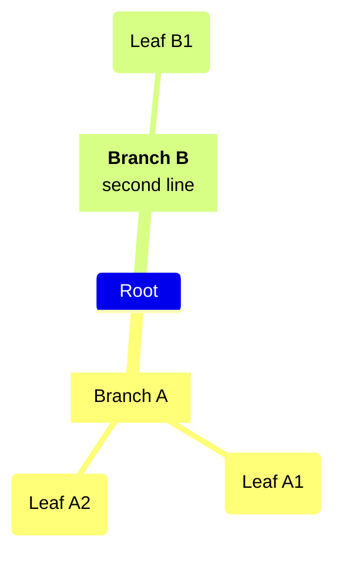

Root leads; consistent indentation sets depth, mixed tabs and spaces are rejected, and explicit edges are invalid.

## [03]-[BLOCK]

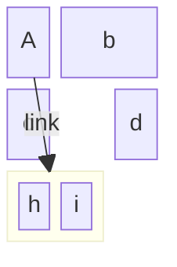

The keyword is `block`; `columns N` precedes a row, a `:n` span widens a block, `space` inserts a filler, and a bare block without a span is valid. A nested `block:id:span ... end` holds its own `columns`, and a labeled edge joins two blocks. A block arrow is `blockArrowId<["Label"]>(dir)` with `dir` one of `right`, `left`, `up`, `down`, `x`, `y`, or a compound like `(x, down)`.

## [04]-[JOURNEY]

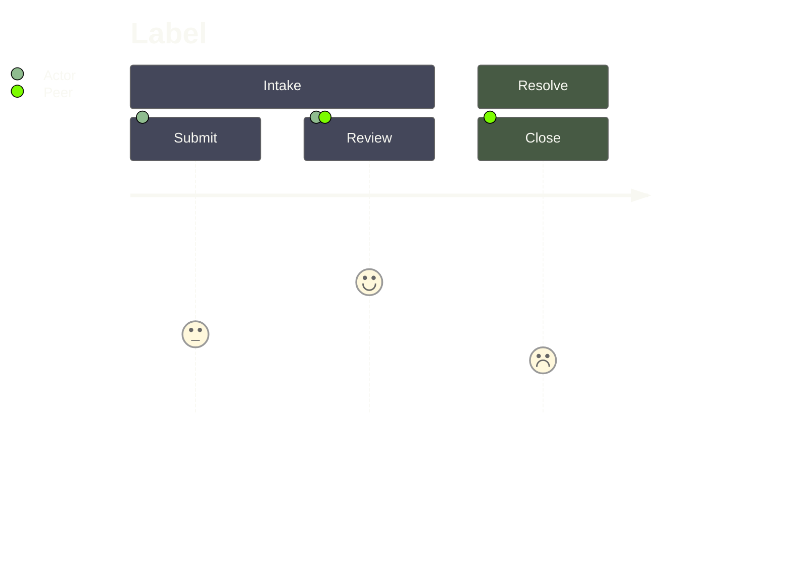

Scores are integers `1` through `5`; a task belongs under a `section`, an actor needs no declaration, and an out-of-range score is invalid.

## [05]-[REQUIREMENT_DIAGRAM]

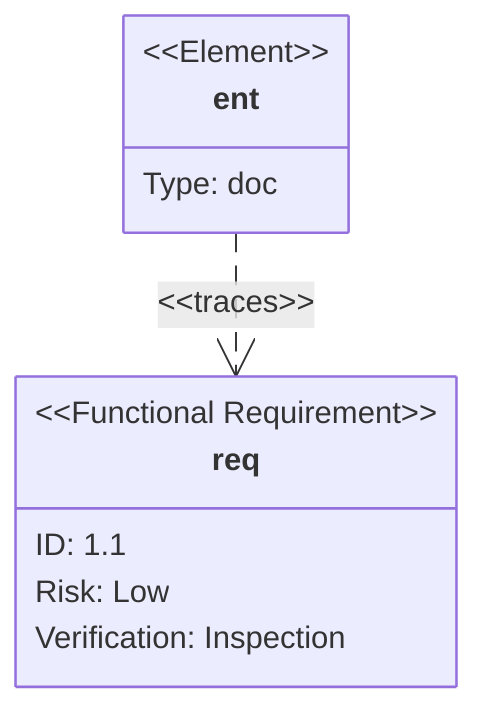

Types are `requirement`, `functionalRequirement`, `interfaceRequirement`, `performanceRequirement`, `physicalRequirement`, `designConstraint`; `risk` takes `Low`/`Medium`/`High` and `verifymethod` takes `Analysis`/`Inspection`/`Test`/`Demonstration`. Relations `contains`, `copies`, `derives`, `satisfies`, `verifies`, `refines`, `traces` spell both `a - satisfies -> b` and `b <- traces - a`, quoted text carries markdown, and the diagram takes `direction` plus the hand-drawn look.

## [06]-[PIE]

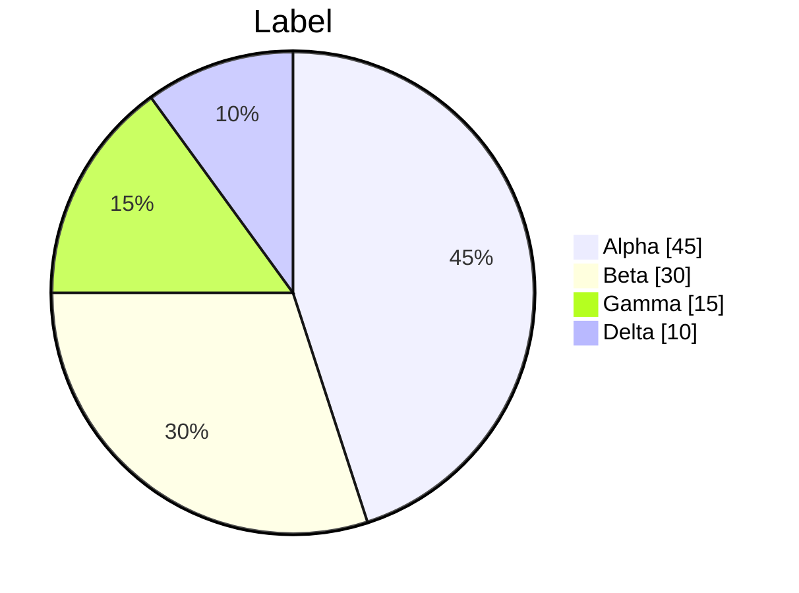

Values sum above `0`, labels are quoted, and `showData` prints percentages; donut, legend, and slice highlight compose on it.

## [07]-[QUADRANT_CHART]


Coordinates bind to `0` through `1` and quadrants number `1` top-right through `4` bottom-right; per-point styling trails the coordinates (`color`, `radius`, `stroke-width`, `stroke-color`) and `:::class` plus `classDef` styles a point. Non-ASCII unquoted labels — CJK, emoji, accented Latin-1 — parse unquoted.

## [08]-[SANKEY]

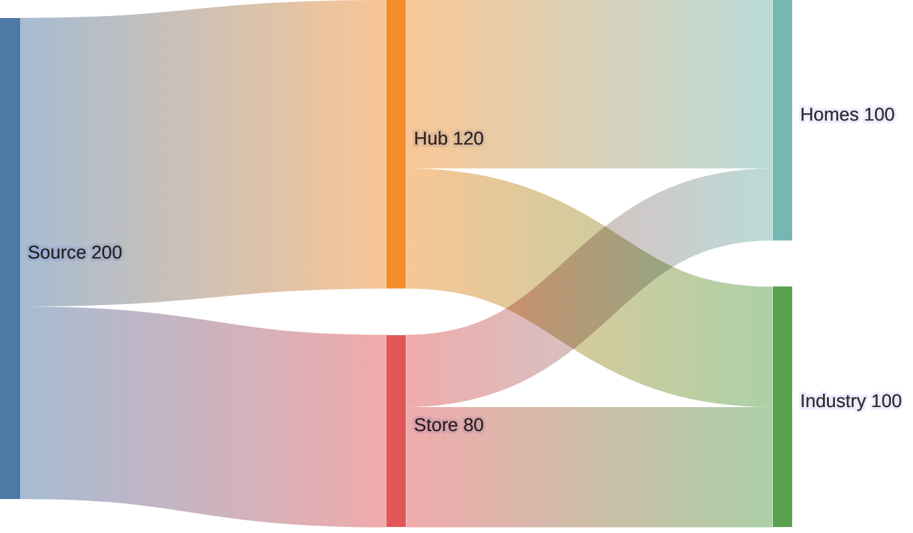

The keyword is `sankey`; the body is three-column CSV `source,target,value` with blank lines allowed and CSV quoting for embedded commas. Config carries `linkColor`, `nodeAlignment`, `showValues`, `prefix`, `suffix`, the styling knobs, and a `nodeColors` name-to-hex map.

## [09]-[XYCHART]

```mermaid
---
config:
  xyChart:
    showDataLabel: true
    xAxis:
      labelRotation: 45
---
xychart
  title "Model Scale"
  x-axis "Quarter" ["Q1", "Q2", "Q3"]
  y-axis "Params (B)" 0 --> 600
  bar [120, 340, 540]
  line [120 "Small", 340 "Mid", 540 "Large"]
```

The keyword is `xychart`; `xychart horizontal` flips orientation and each `bar` or `line` array matches the x-axis category count. Line point labels render on `line` only — accepted but ignored on `bar` — while `showDataLabelOutsideBar` pushes bar values past the bar edge.

## [10]-[RADAR]

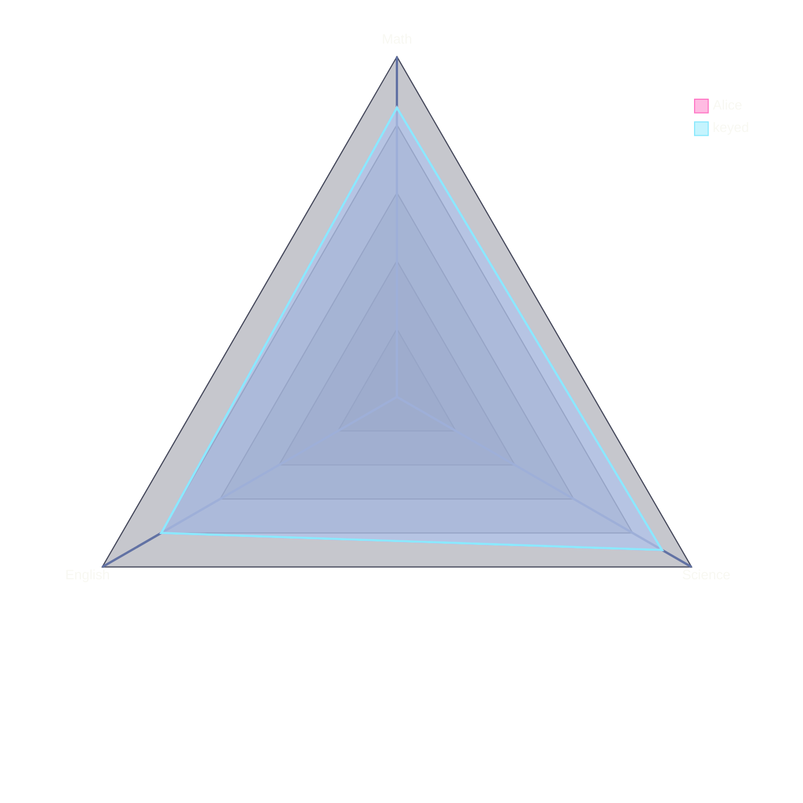

`axis` names the axes, a positional curve `alice["Alice"]{...}` follows axis order and a keyed curve `keyed{ m: 85, ... }` binds by axis id. `graticule` also accepts `circle`, config admits `axisScaleFactor` and `curveTension`, and theme variables nest under `radar:`.

## [11]-[GANTT]

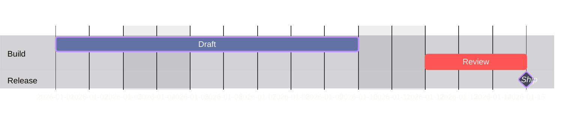

Dates match `dateFormat`, `after taskId` and `until taskId` reference existing IDs, and modifiers are `done`, `active`, `crit`, `milestone`, `vert`; repeated `excludes` and `includes` entries stack.

## [12]-[TREEMAP]

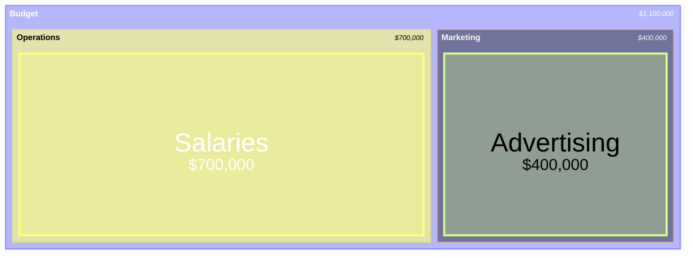

Indentation sets hierarchy and a leaf carries a numeric value; `:::class` plus `classDef` styles a node, and `valueFormat` formats values through d3-format grammar alongside `showValues`, `nodeWidth`, `diagramPadding`.

## [13]-[C4]

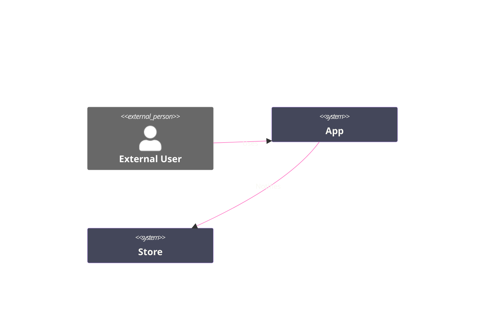

The family covers `C4Context`, `C4Container`, `C4Component`, `C4Dynamic`, `C4Deployment`; an alias exists before `Rel()` and named parameters take `$`. `Enterprise_Boundary` nests boundaries, `System_Ext` marks an external system, and `BiRel` draws a bidirectional relation. Theming routes through `UpdateElementStyle`/`UpdateRelStyle`, not `themeVariables`; the fence stays flat by ruling since boundary label color is uncontrollable.

## [14]-[ARCHITECTURE]


`group`, `service`, and `junction` place nodes, a member declares `in group`, edge ports are `T|B|L|R`, a group-boundary edge takes `{group}`, and an Iconify icon resolves as `pack:name`. `align row|column` orders members and fails when it contradicts a directional edge; layout is cytoscape fcose, not ELK, with knobs `nodeSeparation`, `idealEdgeLengthMultiplier`, `edgeElasticity`, `numIter`, and `architecture.seed` is the deterministic lock since `randomize: false` alone does not guarantee identical renders. Two siblings sharing one logical position overlap — `align row|column` or a junction separates them — and long group names collide, so a group label stays short.

## [15]-[PACKET]

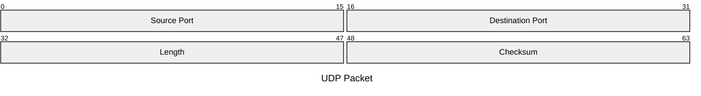

The keyword is `packet`, never `packet-beta`; `start-end: "name"` ranges and `+count: "name"` auto-counted fields mix in one diagram under an optional `title`. Theme-variable propagation is broken, so a packet diagram takes no theme.

## [16]-[TIMELINE]

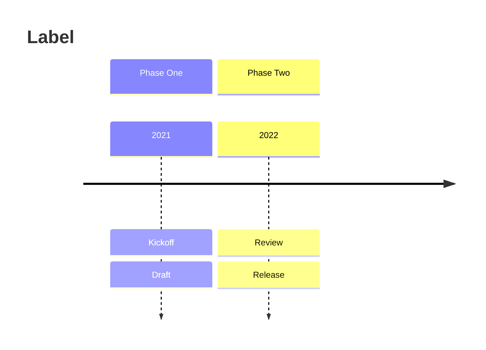

A multi-event row repeats `:`, styling uses `cScale0` through `cScale11`, and timeline takes `direction`.

## [17]-[GITGRAPH]

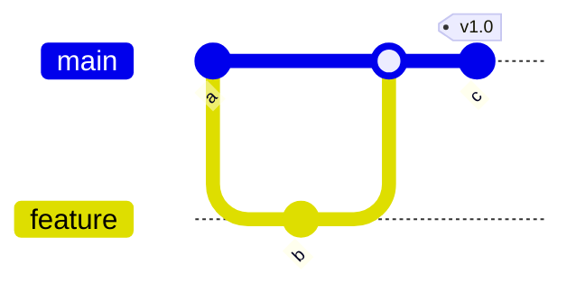

Directions are `LR:`, `TB:`, `BT:`; a branch exists before checkout or merge, commit IDs stay unique, and cherry-picking a merge commit adds `parent:`.

## [18]-[KANBAN]

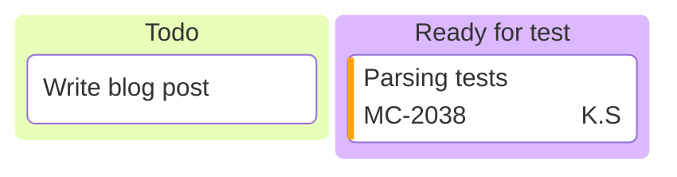

Tasks indent under columns, metadata keys are `assigned`, `ticket`, `priority`, and priorities are exactly `Very High`, `High`, `Low`, `Very Low`; `kanban.ticketBaseUrl` links each ticket by substituting the task ticket for `#TICKET#`.

## [19]-[TREEVIEW]


The tree parses box-drawing input, a trailing `/` marking a directory; annotations trail an entry as `:::class`, `## description`, and `icon(name)`/`icon(none)`. Config carries `showIcons`, `defaultIconPack`, `filenameIcons`, `extensionIcons`, and an unregistered icon renders as a question mark.

## [20]-[CYNEFIN]

```mermaid
cynefin-beta
  clear
    "Restart service"
  complicated
    "Analyze data"
  clear --> complicated : "Pattern found"
```

The five domains are `complex`, `complicated`, `clear`, `chaotic`, `confusion`, each holding quoted items, and a transition spells `domain --> domain : "label"`. The current geometry draws axis-aligned rectangles, not the canonical curved domain boundaries.

## [21]-[RAILROAD]

```mermaid
---
config:
  theme: base
  themeVariables:
    darkMode: true
    textColor: "#F8F8F2"
    primaryColor: "#44475A"
    primaryBorderColor: "#BD93F9"
---
railroad-ebnf-beta
title "Optional Sign"

sign = "+" | "-" ;
number = sign? digit+ ;
```

The keyword selects the grammar parser — `railroad-ebnf-beta` for EBNF, `railroad-abnf-beta` for ABNF, `railroad-peg-beta` for PEG, and `railroad-beta` for Mermaid's intermediate constructors.

## [22]-[SWIMLANE]

```mermaid
swimlane-beta
  Intake --> Review
  Review --> Approve
```

A standalone diagram reusing flowchart body syntax under a dedicated layered orthogonal layout, it honors `flowchart.defaultRenderer: elk`. `look: neo` deforms swimlane output, so swimlane holds `look: classic`; its PNG export diverges from its SVG in current builds.
