# [SYNTAX_EXTENDED]

Diagram types beyond the five core types populate this roster — each row carries its working form and the traps that bind it in the numbered section its index names.

## [01]-[REGISTRY]

Pick a type by intent, then its section for the minimal fence and traps; rows run in section order.

| [INDEX] | [TYPE]               | [INTENT]                 |
| :-----: | :------------------- | :----------------------- |
|  [01]   | `mindmap`            | radial hierarchy         |
|  [02]   | `block`              | manual grid layout       |
|  [03]   | `journey`            | phase sentiment          |
|  [04]   | `requirementDiagram` | requirement traceability |
|  [05]   | `pie`                | part-to-whole share      |
|  [06]   | `quadrantChart`      | two-axis position map    |
|  [07]   | `sankey`             | weighted directed flow   |
|  [08]   | `xychart`            | bar or line chart        |
|  [09]   | `radar-beta`         | multivariate profile     |
|  [10]   | `gantt`              | dated schedule           |
|  [11]   | `treemap-beta`       | area-weighted hierarchy  |
|  [12]   | `C4`                 | system landscape views   |
|  [13]   | `architecture-beta`  | infrastructure groups    |
|  [14]   | `packet`             | bit-field layout         |
|  [15]   | `timeline`           | chronological periods    |
|  [16]   | `gitGraph`           | branch and merge history |
|  [17]   | `kanban`             | workflow-stage board     |
|  [18]   | `treeView-beta`      | file-tree hierarchy      |
|  [19]   | `cynefin-beta`       | decision-domain sort     |
|  [20]   | `railroad-*-beta`    | grammar syntax rails     |
|  [21]   | `swimlane-beta`      | laned process flow       |
|  [22]   | `eventmodeling`      | command-event timeline   |
|  [23]   | `venn-beta`          | set-overlap regions      |
|  [24]   | `wardley-beta`       | value-chain evolution    |
|  [25]   | `ishikawa-beta`      | cause-effect fishbone    |

`zenuml` renders sequence exchanges through an external plugin the CLI registers; it carries this registry mention alone. `UnknownDiagramError` is a host-version fact, never a fence defect: the host's mermaid predates the family, and the bundled validator against the workspace-pinned renderer is the parse proof for every row above.

## [02]-[MINDMAP]

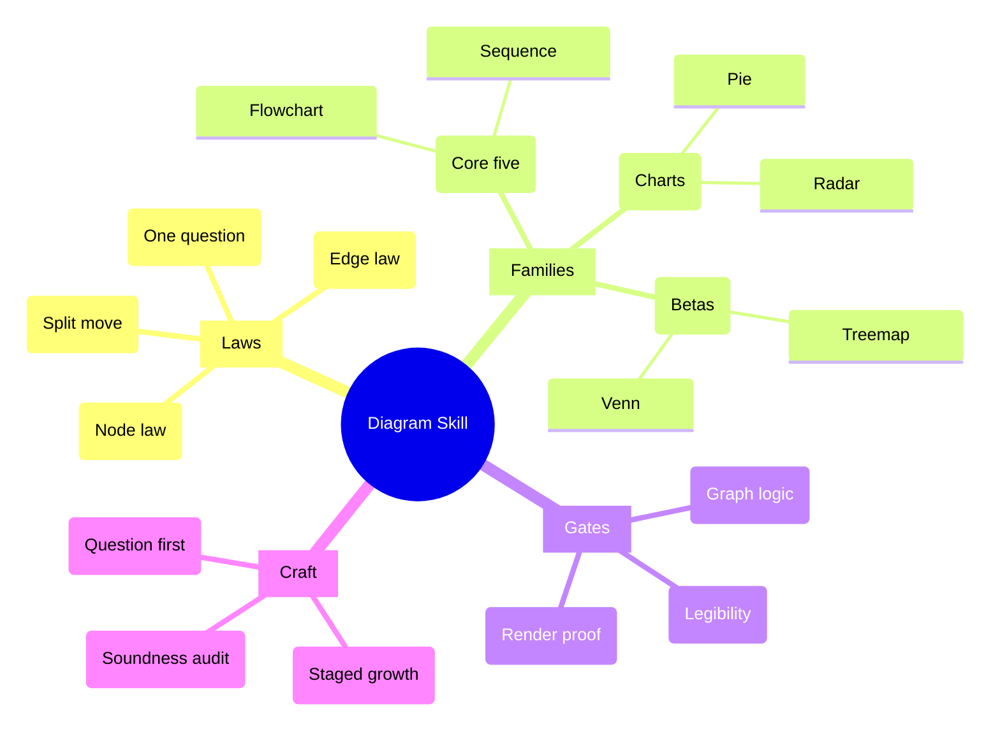

Fence content asserts the skill decomposing into laws, families, gates, and craft to leaf depth; the family mis-handles `accTitle`/`accDescr`, so the relation sentence rides beside the fence. Root leads; consistent indentation sets depth, mixed tabs and spaces are rejected, and explicit edges are invalid. Shapes carry level — `root((...))` circle, `[...]` branch rects, `(...)` rounded topics, bare text leaves. Radial layout is cose-bilkent and owns its own edge geometry; first-level branches carry `.section-0`–`.section-N` classes in declaration order.

## [03]-[BLOCK]

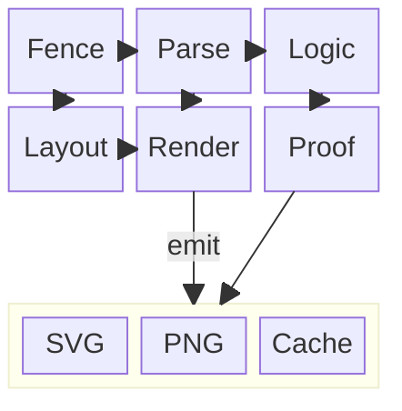

Fence content asserts a two-row render raster feeding a nested proof group; the family rejects `accTitle`/`accDescr` at parse, so the relation sentence rides beside the fence. `block-beta` is the portable keyword; `columns N` precedes a row, a `:n` span widens a block, `space` inserts a filler, and a nested `block:id:span ... end` holds its own `columns`. A block arrow is `blockArrowId<["Label"]>(dir)` with `dir` one of `right`, `left`, `up`, `down`, `x`, `y`, or a compound like `(x, down)`.

Links route straight from source center through a midpoint to target center with no obstacle awareness, so a committed raster links only adjacent cells — that placement discipline is the whole no-crossing law here.

## [04]-[JOURNEY]

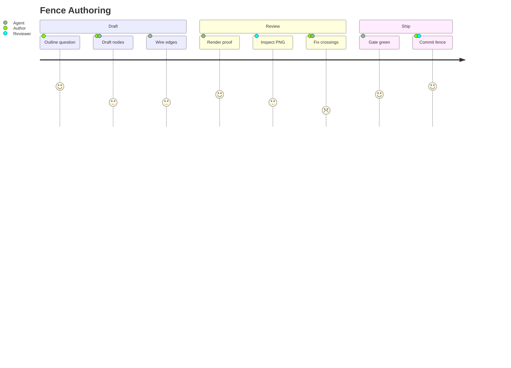

Scores are integers `1` through `5`; a task belongs under a `section`, an actor needs no declaration, and an out-of-range score is invalid.

## [05]-[REQUIREMENT_DIAGRAM]

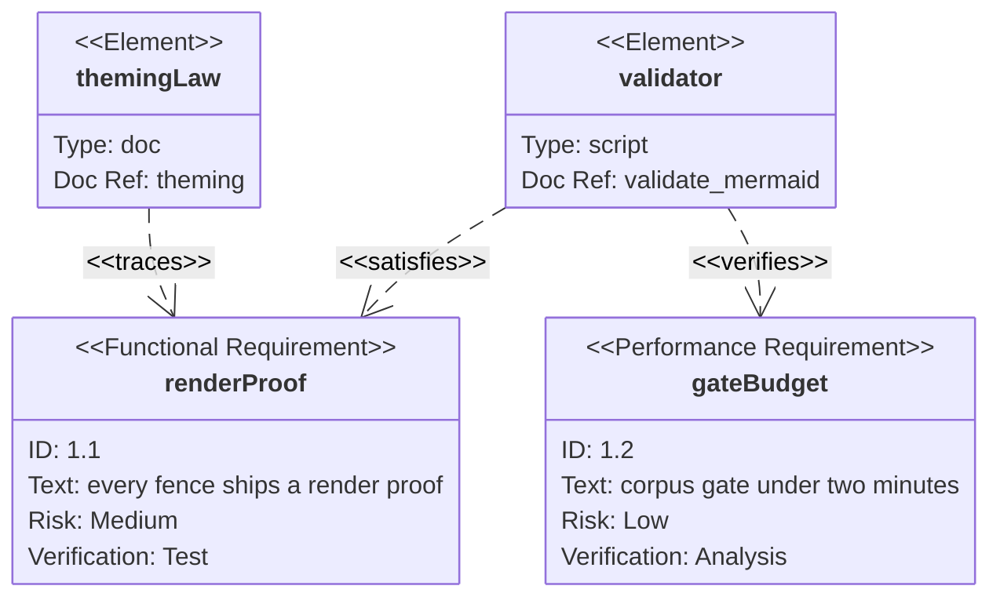

Types are `requirement`, `functionalRequirement`, `interfaceRequirement`, `performanceRequirement`, `physicalRequirement`, `designConstraint`; `risk` takes `Low`/`Medium`/`High` and `verifyMethod` takes `Analysis`/`Inspection`/`Test`/`Demonstration`. Relations `contains`, `copies`, `derives`, `satisfies`, `verifies`, `refines`, `traces` spell both `a - satisfies -> b` and `b <- traces - a`; `contains` draws solid with a crossed-circle start marker, every other relation dashed with the open-arrow end marker. `htmlLabels: false` stacks the body attributes cleanly.

## [06]-[PIE]

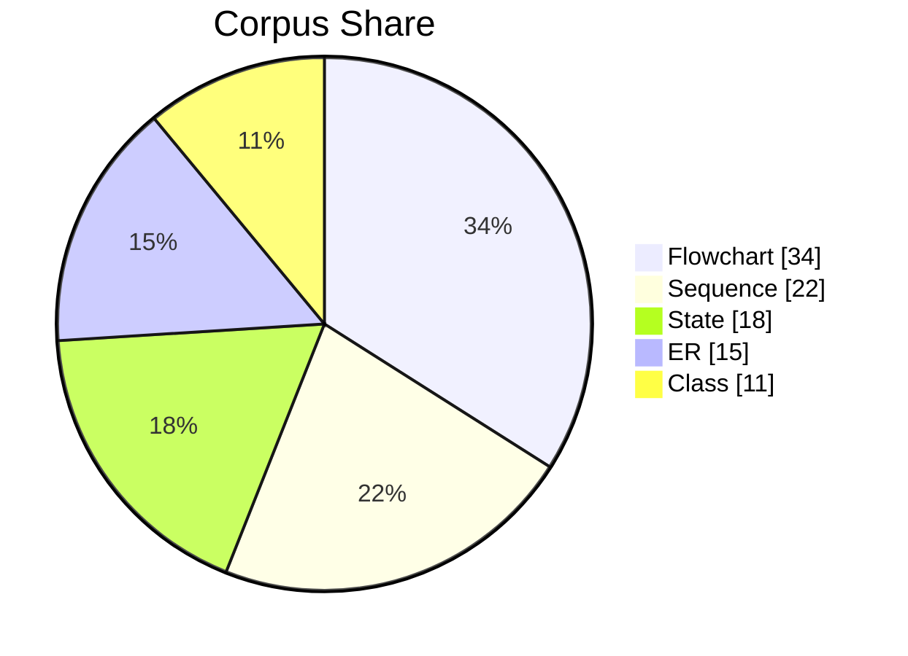

Values sum above `0`, labels are quoted, and `showData` prints values in the legend; donut, legend position, and slice highlight compose on it, and `textPosition` places the slice percentages along the radius.

## [07]-[QUADRANT_CHART]

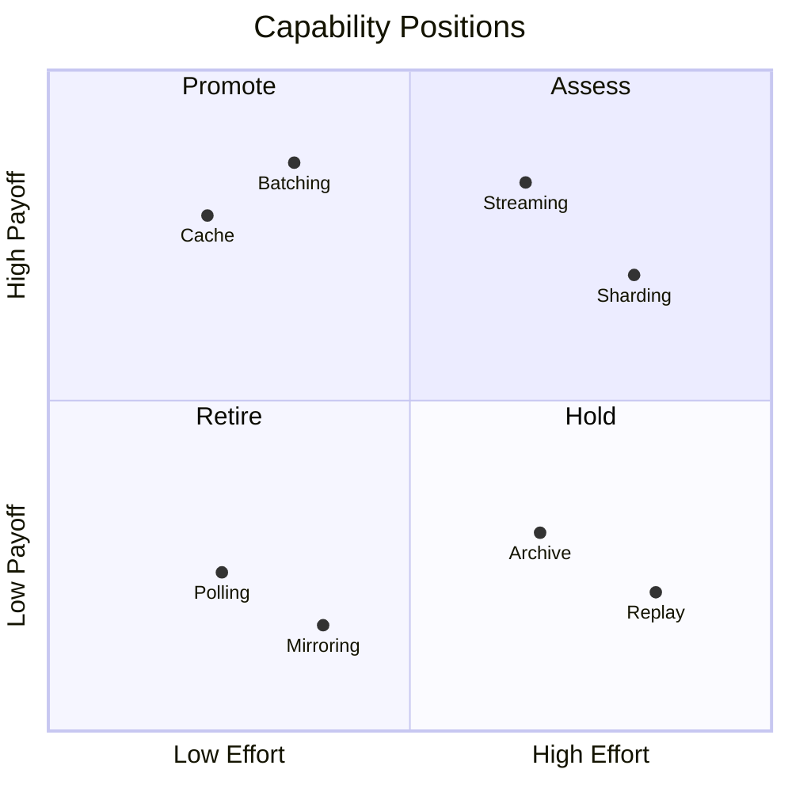

Coordinates bind to `0` through `1` and quadrants number `1` top-right counterclockwise. `pointRadius` sizes every dot and `pointTextPadding` drops each label clear below its dot — the dot never blocks its name.

## [08]-[SANKEY]

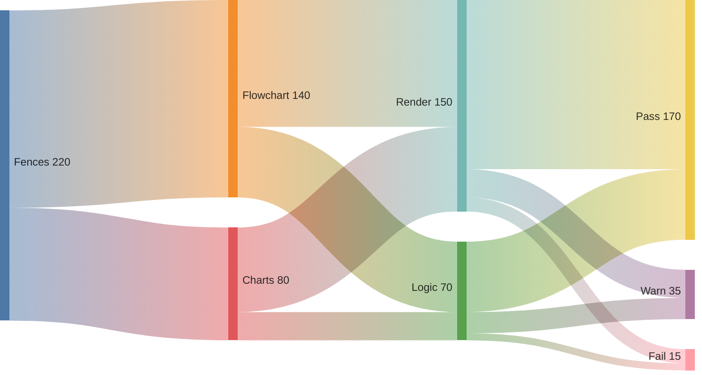

Fence content asserts a corpus splitting through render and logic gates into pass, warn, and fail sinks; the family rejects `accTitle`/`accDescr` at parse, so the relation sentence rides beside the fence. `sankey` is the keyword; the body is strictly three-column CSV `source,target,value` — CSV quoting covers embedded commas, blank lines carry no separators. Config carries `nodeAlignment`, `showValues`, `prefix`/`suffix`, and the geometry knobs `nodeWidth`, `nodePadding`, `width`, and `height`.

## [09]-[XYCHART]

```mermaid
---
config:
  xyChart:
    showDataLabel: true
    showDataLabelOutsideBar: true
---
xychart
  accTitle: Corpus growth
  accDescr: Fences added per quarter as bars with the cumulative corpus size as a line overlay.
  title "Corpus Growth"
  x-axis "Quarter" ["Q1", "Q2", "Q3", "Q4", "Q5", "Q6", "Q7"]
  y-axis "Fences" 0 --> 400
  bar [42, 58, 66, 54, 71, 63, 39]
  line [42, 100 "100", 166 "166", 220 "220", 291 "291", 354 "354", 393 "393"]
```

`xychart` is the keyword; `xychart horizontal` flips orientation and each `bar` or `line` array matches the x-axis category count. Bar width derives from the category count against a fixed padding percent — width tunes by adding categories, never by a knob. `showDataLabel` prints the first declared plot's values at a size computed from bar width, so the bar plot declares first; `showDataLabelOutsideBar` lifts the values above the bars.

Inline point labels (`50 "50"`) render on `line` only — the syntax parses on `bar` while the labels silently drop — and a label omitted on a point suppresses that one chip, clearing the first-category collision where line and bar meet at the origin.

## [10]-[RADAR]

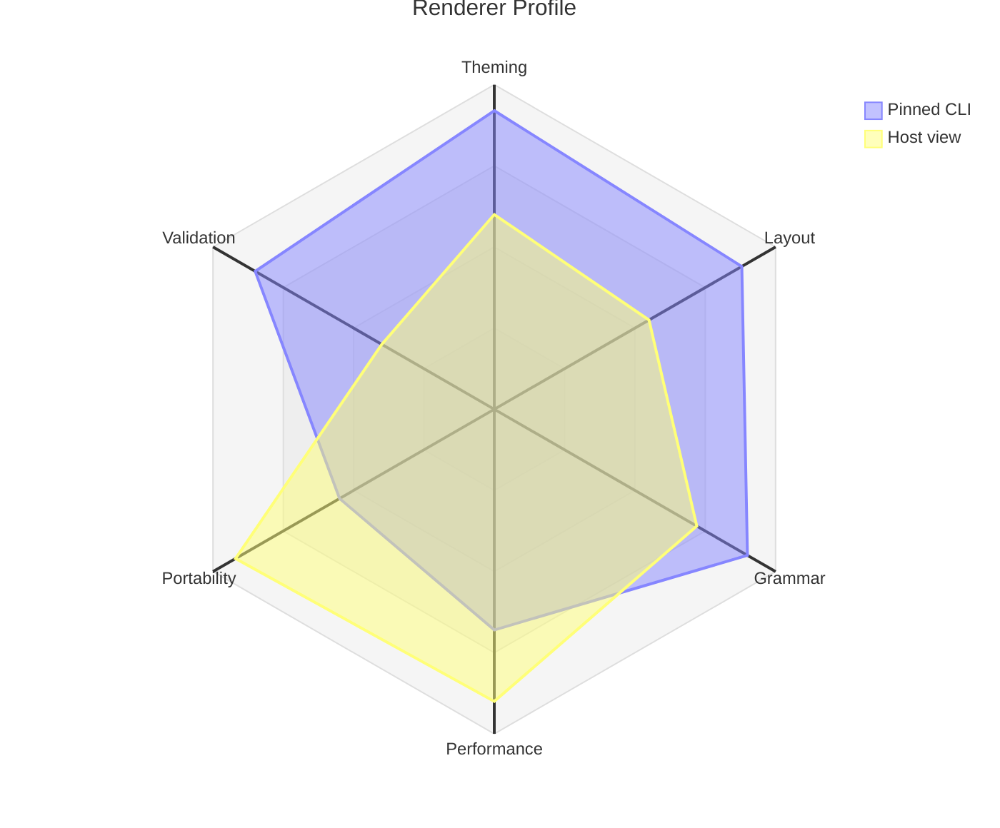

`axis` names the axes, a positional curve `name["Label"]{...}` follows axis order and a keyed curve binds by axis id. Identical data across curves cancels into one pale polygon, so each curve carries distinct values — the subject-count law is the construction reference's property.

`graticule` accepts `polygon` or `circle`, and config admits `axisScaleFactor` and `curveTension`. Axis labels anchor just outside the chart radius and clip at the viewport edge — the `radar:` config margins own that clearance, and the hardcoded legend position demands short curve labels.

## [11]-[GANTT]

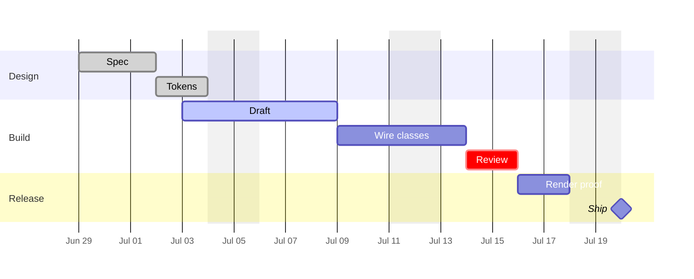

Dates match `dateFormat`, `after`/`until` reference existing IDs, and modifiers are `done`, `active`, `crit`, `milestone`, `vert`; repeated `excludes` and `includes` entries stack. `axisFormat` with `tickInterval` own tick legibility; default daily ISO ticks overlap into an unreadable strip.

`vert` draws a full-height gate marker, an `after` list (`after a b`) converges on every named prerequisite, `weekday` anchors the tick grid, and the today rule spans the whole canvas.

## [12]-[TREEMAP]

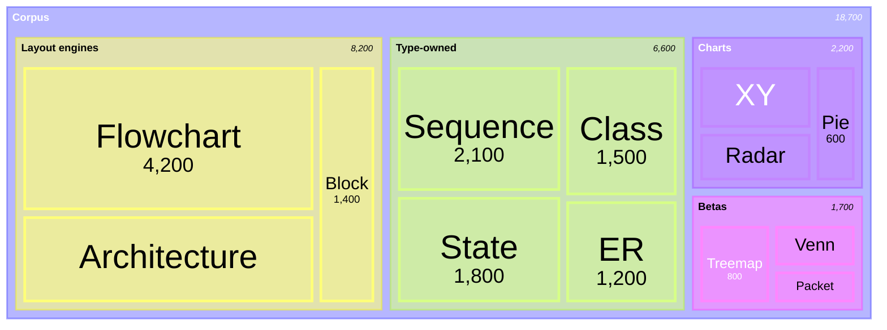

Indentation sets hierarchy and a leaf carries a numeric value; `valueFormat` formats values through d3-format grammar alongside `showValues`, and branch identity assigns in branch declaration order.

## [13]-[C4]

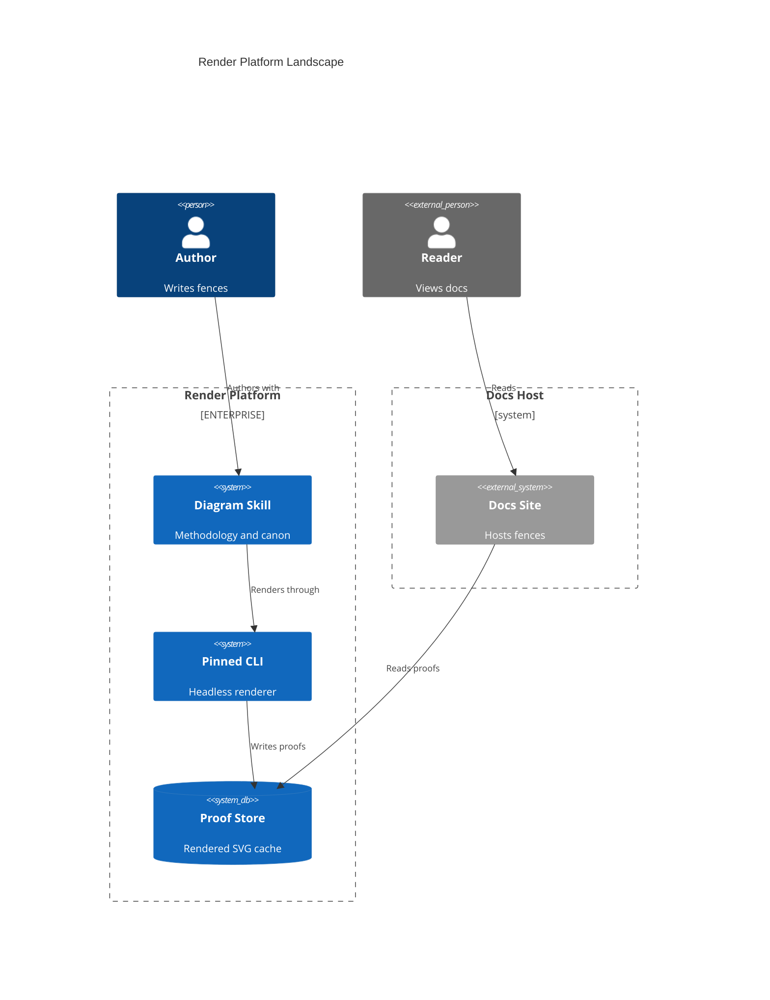

Family coverage spans `C4Context`, `C4Container`, `C4Component`, `C4Dynamic`, `C4Deployment`; an alias exists before `Rel()` and named parameters take `$`. `UpdateRelStyle` offsets a relation label clear of boxes with `$offsetX`/`$offsetY`, and `c4ShapeInRow`/`c4BoundaryInRow` govern packing.

Loose shapes pack in rows above every boundary — a third lands beneath the first where relations cross — so external systems live in their own `Boundary` and boundaries pack side by side.

## [14]-[ARCHITECTURE]


`group` and `service` place nodes, a member declares `in group`, edge ports are `T|B|L|R`, a `junction` joins edges, a group-boundary edge takes `{group}`, and an Iconify icon resolves as `pack:name`. Layout is cytoscape fcose: port pairs and `align row|column` rows fully determine the grid, so a committed fence aligns every rank both ways for orthogonal edges — unaligned members scatter diagonally, and an `align` row fails where its order contradicts a directional-edge constraint. Junction endpoints shift arrow polygons off their lines, so junctions stay grammar for genuine multi-way joins.

Arrow size tunes only through `iconSize` — the arrow is one sixth of it — and `architecture.seed` is the deterministic lock.

## [15]-[PACKET]

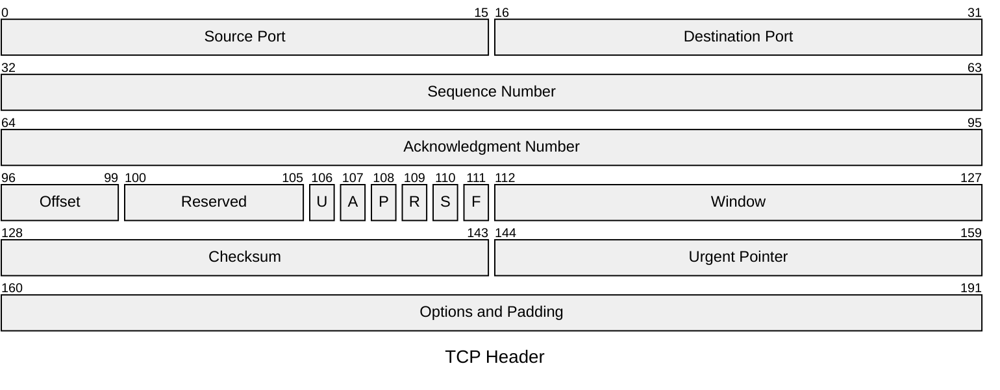

`packet` is the keyword; `start-end: "name"` ranges and `+count: "name"` auto-counted fields mix under an optional `title`, blocks stay contiguous, and `accTitle`/`accDescr` are accepted. `bitWidth` and `rowHeight` size the raster.

## [16]-[TIMELINE]

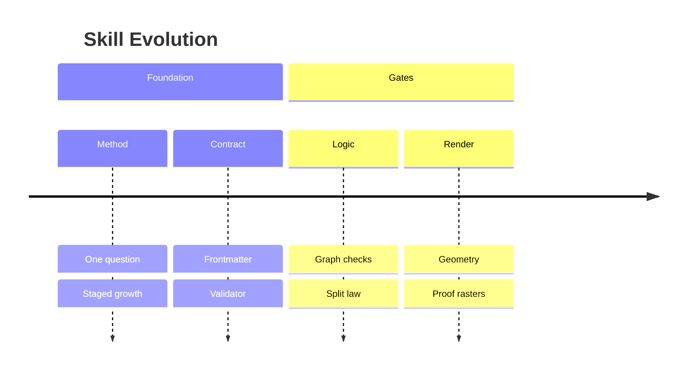

A multi-event row repeats `:`, sections group periods, and timeline takes `LR`/`TD` direction headers. Family parses `accTitle`/`accDescr` while emitting neither into the SVG, so the relation sentence rides beside the fence; section classes index from `-1`, so the first section is `.section--1`.

## [17]-[GITGRAPH]

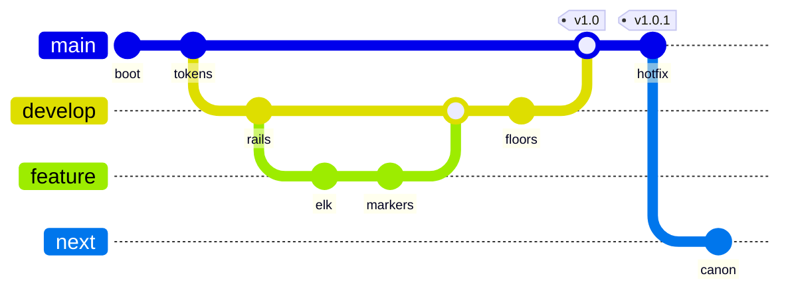

Directions are `LR:`, `TB:`, `BT:`; a branch exists before checkout or merge, commit IDs stay unique, and cherry-picking a merge commit adds `parent:`. `rotateCommitLabel: false` keeps commit ids horizontal, and `.arrowN` classes index the branch declaration order.

## [18]-[KANBAN]

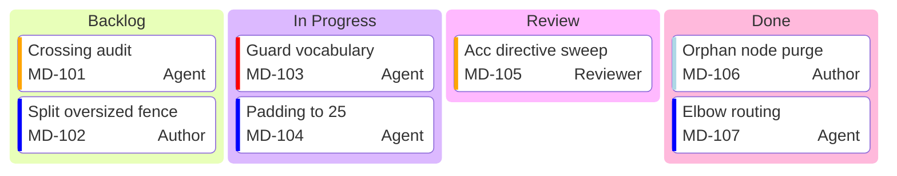

Fence content asserts four queues carrying seven law cards with ticket metadata; the family mis-handles `accTitle`/`accDescr` as columns, so the relation sentence rides beside the fence. Tasks indent under columns, metadata keys are `assigned`, `ticket`, `priority`, and priorities are exactly `Very High`, `High`, `Low`, `Very Low`; `kanban.ticketBaseUrl` links each ticket by substituting the task ticket for `#TICKET#`, and column classes index from `section-1`.

## [19]-[TREEVIEW]


TreeView parses box-drawing input, a trailing `/` marking a directory; annotations trail an entry as `:::class`, `## description`, and `icon(name)`/`icon(none)`. Config carries `rowIndent` and `paddingY`, which land directly. `showIcons`, `defaultIconPack`, `filenameIcons`, and `extensionIcons` govern icons; an unregistered icon renders as a question mark, and `highlight` is the one class name with built-in geometry.

## [20]-[CYNEFIN]

```mermaid
---
config:
  cynefin:
    seed: 7
---
cynefin-beta
  accTitle: Failure domain sort
  accDescr: Render faults sorted across the five cynefin domains with two labeled reclassifications as understanding grows.
  complex
    "Flaky layout drift"
    "Host CSS bleed"
  complicated
    "Marker scale math"
    "Contrast audit"
  clear
    "Restart renderer"
    "Pin the CLI"
  chaotic
    "Corpus-wide breakage"
  confusion
    "Unclassified fault"
  complex --> complicated : "Pattern found"
  chaotic --> clear : "Order imposed"
```

Domains `complex`, `complicated`, `clear`, `chaotic`, and `confusion` each hold quoted items, and a transition spells `domain --> domain : "label"`.

A cliff separates chaotic from clear as canonical geometry; transitions curve center to center with a fixed 15% bow and the arrow tip lands beside the target caption — engine geometry, so a committed fence keeps transitions few and lets the label ride the bow's midpoint. `cynefin.seed` pins the boundary jitter.

## [21]-[RAILROAD]

```mermaid
---
config:
  railroad:
    padding: 16
    markerRadius: 4
---
railroad-ebnf-beta
accTitle: Numeric literal grammar
accDescr: A signed decimal number production with fraction and exponent over sign, integer, and exponent rules.
title "Numeric Literal"

number = [ sign ] integer [ "." digit { digit } ] [ exponent ] ;
sign = "+" | "-" ;
integer = "0" | nonzero { digit } ;
exponent = ( "e" | "E" ) [ sign ] digit { digit } ;
```

Keyword choice selects the grammar parser — `railroad-ebnf-beta` for EBNF, `railroad-abnf-beta` for ABNF, `railroad-peg-beta` for PEG, and `railroad-beta` for Mermaid's intermediate constructors. In this EBNF dialect `? ... ?` is a special sequence, so optionality spells `[ ... ]` and repetition `{ ... }` — a postfix `?` fuses everything up to the next `?` into one special box. Terminals render quoted and nonterminals bare, so the two read as different marks; `padding` and `markerRadius` size the rails.

## [22]-[SWIMLANE]

```mermaid
---
config:
  swimlane:
    lineHops: arc
---
swimlane-beta
  accTitle: Fence review lanes
  accDescr: A fence drafted by the author, tightened by the agent, gated by the validator lane on the critical path, and proven by the renderer.
  subgraph author[AUTHOR]
    Draft([Draft fence])
    Commit([Commit])
  end
  subgraph agent[AGENT]
    Tighten[Tighten graph]
    Inspect[Inspect PNG]
  end
  subgraph validator[VALIDATOR]
    Gate{Gate?}
  end
  subgraph renderer[RENDERER]
    Render[Render proof]
  end
  Draft --> Tighten
  Tighten --> Gate
  Gate -->|pass| Render
  Gate --> Tighten
  Render --> Inspect
  Inspect --> Commit
```

A standalone diagram reusing the flowchart body under a layered orthogonal layout: every top-level `subgraph` is a lane, nodes inside it belong to it, and loose nodes fall into a synthetic unlabeled lane; `swimlane.lineHops: arc` hops edge crossings. A label on a return edge orphans away from its stroke — keep return-edge labels short or carry the fact on the target node.

## [23]-[EVENTMODELING]

```mermaid
eventmodeling
  tf 01 ui CartUI { "sku": "A1" }
  tf 02 cmd AddItem
  tf 03 evt ItemAdded `json`{ "qty": 1 }
  tf 04 rmo CartView
  tf 05 ui CheckoutUI
  tf 06 cmd Checkout
  tf 07 evt CheckedOut
  tf 08 pcr PaymentProcessor
  tf 09 evt PaymentRequested `json`{ "total": 42 }
```

Fence content asserts a cart flow from UI through commands and events into a read model and payment processor; `accTitle`/`accDescr` parse but emit nothing, so the relation sentence rides beside the fence. `tf`/`timeframe` orders frames left to right, `rf`/`resetframe` restarts the clock; kinds are `ui`, `cmd`, `evt`, `pcr` (processor), and `rmo` (read model), and an inline `{ ... }` or `` `json`{ ... } `` payload rides a frame. Relations infer from the nearest prior frame in a different lane, so declaration order draws the chain; namespaced frame ids (`stream.Name`) map to extra swimlanes.

## [24]-[VENN]

```mermaid
venn-beta
  title Corpus Coverage
  set A["Authored"] : 80
  set B["Rendered"] : 70
  set C["Validated"] : 60
  union A,B ["Proofed"] : 42
  union B,C ["Gated"] : 34
  union A,C : 26
  union A,B,C ["Canon"] : 18
```

Fence content asserts three weighted sets overlapping into labeled proof regions; the family rejects `accTitle`/`accDescr` at parse, so the relation sentence rides beside the fence. `set id["Label"] : size` declares a weighted set, `union A,B ["Label"] : size` sizes and captions an overlap, and higher-arity unions list every member.

Region captions ride the union labels at the region centroids, so overlaps read without leaders or a legend; set and intersection label sizes scale from canvas width at engine ratios.

## [25]-[WARDLEY]

```mermaid
wardley-beta
  accTitle: Render capability map
  accDescr: An author need anchored on the diagram skill whose dependencies slide from custom fences toward commodity browsers and caches.
  title Render Capability
  component Author [0.95, 0.63]
  component Skill [0.84, 0.30]
  component Fence [0.72, 0.45]
  component CLI [0.60, 0.62]
  component IconPack [0.42, 0.55]
  component Browser [0.38, 0.78]
  component Cache [0.24, 0.82]
  Author->Skill
  Skill->Fence
  Fence->CLI
  CLI->Browser
  CLI->Cache
  Fence->IconPack
  evolve IconPack 0.75
```

Coordinates are `[visibility, evolution]` on `0`–`1`; `component` places a capability, `->` a dependency link, `evolve` draws the evolution trend to a target maturity, and OWM grammar adds `pipeline`, `note`, decorators, and inertia. Label and axis sizes are engine-owned.

## [26]-[ISHIKAWA]

```mermaid
ishikawa-beta
  "Render Failure"
    Browser
      "Chromium missing"
        "PATH empty"
        "Sandbox denied"
      "Stale headless flag"
    Assets
      "Remote icon"
        "Registry offline"
      "Remote image"
        "Blocked CDN"
    Syntax
      "Syntax drift"
        "Renamed keyword"
      "Reserved word"
```

Fence content asserts a render failure traced through browser, asset, and syntax cause families into nested sub-causes; the family mis-handles `accTitle`/`accDescr`/`title` as spurious head nodes, so the relation sentence rides beside the fence. A quoted head names the effect, top-level identifiers are cause categories, quoted children are causes, and depth rides indentation — growth deepens existing branches into sub-causes, never head-level categories; sub-branches thin under the primary bones in the engine's two weights.
