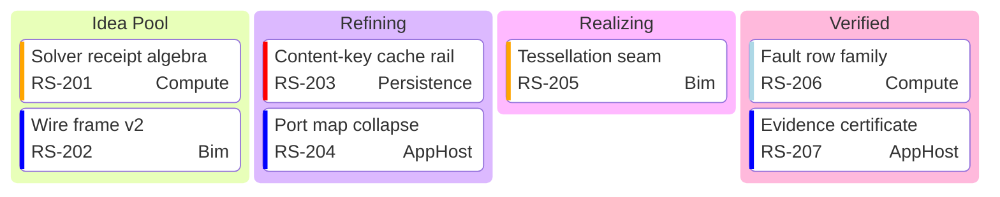

# [BOARD]

Draw which workflow stage holds which work right now. Template law bakes in the board discipline an unassisted attempt decorates away — columns are real queues in flow order, never statuses invented for symmetry, and every card carries its ticket and owner so the board stays auditable against the tracker it mirrors. Use `kanban` with 3-5 columns and 5-9 cards; the family mis-handles `accTitle`/`accDescr` as columns, so the relation sentence rides beside the fence. A column that never drains is the finding — show it, never rebalance it away.

Refill by renaming columns to the real workflow gates and cards to tracker truth — ticket ids link through `ticketBaseUrl` only on a live mermaid host, so the static export renders them as plain audit labels; owners name real owners; priorities hold the exact case-sensitive visible-bar ladder `Very High`, `High`, `Low`, `Very Low`, where `Medium` — recognized but barless — joins every off-vocabulary value in drawing no bar, so the ladder is loudest at the top.
