# [BOARD]

Draw which workflow stage holds which work right now. Template law bakes in the board discipline an unassisted attempt decorates away — columns are real queues in flow order, never statuses invented for symmetry; every card carries its ticket and owner so the board stays auditable against the tracker it mirrors; and priority renders on the severity ladder, not as free color. Use `kanban` with 3-5 columns and 5-9 cards; the family mis-handles `accTitle`/`accDescr` as columns, so the relation sentence rides beside the fence. Column classes index from `section-1`, so the full ordinal range recesses every column, titles take the container-title stamp through `.cluster-label .nodeLabel`, and the hardcoded priority bars remap onto the ladder through the `line[stroke=...]` hooks. A column that never drains is the finding — show it, never rebalance it away.

```mermaid
---
config:
  theme: base
  look: classic
  kanban:
    sectionWidth: 210
    ticketBaseUrl: '<ticket-url>#TICKET#'
  themeVariables:
    darkMode: true
    fontFamily: "SF Mono, Menlo, Cascadia Mono, Segoe UI Mono, Consolas, monospace"
    useGradient: false
    dropShadow: "none"
    textColor: "#F8F8F2"
    background: "#44475A"
    nodeBorder: "#BD93F9"
    cScale0: "#21222C"
    cScale1: "#21222C"
    cScale2: "#21222C"
    cScale3: "#21222C"
    cScale4: "#21222C"
    cScale5: "#21222C"
    cScale6: "#21222C"
    cScale7: "#21222C"
    cScaleLabel0: "#D6BCFA"
    cScaleLabel1: "#D6BCFA"
    cScaleLabel2: "#D6BCFA"
    cScaleLabel3: "#D6BCFA"
    cScaleLabel4: "#D6BCFA"
    cScaleLabel5: "#D6BCFA"
    cScaleLabel6: "#D6BCFA"
    cScaleLabel7: "#D6BCFA"
  themeCSS: ".nodeLabel{font-size:13px;font-weight:500}.cluster-label .nodeLabel{font-size:13.5px;font-weight:700;color:#D6BCFA}.node rect{stroke-width:1.5px;filter:none!important}line[stroke='red']{stroke:#FF5555;stroke-width:3px}line[stroke='orange']{stroke:#FFB86C;stroke-width:3px}line[stroke='blue']{stroke:#6272A4;stroke-width:3px}line[stroke='lightblue']{stroke:#44475A;stroke-width:3px}"
---
kanban
  pool[Idea Pool]
    t1[Solver receipt algebra]@{ ticket: RS-201, assigned: 'Compute', priority: 'High' }
    t2[Wire frame v2]@{ ticket: RS-202, assigned: 'Bim', priority: 'Low' }
  refine[Refining]
    t3[Content-key cache rail]@{ ticket: RS-203, assigned: 'Persistence', priority: 'Very High' }
    t4[Port map collapse]@{ ticket: RS-204, assigned: 'AppHost', priority: 'Low' }
  realize[Realizing]
    t5[Tessellation seam]@{ ticket: RS-205, assigned: 'Bim', priority: 'High' }
  verified[Verified]
    t6[Fault row family]@{ ticket: RS-206, assigned: 'Compute', priority: 'Very Low' }
    t7[Evidence certificate]@{ ticket: RS-207, assigned: 'AppHost', priority: 'Low' }
```

Refill by renaming columns to the real workflow gates and cards to tracker truth — ticket ids resolve through `ticketBaseUrl`, owners name real owners, priorities hold the exact vocabulary `Very High`, `High`, `Low`, `Very Low`. Recessed columns, Lavender titles, and priority-ladder remaps are fixed law — a refill renames work, never strips the fidelity surface.
