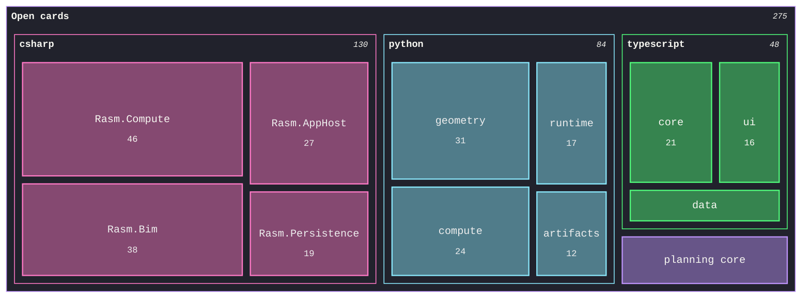

# [DECOMPOSITION]

Draw how a whole decomposes into parts weighted by one decision-bearing measure — remaining work, spend, line count, latency — so tile area answers where attention goes next. The template bakes in the treemap discipline an unassisted attempt breaks — one measure in one unit across every leaf, so sibling areas compare truthfully; branches follow the reader's grouping; and `classDef` stays out entirely, because its inline `!important` fills lock the section surfaces against the canon stamps. Branch hues assign from the ordinal range in declaration order with full-hue `cScalePeer` borders, sections recess to `#21222C` through the section stamp so the translucent leaf tiles composite over the dark canvas, `cScaleLabel` inks Foreground, and the label caps hold the engine's fit-to-tile sizing on the type ramp. Use `treemap-beta` with 3-5 branches and 3-7 leaves each; a leaf below label size hides its text, so the smallest tail aggregates into a named remainder — here the planning core rides as one aggregated leaf instead of two label-hiding slivers.

Refill by renaming branches and leaves to the real decomposition under one stated decision-bearing measure and unit — the accessible description names both; sibling weights must sum to their parent's meaning, and the smallest tail aggregates rather than hiding labels. The recessed sections, translucent hue tiles, full-hue borders, Foreground ink, and capped label ramp are fixed law — a refill renames the tree, never strips the fidelity surface.
