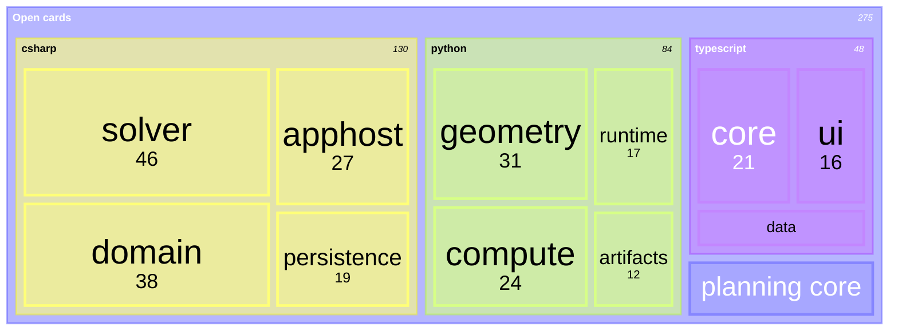

# [DECOMPOSITION]

Draw how a whole decomposes into parts weighted by one decision-bearing measure — remaining work, spend, line count, latency — so tile area answers where attention goes next. Template law bakes in the treemap discipline an unassisted attempt breaks — one measure in one unit across every leaf, so sibling areas compare truthfully, and branches follow the reader's grouping, not the org chart. A short tile hides its value line and a sliver hides its label entirely — which is why the smallest tail aggregates into a named remainder, and why that remainder lives at root only while it holds a visible fraction of the whole: under branch dominance the aggregate nests inside its owning branch or accepts a value-less tile. Use `treemap-beta` with 3-4 branches and 3-6 leaves each.

Refill by renaming branches and leaves to the real decomposition under one stated decision-bearing measure and unit — the accessible description names both; sibling weights must sum to their parent's meaning, and the smallest tail aggregates where its labels stay visible.
