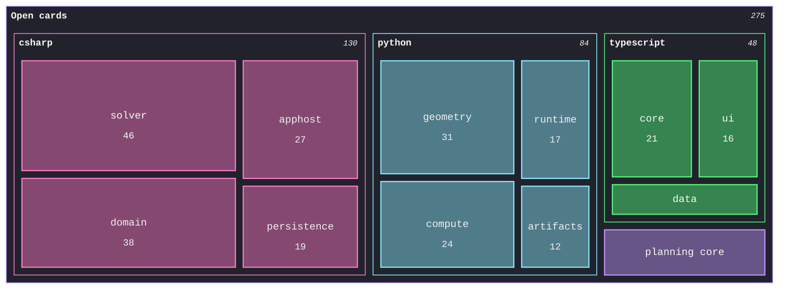

# [DECOMPOSITION]

Draw how a whole decomposes into parts weighted by one decision-bearing measure — remaining work, spend, line count, latency — so tile area answers where attention goes next. Template law bakes in the treemap discipline an unassisted attempt breaks — one measure in one unit across every leaf, so sibling areas compare truthfully; branches follow the reader's grouping; and `classDef` stays out entirely, because its inline `!important` fills lock the section surfaces against the canon stamps. Root chrome consumes `cScale0`, so branch hues assign from `cScale1` up in declaration order with full-hue `cScalePeer` borders — the palette's five slots carry the root and 3-4 branches, and a fifth branch derives an illegible hue; sections recess to `#21222C` through the section stamp so the translucent leaf tiles composite over the dark canvas, and `cScaleLabel` inks Foreground. Label sizes are fixed by the type-ramp stamps rather than fit-to-tile, so a short tile hides its value line and a sliver hides its label entirely — which is why the smallest tail aggregates into a named remainder, and why that remainder lives at root only while it holds a visible fraction of the whole: under branch dominance the aggregate nests inside its owning branch or accepts a value-less tile. Use `treemap-beta` with 3-4 branches and 3-6 leaves each; a root-level tail leaf paints the root's `cScale0` hue.

Refill by renaming branches and leaves to the real decomposition under one stated decision-bearing measure and unit — the accessible description names both; sibling weights must sum to their parent's meaning, and the smallest tail aggregates where its labels stay visible.
