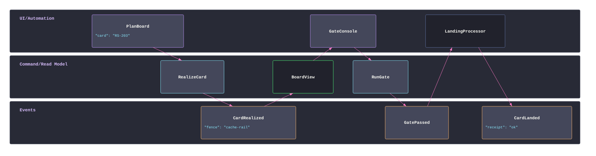

# [EVENT_FLOW]

Draw which commands produce which events and which read models consume them, in timeline order. Template law bakes in the event-modeling discipline an unassisted attempt scrambles — frames land in strict causal order because relations infer from the nearest prior frame in a different lane, so declaration order IS the arrow set; payloads annotate the frames whose shape is the contract, each riding the `` `json` `` code form; and each frame kind reads its own `em*` pair so the lane semantics render. Relations stay single-source by construction: the family has no explicit-edge syntax, so a fan-in — a frame consuming two upstream lanes, a merge, a correlation — is inexpressible here and routes to logic-flow or a flowchart. `eventmodeling` parses at mermaid 11.15+, so a lagging host renders the error bomb rather than the lanes. Use 6-10 `tf` frames across the ui, command/read-model, and event lanes; `accTitle`/`accDescr` parse but emit nothing into the SVG, so the relation sentence rides beside the fence. Box text mono, payloads Cyan, lane titles Lavender — the `.em-*` stamps carry all three. A read model fed by no upstream event is the defect the frame order makes visible.

Refill by renaming frames to the real command-event chain in causal order — the implicit relation chain is the assertion, so a frame that must source from an earlier lane declares immediately after it, namespaced ids (`stream.Name`) open extra lanes per stream, and a join of two streams leaves this family. `em*` pairs and the three `.em-*` stamps are fixed law — a refill renames the flow, never strips the fidelity surface.
