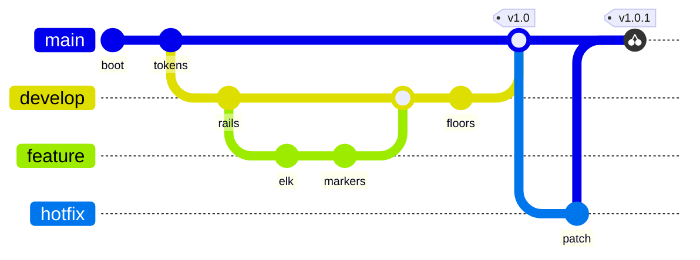

# [HISTORY]

Draw how branches diverge, commit, and merge. Template law bakes in the history discipline an unassisted attempt fabricates — every commit id names real landed work, a branch exists before its checkout, merges record the true integration direction, and tags land on main at release points, so the subway map stays auditable against `git log`. Use `gitGraph LR:` with 2-4 branches ordered main-first, 6-12 commits, and at least one merge chain; `rotateCommitLabel: false` keeps ids horizontal. A cherry-pick lifts a commit across tracks without a merge: an ordinary-commit cherry-pick takes no argument beyond its `id:`, cherry-picking a merge commit requires `parent:` naming which parent line to lift, and a `tag:` on the cherry-pick replaces the auto label that would otherwise collide with adjacent chips. History that matches no repository state is the defect this archetype exists to prevent.

Refill by renaming branches and commit ids to repository truth — ids stay unique and a branch predates its checkout.
