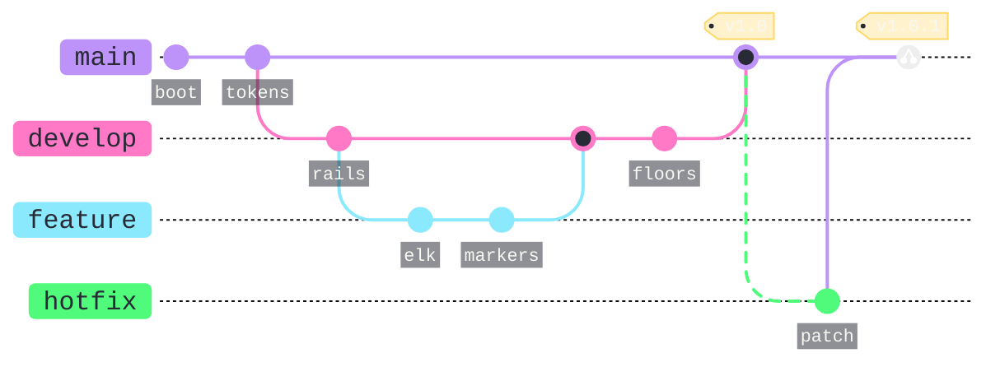

# [HISTORY]

Draw how branches diverge, commit, and merge. Template law bakes in the history discipline an unassisted attempt fabricates — every commit id names real landed work, a branch exists before its checkout, merges record the true integration direction, and tags land on main at release points, so the subway map stays auditable against `git log`. Use `gitGraph LR:` with 2-4 branches ordered main-first, 6-12 commits, and at least one merge chain; `rotateCommitLabel: false` keeps ids horizontal on their recessed chips, the `.arrow` stamp pulls the engine's 8px rails to the standing 2px, the commit-dot transform holds the −25% circle law while preserving merge-ring ratios, and a canvas-valued `primaryColor` renders merges as hollow rings. Every tag is the yellow-law chip, stamped through `.tag-label-bkg`/`.tag-label` CSS so the translucent gold survives hosts that strip theme-variable alpha. A cherry-pick lifts a commit across tracks without a merge: an ordinary-commit cherry-pick takes no argument beyond its `id:`, cherry-picking a merge commit requires `parent:` naming which parent line to lift, and a `tag:` on the cherry-pick replaces the auto label that would otherwise collide with adjacent chips — the `.commit-cherry-pick circle` stamp inks its double-dot Foreground, because the engine hardcodes it off-palette white. Genuinely unmerged tracks — here the `hotfix` branch whose patch reached main only by cherry-pick — carry the `6 6` planned rhythm through their `.arrowN` classes, where N indexes branch declaration order, while every merged track runs solid, so the dash states repository truth rather than decoration. History that matches no repository state is the defect this archetype exists to prevent.

Refill by renaming branches and commit ids to repository truth — ids stay unique and a branch predates its checkout. Planned-track dash rides `.arrowN` where N is the unmerged branch's declaration index: repoint it on refill, or drop the stamp when every track merges. 2px rails, scaled dots, hollow merge rings, recessed commit chips, Foreground cherry-pick dots, and gold tag chips are fixed law — a refill renames history, never strips the fidelity surface.
