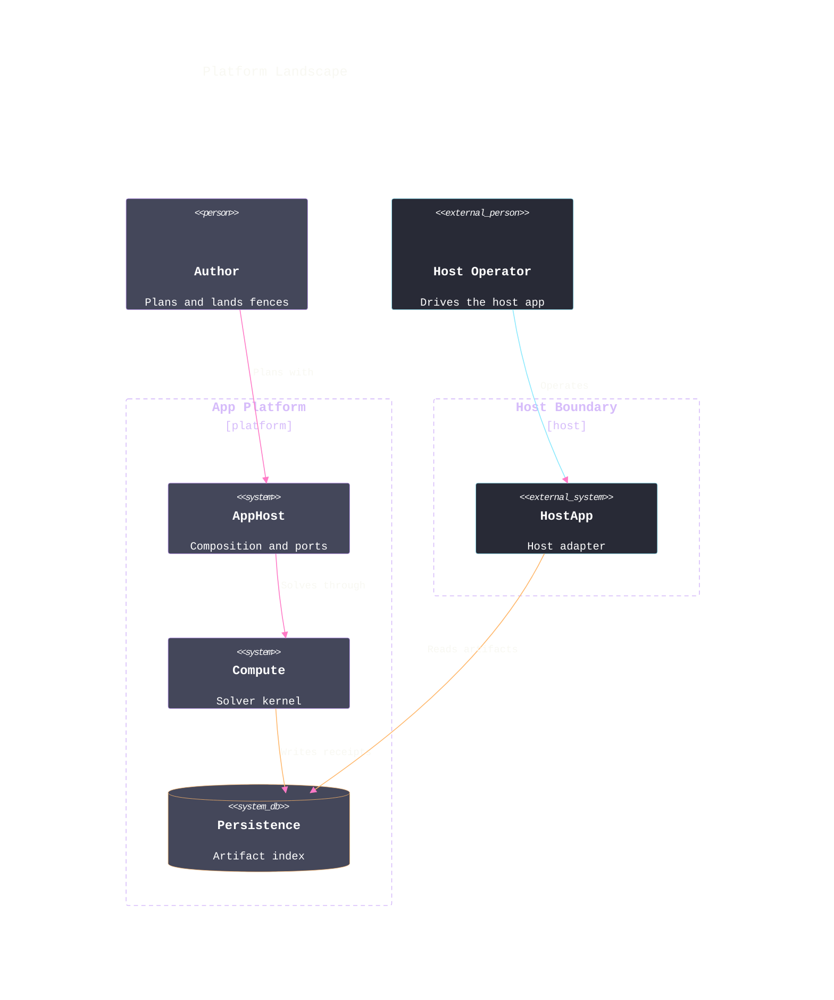

# [LANDSCAPE]

Draw the system landscape at one audience's zoom. Template law bakes in the C4 discipline an unassisted attempt violates — one boundary per ownership domain with externals homed in their own boundary, because the engine packs loose shapes in rows above every boundary and relations cross whatever lands beneath the first; persons sit above their systems; every relation carries its verb and its kind's color through `UpdateRelStyle`, with `$offsetX`/`$offsetY` pulling labels clear of boxes. Boundaries ride one macro family — the generic `Boundary` whose third argument is a real ownership word rendered as the bracketed tag under the title, so no committed landscape leaks the `[ENTERPRISE]`/`[system]` macro defaults. Element colors are `c4:` config keys, and so are fonts — `themeVariables.fontFamily` reaches only the diagram title, so the per-family `*FontFamily`/`*FontSize` pairs carry the mono stack and the type ramp to every element; boundary walls and titles re-ink Lavender through the `#444444` attribute hooks, the black default markers take canon pink at the unified scale — one shared marker serves every relation, so heads hold Pink over any line color — and the raster person sprites retire so the stereotype carries the role. Use `C4Context` with 5-8 systems and persons across one boundary per ownership domain, commonly 2-4; a view mixing zoom levels is two views, and a container question re-declares as `C4Container` in its own fence.

Refill by renaming boundaries to the real ownership domains — each with its ownership word in the `$type` slot — and elements to the real systems at ONE zoom. Every relation keeps its verb, kind color, and a label offset that clears the packed rows. Lavender boundary hooks, pink scaled markers, per-family mono pairs, and retired sprites are fixed law — a refill renames the landscape, never strips the fidelity surface.
