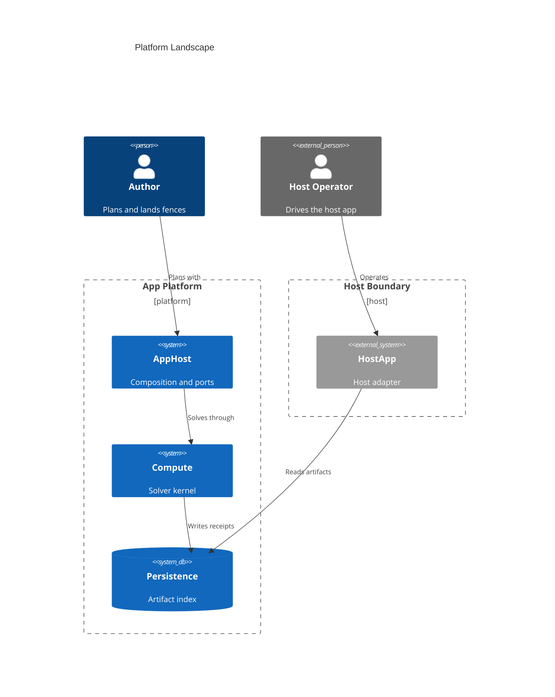

# [LANDSCAPE]

Draw the system landscape at one audience's zoom. Template law bakes in the C4 discipline an unassisted attempt violates — one boundary per ownership domain with externals homed in their own boundary, because the engine packs loose shapes in rows above every boundary and relations cross whatever lands beneath the first; persons sit above their systems; every relation carries its verb. Boundaries ride one macro family — the generic `Boundary` whose third argument is a real ownership word rendered as the bracketed tag under the title, so no committed landscape leaks the `[ENTERPRISE]`/`[system]` macro defaults. Use `C4Context` with 5-8 systems and persons across one boundary per ownership domain, commonly 2-4; a view mixing zoom levels is two views, and a container question re-declares as `C4Container` in its own fence.

Refill by renaming boundaries to the real ownership domains — each with its ownership word in the `$type` slot — and elements to the real systems at ONE zoom. Every relation keeps its verb.
