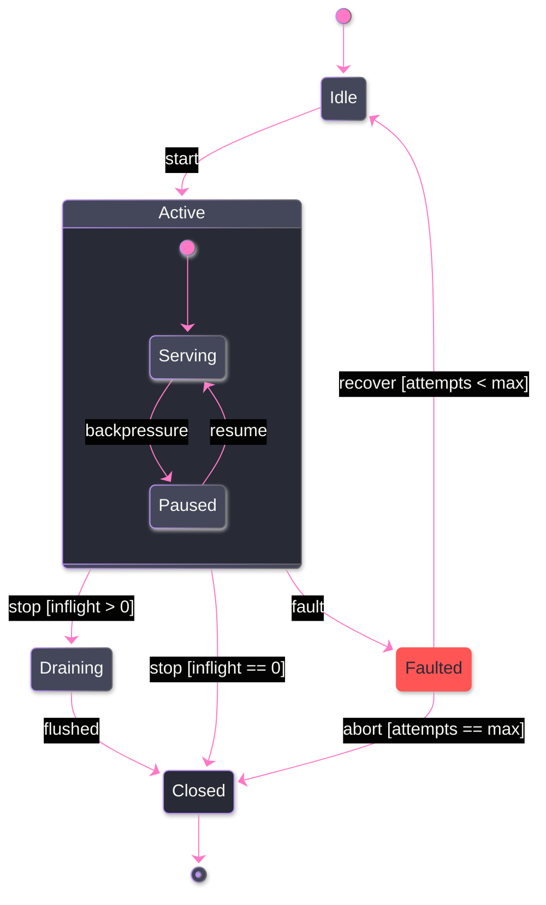

# [LIFECYCLE]

Draw a stateful owner: the resting modes it occupies and the guarded transitions between them. The template bakes in the state semantics an unassisted attempt flattens — every state is a mode the owner rests in, never an activity; guards leaving one state are disjoint, so the two `stop` exits cannot race; the fault path is a first-class state with a bounded recovery loop and a terminal abort, not an annotation; and the composite earns its nesting because its substates share every external transition. Use `stateDiagram-v2` with 5-9 states, `[*]` entry and exit, and a guard on every ambiguous transition. `stateDiagram-v2` takes no ELK — drop `layout: elk`; `look: neo` applies, and `classDef` styles plain states only, never `[*]` or a composite.

Refill law: rename the modes to the real owner's vocabulary and keep the invariants — disjoint guards per source state, one fault state with its recovery bound, exactly one terminal reached by every path.
