# [LIFECYCLE]

Draw a stateful owner: the resting modes it occupies and the guarded transitions between them. The template bakes in the state semantics an unassisted attempt flattens — every state is a mode the owner rests in, never an activity; guards leaving one state are disjoint, so the two `stop` exits cannot race; the fault path is a first-class state with a bounded recovery loop and a terminal abort, not an annotation; and the composite earns its nesting because its substates share every external transition, its concurrency regions genuinely independent. Use `stateDiagram-v2` with 5-9 states, `[*]` entry and exit, and a guard on every ambiguous transition. `stateDiagram-v2` takes no ELK — drop `layout: elk`, and `classDef` styles plain states only, never `[*]` or a composite. Dormant and transitional modes take `recessed`, the fault state `error`, the terminal `boundary`, and the nominal modes inside the composite deliberately ride the primary default — criticality contrast stays loud because not every state shouts. A once-walked path with no re-entry is a spine, never a lifecycle.

```mermaid
---
config:
  theme: base
  look: classic
  themeVariables:
    darkMode: true
    fontFamily: "SF Mono, Menlo, Cascadia Mono, Segoe UI Mono, Consolas, monospace"
    useGradient: false
    dropShadow: "none"
    background: "#282A36"
    primaryColor: "#44475A"
    primaryTextColor: "#F8F8F2"
    primaryBorderColor: "#BD93F9"
    tertiaryColor: "#21222C"
    tertiaryTextColor: "#F8F8F2"
    lineColor: "#FF79C6"
    textColor: "#F8F8F2"
    clusterBkg: "#21222C"
    clusterBorder: "#D6BCFA"
    compositeBackground: "#21222C"
    compositeTitleBackground: "#282A36"
    compositeBorder: "#D6BCFA"
    edgeLabelBackground: "#21222C"
    labelBackgroundColor: "#21222C"
  themeCSS: ".nodeLabel{font-size:13px;font-weight:500}.edgeLabel{font-size:12px;font-weight:500}.cluster-label .nodeLabel{font-size:13.5px;font-weight:700;letter-spacing:.08em;color:#D6BCFA}.transition{stroke-width:2px}.note-edge{stroke-width:1.5px}.node rect,.node circle,.node path,.node .outer-path{stroke-width:1.5px;filter:none!important}.statediagram-cluster rect.outer{stroke:#D6BCFA;stroke-width:1px!important;stroke-dasharray:5 4}.statediagram-state rect.divider{stroke:#D6BCFA;stroke-width:1px;stroke-dasharray:5 4;fill:#282A36}[id*='barbEnd'] path{fill:#FF79C6;stroke:#FF79C6;transform:scale(.4);transform-origin:14px 7px}.state-start{r:3.4px;fill:#FF79C6;stroke:#FF79C6}.node[id*='_end'] .outer-path{transform-box:fill-box;transform-origin:center;transform:scale(.48)}.edgeLabel rect{transform-box:fill-box;transform-origin:center;transform:scale(1.1,1.2)}"
---
stateDiagram-v2
    accTitle: Bridge session lifecycle
    accDescr: A bridge session moving from idle through handshake into a composite active state with concurrent streaming and watchdog regions, guarded stop exits, and a bounded fault recovery loop before terminal close.
    [*] --> Idle
    Idle --> Handshake: connect
    Handshake --> Active: certified
    Handshake --> Faulted: reject
    state "ACTIVE" as Active {
        direction TB
        [*] --> Streaming
        Streaming --> Paused: backpressure
        Paused --> Streaming: resume
        --
        [*] --> Watchdog
    }
    Active --> Draining: stop [inflight > 0]
    Active --> Closed: stop [inflight == 0]
    Active --> Faulted: fault
    Faulted --> Idle: recover [attempts < max]
    Faulted --> Closed: abort [attempts == max]
    Draining --> Closed: flushed
    Closed --> [*]
    classDef error fill:#FF555580,stroke:#FF5555,color:#F8F8F2
    classDef boundary fill:#282A36,stroke:#BD93F9,color:#F8F8F2
    classDef recessed fill:#21222C,stroke:#6272A4,color:#F8F8F2
    class Faulted error
    class Closed boundary
    class Idle,Handshake,Paused,Draining recessed
```

Refill by renaming the modes to the real owner's vocabulary and keep the invariants — disjoint guards per source state, one fault state with its recovery bound, exactly one terminal reached by every path, concurrency regions only for genuinely independent sub-modes, and a class on every resting state. The frontmatter micro-scale `themeCSS` stamp and the ruled mono stack are fixed law — a refill renames modes, never strips the fidelity surface.
