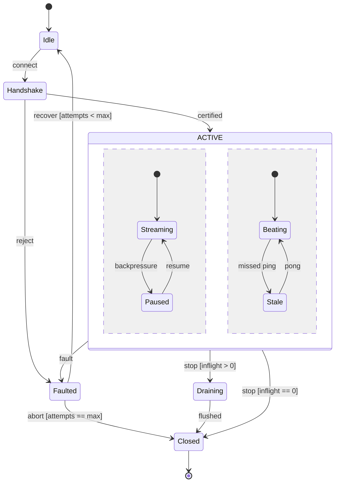

# [LIFECYCLE]

Draw a stateful owner: the resting modes it occupies and the guarded transitions between them. Template law bakes in the state semantics an unassisted attempt flattens — every state is a mode the owner rests in, never an activity; guards leaving one state are disjoint, so the two `stop` exits cannot race; the fault path is a first-class state with a bounded recovery loop and a terminal abort, not an annotation; and the composite earns its nesting because its substates share every external transition, its concurrency regions genuinely independent with every region's sub-modes holding real guarded exits — a region whose one state never leaves is an absorbing non-terminal, the degenerate region this template exists to forbid. Use `stateDiagram-v2` with 5-9 top-level states, `[*]` entry and exit, and a guard on every ambiguous transition; a three-or-more-way guarded branch fans through a `<<choice>>` pseudostate instead of stacking guards on one source. State ELK needs a host-registered loader with no dagre fallback — drop `layout: elk` so the fence renders on any host. A once-walked path with no re-entry is a spine, never a lifecycle.

Refill by renaming the modes to the real owner's vocabulary and keep the invariants — disjoint guards per source state, one fault state with its recovery bound, exactly one terminal reached by every path, and concurrency regions only for genuinely independent sub-modes each carrying real exits.
