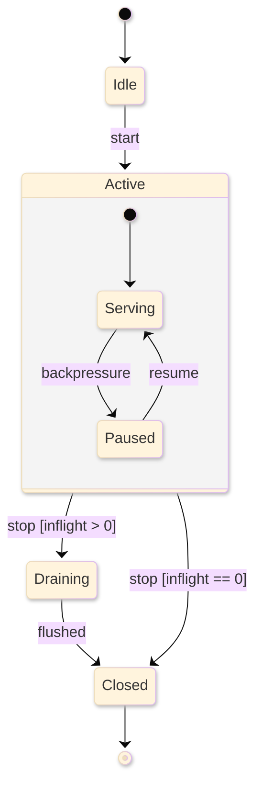

# [LIFECYCLE]

Draw a stateful owner: the states it holds and the guarded transitions between them. Use `stateDiagram-v2` with 5-7 states, `[*]` entry and exit, guard labels on every transition, and one composite state expanding its internal substates. `stateDiagram-v2` does not support ELK — drop `layout: elk`; `look: neo` still applies.

