# [LOGIC_FLOW]

Draw one operation's dispatch structure: input discrimination fanning to arms, arms folding into one merge, the merge yielding a receipt. Template law bakes in the polymorphic-collapse law — variation lives in the arms and never in parallel exits, so every arm folds back to the single receipt path — plus four load-bearing moves an unassisted attempt omits: the discriminator reads its arms from a policy store, making dispatch table-driven rather than hardcoded branching; the content key gates a cache short-circuit, and that one hit edge carries `animate: true` because it is the hot path; every arm can reject onto one Red fault rail whose convergence point states the recovery law once, and the rail rejoins the fold so a fault still yields the one receipt; and evidence feeds the fold on a dotted trace so the receipt is auditable. Use `flowchart LR` with two rhombi — a cache gate feeding one arm discriminator, each with exhaustive, disjoint out-labels — and three-or-more arms; the receipt is classed `success` with delivery on the Green rail, stores are classed `data`, the fault rail `error` on Red `edgeError`, and dotted traces ride Comment `edgeTrace`. Ordered steps across a boundary are a wire-sequence, never a dispatch fold.

```mermaid
---
config:
  theme: base
  look: classic
  layout: elk
  flowchart:
    curve: linear
    padding: 25
  themeVariables:
    darkMode: true
    fontFamily: "SF Mono, Menlo, Cascadia Mono, Segoe UI Mono, Consolas, monospace"
    useGradient: false
    dropShadow: "none"
    background: "#282A36"
    primaryColor: "#44475A"
    primaryTextColor: "#F8F8F2"
    primaryBorderColor: "#BD93F9"
    lineColor: "#FF79C6"
    textColor: "#F8F8F2"
    edgeLabelBackground: "#21222C"
    labelBackgroundColor: "#21222C"
  themeCSS: ".nodeLabel{font-size:13px;font-weight:500}.edgeLabel{font-size:12px;font-weight:500}.cluster-label .nodeLabel{font-size:13.5px;font-weight:700;letter-spacing:.08em}.edge-thickness-normal{stroke-width:2px}.edge-thickness-thick{stroke-width:3px}.edge-pattern-dashed,.edge-pattern-dotted{stroke-width:1.5px;stroke-dasharray:4 6}.node rect,.node circle,.node polygon,.node path,.node .outer-path{stroke-width:1.5px;filter:none!important}.cluster rect{stroke-width:1px!important;stroke-dasharray:5 4!important;filter:none!important}.marker path{transform:scale(.8);transform-origin:5px 5px}.marker circle{transform:scale(.48);transform-origin:5px 5px}.edgeLabel rect{transform-box:fill-box;transform-origin:center;transform:scale(1.1,1.2)}"
---
flowchart LR
    accTitle: Solve dispatch and fold
    accDescr: One compute entry discriminating input shape into three policy-selected arms behind an animated content-key cache short-circuit, arm rejects converging on one red fault rail that rejoins the fold, and a dotted evidence trace feeding the single solver receipt.
    In([SolveRequest]) -->|"content key"| Hit{Cached?}
    Hit e1@-->|"hit"| Fold
    Hit -->|"miss"| Shape{Shape?}
    Policy[(Policy rows)] e2@-.->|"selects arms"| Shape
    Shape -->|"single"| ArmA[Solve one]
    Shape -->|"batch"| ArmB[Solve batch]
    Shape -->|"stream"| ArmC[Solve stream]
    ArmA --> Fold[Fold]
    ArmB --> Fold
    ArmC --> Fold
    ArmA e3@-.->|"reject"| Fault[/Fault rail/]
    ArmB e4@-.->|"reject"| Fault
    ArmC e5@-.->|"reject"| Fault
    Fault e6@-->|"fault row"| Fold
    Fold e7@--> Receipt[/SolveReceipt/]
    Evidence[(Evidence)] e8@-.->|"trace"| Fold
    e1@{ animate: true }
    classDef primary fill:#44475A,stroke:#FF79C6,color:#F8F8F2
    classDef success fill:#50FA7BBF,stroke:#50FA7B,color:#282A36
    classDef error fill:#FF555580,stroke:#FF5555,color:#F8F8F2
    classDef data fill:#FFB86CBF,stroke:#FFB86C,color:#282A36
    classDef boundary fill:#282A36,stroke:#BD93F9,color:#F8F8F2
    classDef edgeSuccess stroke:#50FA7B,color:#F8F8F2
    classDef edgeError stroke:#FF5555,stroke-width:3px,color:#F8F8F2
    classDef edgeTrace stroke:#6272A4,color:#F8F8F2
    class ArmA,ArmB,ArmC,Shape,Hit primary
    class Receipt success
    class Fault error
    class Policy,Evidence data
    class In,Fold boundary
    class e1,e7 edgeSuccess
    class e2,e8 edgeTrace
    class e3,e4,e5,e6 edgeError
```

Arm labels are the input-shape vocabulary — rename them to the real discriminants and keep them exhaustive; a new capability is a new arm row, never a second exit after the fold, and every rail binds through `eN@` ids and `class eN edge<Rail>`, so an added arm never renumbers the survivors. Cache short-circuit rides the Green rail and the sole `animate: true` because it delivers the same receipt on the hot path; a raster export stills it. Node budget of 8-12 holds at three arms — past four, drop the cache or evidence furniture or extract an arm subflow into its own fence, because 2N converging arm edges break the crossing floor before the node ceiling. Frontmatter micro-scale `themeCSS` stamp, the ruled mono stack, and the `#21222C` edge-label backing are fixed law — a refill renames content, never strips the fidelity surface.
