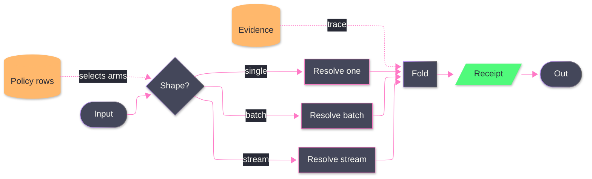

# [LOGIC_FLOW]

Draw one operation's dispatch structure: input discrimination fanning to arms, arms folding into one merge, the merge yielding a receipt. The template bakes in the polymorphic-collapse law — variation lives in the arms and never in parallel exits, so every arm folds back to the single receipt path — plus two supports an unassisted attempt omits: the discriminator reads its arms from a policy store, making dispatch table-driven rather than hardcoded branching, and evidence feeds the fold on a dotted trace so the receipt is auditable. Use `flowchart LR` with 8-12 nodes, one rhombus discriminator whose out-labels are exhaustive and disjoint, and three-or-more arms; the receipt is classed `success`, stores are classed `data`.

Refill law: the arm labels are the input-shape vocabulary — rename them to the real discriminants and keep them exhaustive; a new capability is a new arm row, never a second exit after the fold.
