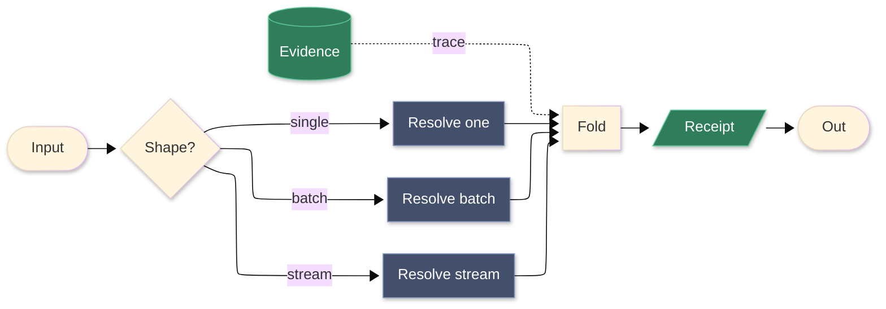

# [LOGIC_FLOW]

Draw one operation's branch and dispatch structure: input discrimination fanning to dispatch arms, arms folding into a merge, and the merge yielding a receipt. Use `flowchart LR` with 8-12 nodes, one rhombus discriminator, three-or-more parallel arms collapsing to a single fold, and exactly one dotted evidence edge feeding the fold. Variation lives in the arms, never in parallel exits.

