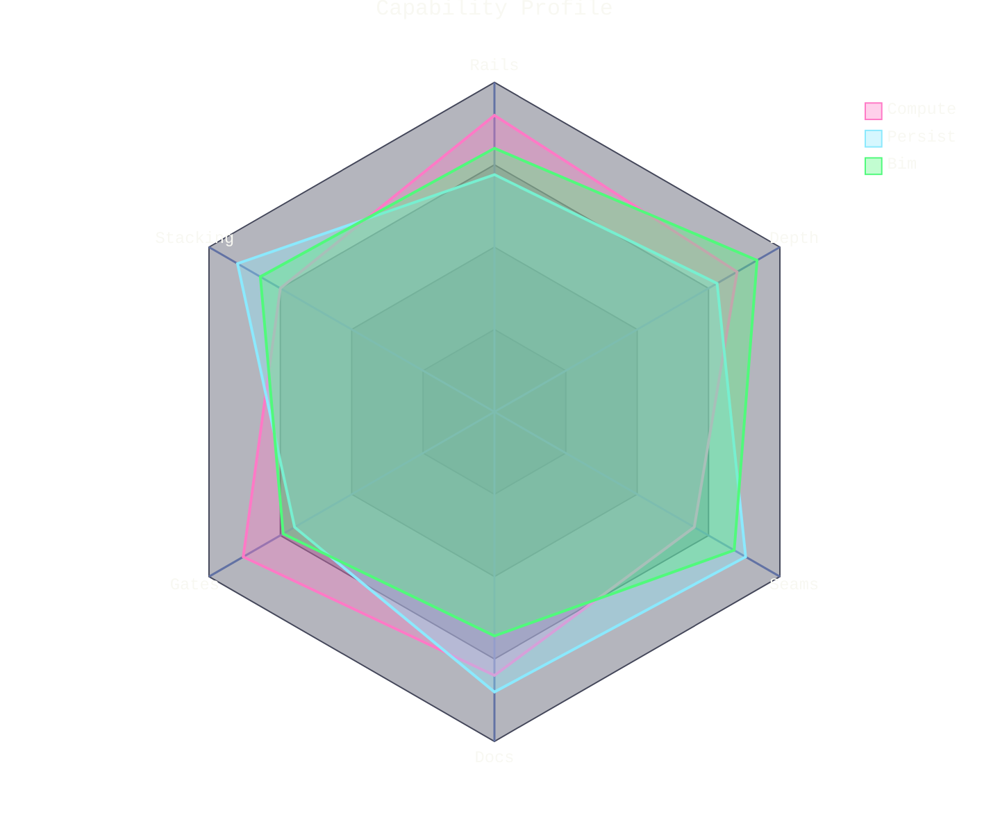

# [PROFILE]

Draw a multivariate comparison of two subjects across one axis set. The template bakes in the radar discipline an unassisted attempt washes out — the curves carry genuinely distinct assessments, because identical data cancels into one pale polygon; fills sit at the `.35` curve opacity so both polygons read where they overlap while their full-hue 2px strokes hold the border law; and the margins clear the axis labels, which anchor outside the chart radius and clip at the viewport edge. Use `radar-beta` with 5-7 axes, two to four curves whose hues follow the ordinal order — pink, cyan, green, keyed entries so values bind by axis id, and short curve labels — the legend position is engine-fixed. Scores come from assessment, never narrative; a profile without a stated scoring basis beside the fence is decoration.

Refill by renaming axes to the real judgment set and curves to the subjects, scores from the stated assessment; axis labels stay short enough for the margins, and a longer roster widens `marginLeft`/`marginRight` before it abbreviates. The two-hue curve set, `.35` fill opacity, full-hue strokes, and Comment graticule are fixed law — a refill renames the comparison, never strips the fidelity surface.
