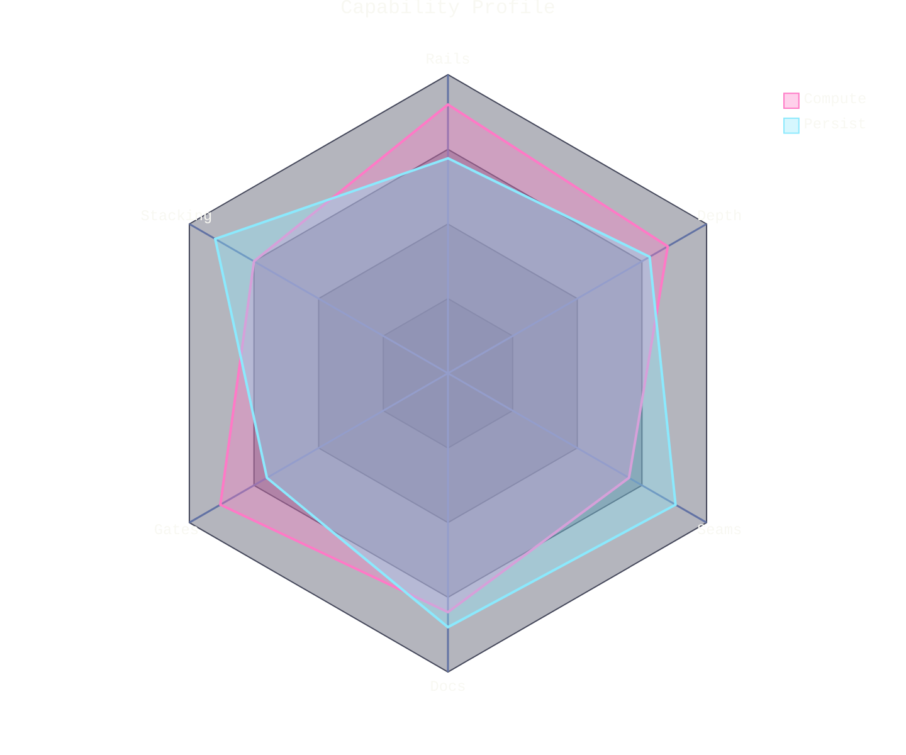

# [PROFILE]

Draw a multivariate comparison of two subjects across one axis set. Template law bakes in the radar discipline an unassisted attempt washes out — two curves is the canonical form, because fills at the `.35` curve opacity keep both polygons readable where they overlap while their full-hue 2px strokes hold the border law; a third curve is admissible only when its values separate visibly, since stacked translucent fills mud the center, and a fourth is a defect the canon rejects; curves carry genuinely distinct assessments, because identical data cancels into one pale polygon; and the margins clear the axis labels, which anchor outside the chart radius and clip at the viewport edge. Use `radar-beta` with 5-8 axes and short curve labels, hues on the ordinal order — pink, cyan, then green for the earned third — with values keyed by axis id; the legend position is engine-fixed. Scores land on the 0-100 band the fence sets, and a different rubric retunes `max` and `ticks` together. Scores come from assessment, never narrative; a profile without a stated scoring basis beside the fence is decoration.

Refill by renaming axes to the real judgment set and curves to the subjects, scores from the stated assessment; axis labels stay short enough for the margins, and a longer roster widens `marginLeft`/`marginRight` before it abbreviates. Two-curve set, `.35` fill opacity, full-hue strokes, the shared axis set, and the polygon graticule are fixed law — a refill renames the comparison, never strips the fidelity surface.
