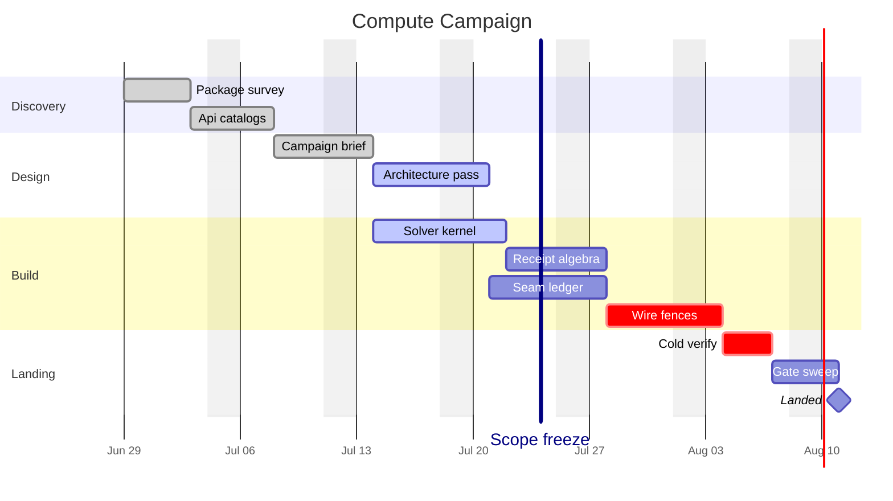

# [SCHEDULE]

Draw owned work committed to dates. Template law bakes in the schedule discipline an unassisted attempt fakes — every bar chains through `after` onto its real dependency and a convergence point lists every prerequisite (`after k2 s2`), so the critical path is derivable, never asserted; state marks truth against the real today (`done`, `active`, `crit`), a law the refiller upholds by dating active bars to straddle the today rule; a `vert` task draws the governance gate as a full-height marker; and the milestone is the zero-length terminal commitment downstream of the convergence gate. Gantt has no blocked state: a stalled task carries its blocker in the label, and `crit` stays reserved for the critical path rather than doubling as an alarm chip. Use `gantt` with sections in phase order, parallel workstreams as interleaved chains, and `axisFormat` with `tickInterval` and `weekday` sized to the span; the `gantt:` block carries geometry keys. Dependency-free decoration bars are the defect — a bar with no `after` and no date commitment is prose, not schedule.

Refill by renaming sections to the real phases and tasks to the owned work, keep every bar on its `after` chain with convergence points listing all prerequisites, mark state truthfully against the real today, place the `vert` gate on its governed date, and size `tickInterval`/`weekday` to the real span so the axis never overlaps.
