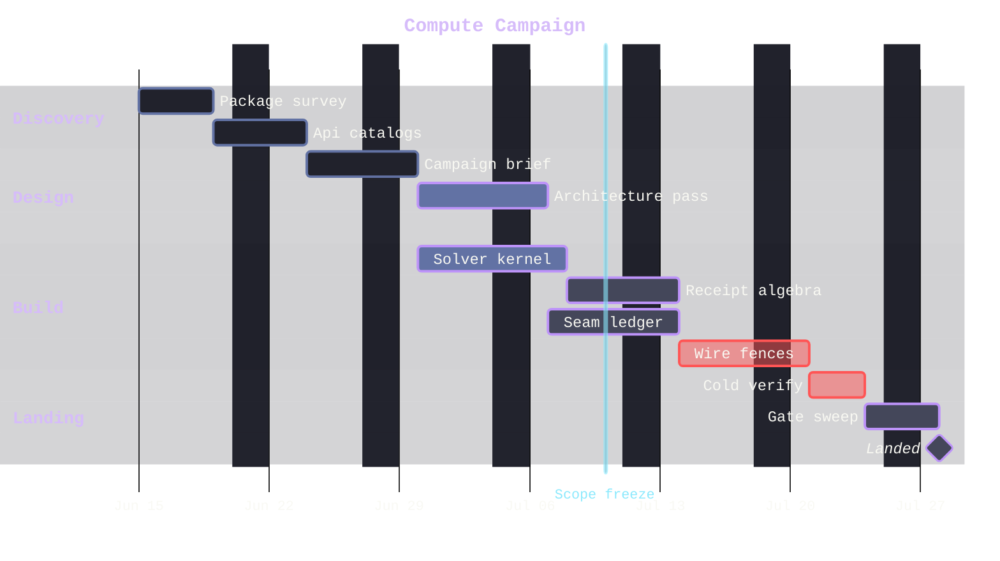

# [SCHEDULE]

Draw owned work committed to dates. The template bakes in the schedule discipline an unassisted attempt fakes — every bar chains through `after` onto its real dependency and a convergence point lists every prerequisite (`after k2 s2`), so the critical path is derivable, never asserted; state marks truth (`done`, `active`, `crit`), with active bars straddling the today rule; a `vert` task draws the governance gate as a full-height marker — an engine rect classed `.vert` that renders as an opaque pipe until the fill-opacity stamp washes it; excluded days recess instead of glare; and the milestone is the one zero-length commitment the chains converge on. Use `gantt` with sections in phase order, parallel workstreams as interleaved chains, `axisFormat` with `tickInterval` and `weekday` sized to the span, and the Lavender `.sectionTitle` stamp so lane titles carry the container-title law. The today rule spans the full canvas, so it carries a translucent stroke through the `todayMarker` style string and never blinds what it crosses. Dependency-free decoration bars are the defect — a bar with no `after` and no date commitment is prose, not schedule.

Refill by renaming sections to the real phases and tasks to the owned work, keep every bar on its `after` chain with convergence points listing all prerequisites, mark state truthfully against the real today, place the `vert` gate on its governed date, and size `tickInterval`/`weekday` to the real span so the axis never overlaps. The Lavender section stamp, recessed exclude bands, translucent critical chip, and translucent today rule are fixed law — a refill renames work, never strips the fidelity surface.
