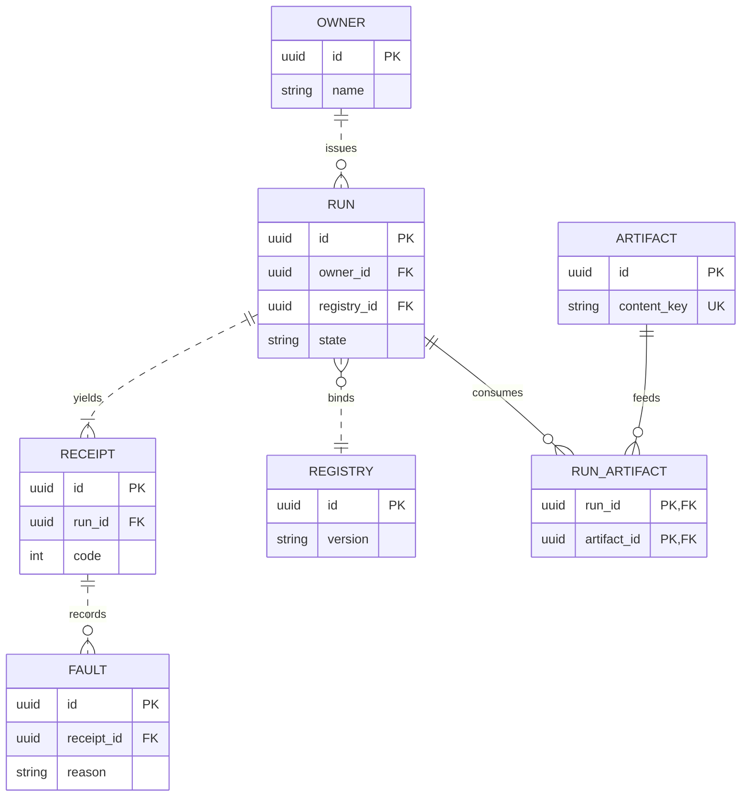

# [SCHEMA]

Draw persistent entities and their relations. Template law bakes in the schema discipline an unassisted attempt violates — every relationship edge has its FK attribute on the owning side and every FK has its edge, drawn so the diagram cannot disagree with the DDL; cardinality states what storage enforces, never intended usage; the stroke is a dependency claim, not typography — solid `--` marks an identifying relation whose FK sits inside the child's PK, dashed `..` marks a non-identifying relation whose FK is a plain column; and a many-to-many resolves through a visible junction entity carrying both FKs in its composite key, because the crow's foot cannot express it directly. A polymorphic association — one `subject_id` discriminated over N parents — is the other shape crow's foot cannot draw: split it into concrete owner tables with one real FK-edge each, or carry the bare discriminator pair with no FK marker and the union stated in prose, never two mandatory edges asserting a join that storage does not enforce. Use `erDiagram` with 4-7 entities around one aggregate root, typed attributes with `PK`/`FK`/`UK` markers including the compound `PK, FK` form, and verb-labeled relations; `erDiagram` takes no ELK. In-memory type relations are a class diagram, never a persistence schema.

Refill by renaming entities to the real aggregate, keep FK-edge reciprocity on every relation, dash every relation whose FK sits outside the child's PK — here only the junction's two edges stay solid, because `run_id` and `artifact_id` are its composite key — and resolve any many-to-many through such a junction.
