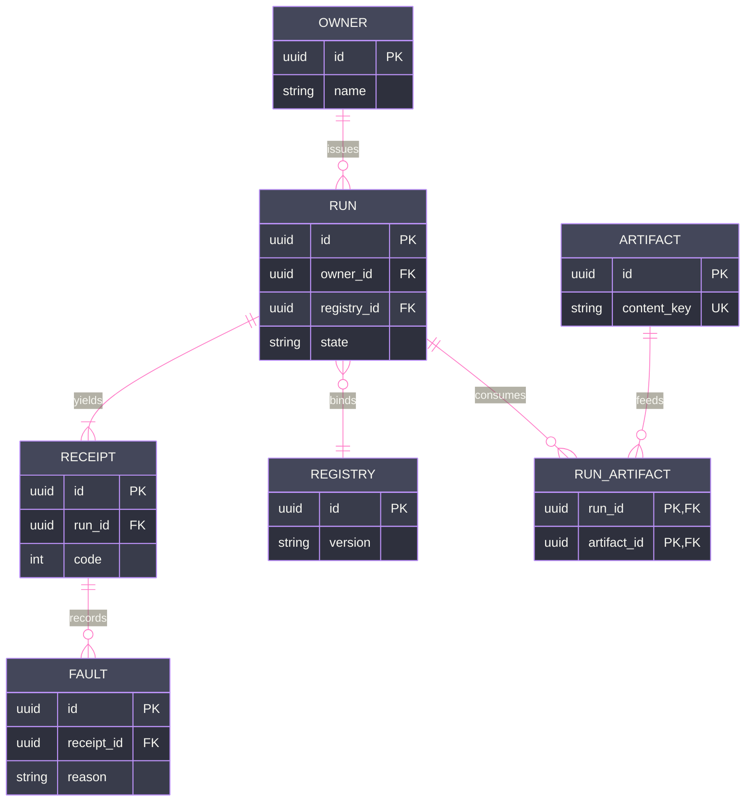

# [SCHEMA]

Draw persistent entities and their relations. The template bakes in the schema discipline an unassisted attempt violates — every relationship edge has its FK attribute on the owning side and every FK has its edge, so the diagram and the storage constraint cannot disagree; cardinality states what storage enforces, never intended usage; and a many-to-many resolves through a visible junction entity carrying both FKs, because the crow's foot cannot express it directly. Use `erDiagram` with 4-7 entities around one aggregate root, typed attributes with `PK`/`FK` markers, and verb-labeled relations. `erDiagram` takes no ELK and no `look` — keep `theme: base` with its variable block.

Refill law: rename entities to the real aggregate, keep FK-edge reciprocity on every relation, and resolve any many-to-many through a junction entity whose composite key is both FKs.
