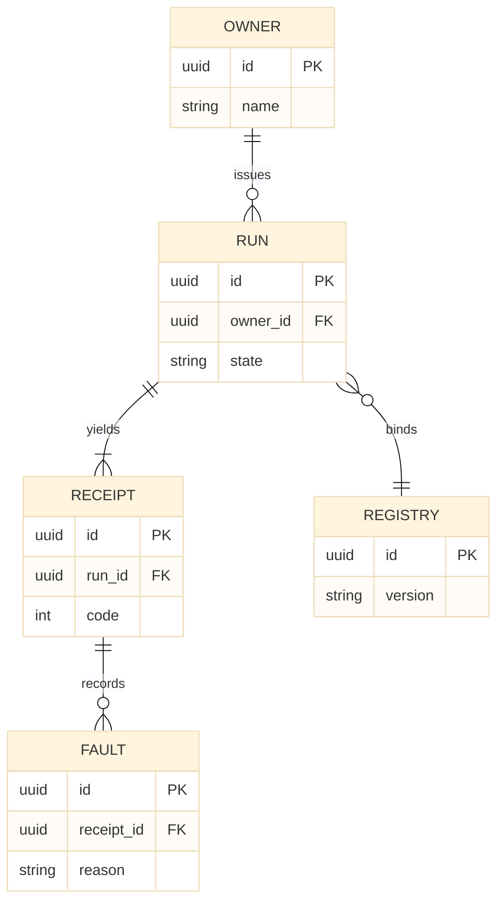

# [SCHEMA]

Draw persistent entities and their relations. Use `erDiagram` with 4-5 entities, typed attributes carrying `PK`/`FK` markers, and relationship cardinalities with verb labels. `erDiagram` supports neither ELK nor `look` — keep only `theme: base`.

