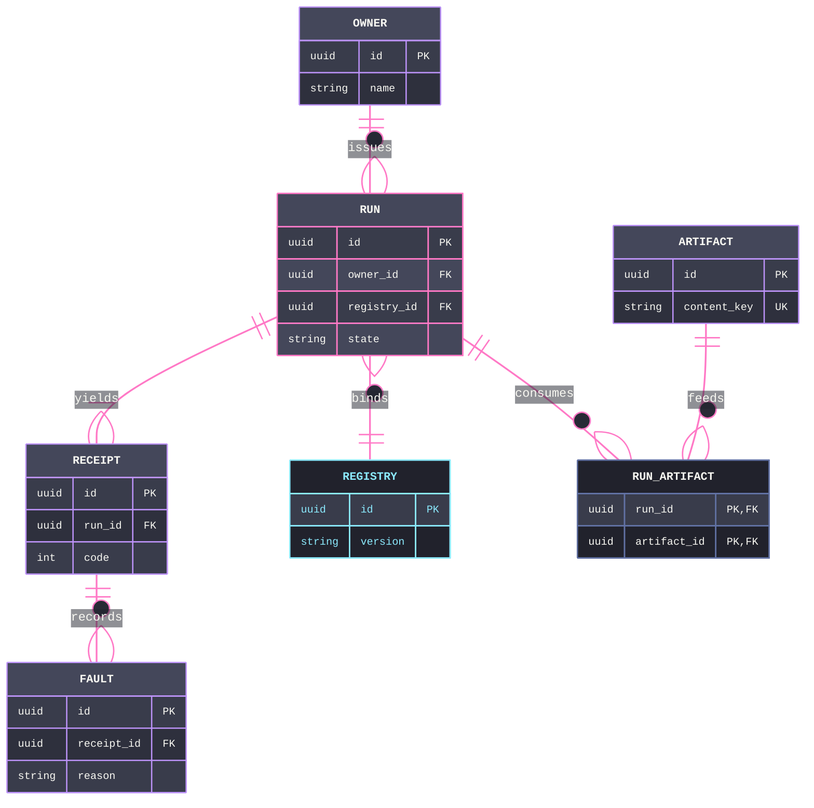

# [SCHEMA]

Draw persistent entities and their relations. The template bakes in the schema discipline an unassisted attempt violates — every relationship edge has its FK attribute on the owning side and every FK has its edge, so the diagram and the storage constraint cannot disagree; cardinality states what storage enforces, never intended usage; and a many-to-many resolves through a visible junction entity carrying both FKs, because the crow's foot cannot express it directly. Use `erDiagram` with 4-7 entities around one aggregate root, typed attributes with `PK`/`FK` markers, and verb-labeled relations; the aggregate root is classed `primary`, the junction `recessed`, and an externally-owned registry `external` in its ER stroke-encoded form — dark fill, Cyan stroke and title — because a bright fill floods the attribute rows; the hierarchy the prose claims is the hierarchy the render shows. `erDiagram` takes no ELK, and this template holds the classic look — keep `theme: base` with its variable block. In-memory type relations are a class diagram, never a persistence schema.

Refill by renaming entities to the real aggregate, keep FK-edge reciprocity on every relation, resolve any many-to-many through a junction entity whose composite key is both FKs, and keep the root/junction/external classes on the entities that carry those roles. The frontmatter micro-scale `themeCSS` stamp, the ruled mono stack, and the `#21222C` label backing are fixed law — a refill renames entities, never strips the fidelity surface.
