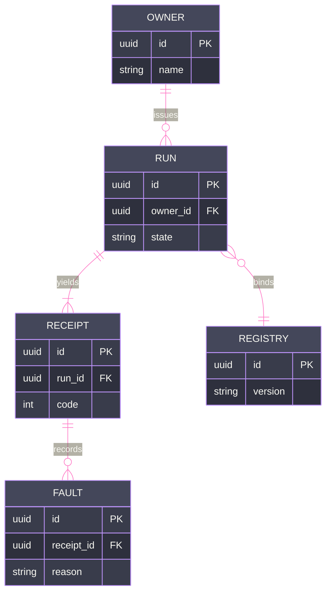

# [SCHEMA]

Draw persistent entities and their relations. Use `erDiagram` with 4-5 entities, typed attributes carrying `PK`/`FK` markers, and relationship cardinalities with verb labels. `erDiagram` supports no ELK and no `look` — keep `theme: base` with its variable block.

