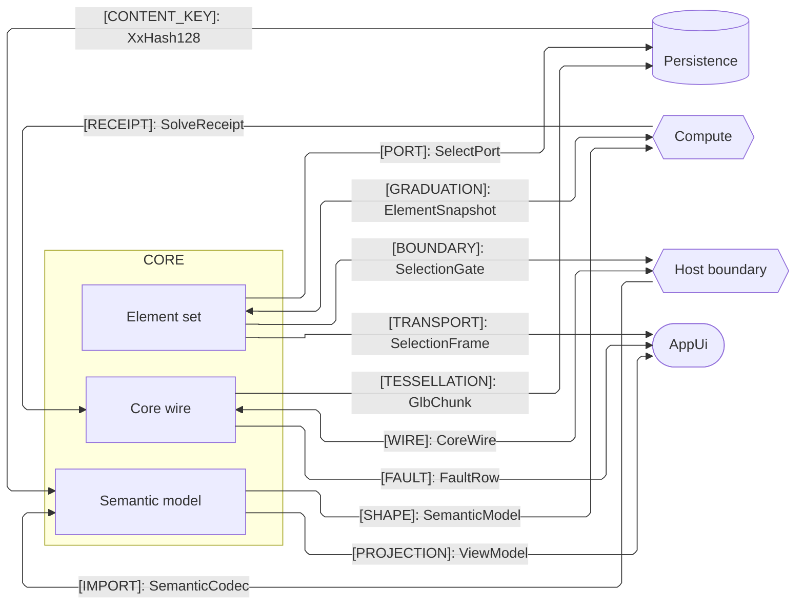

# [SEAM_GRAPH]

Draw who exchanges what shape across a package boundary. A seam edge is cross-boundary by construction: the home package's sub-domain owner on one side, a counterpart package on the other. An in-package relation — home sub-domain to home sub-domain — is never a seam; it lives in the codemap or an internal-flow diagram. Every edge is one contracted shape labeled `"[KIND]: shape-name"` from the KIND vocabulary `[WIRE] [SHAPE] [PORT] [BOUNDARY] [IMPORT] [RECEIPT] [CONTENT_KEY] [GRADUATION] [TESSELLATION] [FAULT] [PROJECTION] [TRANSPORT]`, so an unkinded edge is an unowned contract; a new kind joins the vocabulary beside its nearest existing kind, never as a free-form label. A bidirectional edge exists only where a real inverse contract exists, and the counterpart mirrors the same edge verbatim in its own seam graph, so the label is shared law, not local prose. Each label carries the canonical wire name only — never a method chain, sub-path, or "via" clause; the owning page carries the bytes.

A seam graph is partner-package grain, not row grain: the home `subgraph` holds only the sub-domain owners that carry a cross-boundary seam, and each counterpart is one node named by its package, never a sub-path. Multiple contracts between one sub-domain and one partner collapse to a single edge at the load-bearing kind — the owning page's prose enumerates the rest. Node shape encodes counterpart role: a data store rides the cylinder `[( )]`, a bidirectional peer the hexagon `{{ }}`, a pure-sink peer the stadium `([ ])`, and home owners the rectangle `[ ]`. A pure source has no reversed-arrow form — flowchart rejects `<--`, so a source counterpart is always the edge source (`Source --> Owner`) and lands left of the home subgraph unless a split isolates sources. Never `elk.mergeEdges`, which fuses same-target edges into one arrowhead and erases the per-edge kind semantics this archetype exists to carry.

One fence renders clean — no edge-over-node, few crossings. Crossing control starts at declaration order: group counterparts beside the owners they attach to and keep a shared counterpart adjacent to both, but the primary cure is the split, never ELK knobs. A package whose cross-boundary seams overflow one clean fence splits by counterpart group into two fences, each answering one question and carrying its own frontmatter and `accTitle` — the natural partition is peer-role (domain peers versus platform and cross-runtime peers) or same-branch versus cross-branch. A layer-permission question is strata, never a seam registry.

Refill by renaming owners and counterparts to the real packages, keep every label `[KIND]: shape-name` with the shape's exact wire name, and land the mirrored edge in the counterpart's graph in the same change.
