# [SEAM_GRAPH]

Draw who exchanges what shape across a package boundary. The template bakes in what a seam actually is — every edge is one contracted shape crossing the boundary, labeled `"[KIND]: shape-name"` from the closed KIND vocabulary `[WIRE] [SHAPE] [PORT] [BOUNDARY] [RECEIPT] [CONTENT_KEY] [GRADUATION] [TESSELLATION] [FAULT] [PROJECTION] [TRANSPORT]`, so an unkinded edge is an unowned contract; a bidirectional edge exists only where a real inverse contract exists, never as label-dodging; and the counterpart mirrors the same edge verbatim in its own seam graph, so the label text is shared law, not local prose. The KIND also selects the edge rail — data-bearing kinds (`[WIRE] [CONTENT_KEY] [GRADUATION] [TESSELLATION]`) ride Orange, `[RECEIPT]` rides Green, `[FAULT]` rides Red, boundary-crossing delivery (`[TRANSPORT] [PROJECTION]`) rides Cyan, and control kinds keep the Pink default — so the label's law and the stroke's law agree. Use `flowchart LR` with one `subgraph` for the home package holding its sub-domain owners, counterpart packages outside it, and 8-12 edges — never `elk.mergeEdges`, which fuses same-target rails into one arrowhead painted by a single edge's color, erasing the kind semantics this archetype exists to carry. Node `classDef` encodes seam direction — bidirectional counterparts classed `external` against one-way sinks classed `annotation`. Layer permission questions are strata, never a seam registry.

```mermaid
---
config:
  theme: base
  look: classic
  layout: elk
  flowchart:
    curve: linear
    padding: 25
  themeVariables:
    darkMode: true
    fontFamily: "SF Mono, Menlo, Cascadia Mono, Segoe UI Mono, Consolas, monospace"
    useGradient: false
    dropShadow: "none"
    background: "#282A36"
    primaryColor: "#44475A"
    primaryTextColor: "#F8F8F2"
    primaryBorderColor: "#BD93F9"
    lineColor: "#FF79C6"
    textColor: "#F8F8F2"
    clusterBkg: "#21222C"
    clusterBorder: "#D6BCFA"
    edgeLabelBackground: "#21222C"
    labelBackgroundColor: "#21222C"
    titleColor: "#D6BCFA"
  themeCSS: ".nodeLabel{font-size:13px;font-weight:500}.edgeLabel{font-size:12px;font-weight:500}.cluster-label .nodeLabel{font-size:13.5px;font-weight:700;letter-spacing:.08em}.edge-thickness-normal{stroke-width:2px}.edge-thickness-thick{stroke-width:3px}.edge-pattern-dashed,.edge-pattern-dotted{stroke-width:1.5px;stroke-dasharray:4 6}.node rect,.node circle,.node polygon,.node path,.node .outer-path{stroke-width:1.5px;filter:none!important}.cluster rect{stroke-width:1px!important;stroke-dasharray:5 4!important;filter:none!important}.marker path{transform:scale(.8);transform-origin:5px 5px}.marker circle{transform:scale(.48);transform-origin:5px 5px}.edgeLabel rect{transform-box:fill-box;transform-origin:center;transform:scale(1.1,1.2)}"
---
flowchart LR
    accTitle: Bim package seam registry
    accDescr: Bim sub-domain owners exchanging kinded shapes with persistence, compute, the host boundary, and the app shell, edge rails colored by kind and nodes classed by seam direction.
    subgraph bim[RASM.BIM]
        Semantic[Semantic model]
        ElementSet[Element set]
        Wire[Bim wire]
    end
    Persistence[(Rasm.Persistence)]
    Compute{{Rasm.Compute}}
    Host{{Host boundary}}
    AppUi([Rasm.AppUi])
    Semantic -->|"[SHAPE]: IfcSemanticModel"| ElementSet
    ElementSet -->|"[PORT]: SelectPort"| Wire
    Wire <-->|"[WIRE]: BimWire"| Host
    Persistence -->|"[CONTENT_KEY]: XxHash128"| Semantic
    Wire -->|"[TESSELLATION]: GlbChunk"| Persistence
    ElementSet <-->|"[GRADUATION]: ElementSnapshot"| Compute
    Compute -->|"[RECEIPT]: SolveReceipt"| Wire
    Wire -->|"[FAULT]: FaultRow"| AppUi
    Wire -->|"[PROJECTION]: ViewModel"| AppUi
    Host -->|"[TRANSPORT]: Frame"| AppUi
    linkStyle 1 stroke:#FF79C6,color:#F8F8F2
    linkStyle 2,3,4,5 stroke:#FFB86C,color:#F8F8F2
    linkStyle 6 stroke:#50FA7B,color:#F8F8F2
    linkStyle 7 stroke:#FF5555,stroke-width:3px,color:#F8F8F2
    linkStyle 8,9 stroke:#8BE9FD,color:#F8F8F2
    classDef primary fill:#44475A,stroke:#FF79C6,color:#F8F8F2
    classDef external fill:#8BE9FDBF,stroke:#8BE9FD,color:#282A36
    classDef data fill:#FFB86CBF,stroke:#FFB86C,color:#282A36
    classDef annotation fill:#21222C,stroke:#6272A4,color:#F8F8F2
    class Semantic,ElementSet,Wire primary
    class Compute,Host external
    class Persistence data
    class AppUi annotation
```

Refill by renaming owners and counterparts to the real packages, keep every label `[KIND]: shape-name` with the shape's exact wire name, keep each edge on its kind's rail — `linkStyle` indices are declaration positions, recounted after any edge insertion; a seam registry that grows under edits moves its rails to edge-id classes (`Wire f1@-->|"[FAULT]: FaultRow"| AppUi` with `class f1 edgeError`), which survive insertions without recounts — and land the mirrored edge in the counterpart's graph in the same change. The frontmatter micro-scale `themeCSS` stamp, the ruled mono stack, and the `#21222C` edge-label backing are fixed law — a refill renames content, never strips the fidelity surface.
