# [SEAM_GRAPH]

Draw who exchanges what shape across a package boundary. Use `flowchart LR` with one `subgraph` for the home package holding its sub-domain owners, counterpart packages outside it, and 8-12 edges each labeled `"[KIND]: shape-name"`. The KIND vocabulary is closed: `[WIRE] [SHAPE] [PORT] [BOUNDARY] [RECEIPT] [CONTENT_KEY] [GRADUATION] [TESSELLATION] [FAULT] [PROJECTION] [TRANSPORT]`. Node `classDef` encodes seam direction — bidirectional counterparts classed `external` against one-way sinks classed `annotation`.

```mermaid
---
config:
  layout: elk
  look: neo
  theme: base
  themeVariables:
    darkMode: true
    background: "#282A36"
    primaryColor: "#44475A"
    primaryTextColor: "#F8F8F2"
    primaryBorderColor: "#BD93F9"
    lineColor: "#FF79C6"
    textColor: "#F8F8F2"
    clusterBkg: "#21222C"
    clusterBorder: "#6272A4"
    edgeLabelBackground: "#282A36"
    titleColor: "#F8F8F2"
---
flowchart LR
    accTitle: Package seam registry
    accDescr: Home package sub-domains exchanging kinded shapes with external counterparts, classed by bidirectional versus one-way seam direction.
    subgraph core[core package]
        Resolver[Resolver]
        Registry[Registry]
        Composer[Composer]
    end
    DataStore[(data)]
    UiShell[ui]
    Transport{{transport}}
    Registry -->|"[SHAPE]: Descriptor"| Composer
    Composer -->|"[PORT]: ResolvePort"| Resolver
    Resolver <-->|"[WIRE]: RowBatch"| DataStore
    DataStore -->|"[CONTENT_KEY]: Hash128"| Registry
    DataStore -->|"[GRADUATION]: Snapshot"| Composer
    Composer <-->|"[BOUNDARY]: PortMap"| Transport
    Transport -->|"[TRANSPORT]: Frame"| UiShell
    Resolver -->|"[PROJECTION]: ViewModel"| UiShell
    Resolver -->|"[RECEIPT]: RunReceipt"| UiShell
    Resolver -->|"[FAULT]: FaultRow"| UiShell
    classDef primary fill:#44475A,stroke:#FF79C6,color:#F8F8F2
    classDef external fill:#8BE9FD,stroke:#8BE9FD,color:#282A36
    classDef annotation fill:#44475A,stroke:#6272A4,color:#F8F8F2
    class Resolver,Registry,Composer primary
    class DataStore,Transport external
    class UiShell annotation
```

