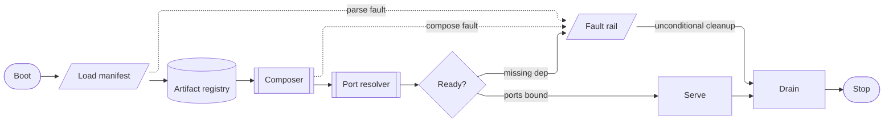

# [SPINE]

Draw the main path a runtime walks once: boot, compose, resolve, a readiness gate, run, drain, stop. A spine captures three decisions an unassisted attempt misses — the gate is the only branch point, since a spine with two gates is two spines; every stage before the gate can fault and every fault converges on one rail; the rail rejoins drain, so cleanup is unconditional rather than a happy-path privilege. Use `flowchart LR` with 8-12 nodes on one dominant rail. Shape names the step kind: terminals ride the stadium `([ ])`, stores the cylinder `[( )]`, I/O stages and the fault rail the parallelogram `[/ /]`, composed sub-runs the subroutine `[[ ]]`, plain run stages the bare `[ ]`, and the gate the rhombus. A cycle anywhere is a defect — a runtime that loops back is a lifecycle, not a spine.

Refill by renaming stages to the real owner set under the shape-to-step-kind vocabulary above, keep the single gate, and route every stage that can fail onto the one rail — the gate's fault exit and the unconditional cleanup rejoin stay solid because the runtime walks them, and a mid-stage fault hop rides a dotted edge: dash marks the hop.
