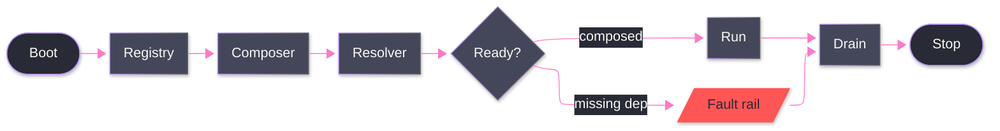

# [SPINE]

Draw the main path through an owner set: the boot to compose to ready to run to drain shape a runtime walks once. Use `flowchart LR` with 8-12 nodes on a single dominant rail and exactly one branch off a readiness gate onto the fault rail. Terminals are stadium nodes classed `boundary`; the fault rail is classed `error` and rejoins the drain so cleanup is unconditional.

