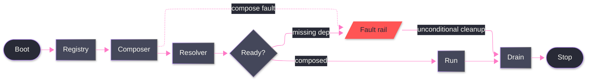

# [SPINE]

Draw the main path a runtime walks once: boot, compose, resolve, a readiness gate, run, drain, stop. The spine captures three decisions an unassisted attempt misses — the gate is the only branch point, since a spine with two gates is two spines; every stage before the gate can fault and every fault converges on one rail; the rail rejoins drain, so cleanup is unconditional rather than a happy-path privilege. Use `flowchart LR` with 8-12 nodes on one dominant rail; terminals are stadium nodes classed `boundary`, the fault rail is classed `error`, and a cycle anywhere is a defect — a runtime that loops back is a lifecycle, not a spine.

Refill by renaming stages to the real owner set, keep the single gate, and route every stage that can fail onto the one rail with a dotted edge — solid edges carry the walked path, dotted edges carry the fault hops.
