# [SPINE]

Draw the main path a runtime walks once: boot, compose, resolve, a readiness gate, run, drain, stop. The spine captures three decisions an unassisted attempt misses — the gate is the only branch point, since a spine with two gates is two spines; every stage before the gate can fault and every fault converges on one rail; the rail rejoins drain, so cleanup is unconditional rather than a happy-path privilege. Use `flowchart LR` with 8-12 nodes on one dominant rail; terminals are stadium nodes classed `boundary`, stores take the cylinder form classed `data`, processes take the subroutine form classed `primary`, and the fault rail is classed `error` with every fault edge riding the Red `linkStyle` rail — the node and its edges state the same law. A cycle anywhere is a defect — a runtime that loops back is a lifecycle, not a spine.

```mermaid
---
config:
  layout: elk
  look: neo
  theme: base
  flowchart:
    padding: 16
  themeCSS: ".nodeLabel{font-size:14px;font-weight:500}.edgeLabel{font-size:12.5px;font-weight:500}.edgePaths path{stroke-width:1.5px}"
  themeVariables:
    darkMode: true
    background: "#282A36"
    primaryColor: "#44475A"
    primaryTextColor: "#F8F8F2"
    primaryBorderColor: "#BD93F9"
    lineColor: "#FF79C6"
    textColor: "#F8F8F2"
    edgeLabelBackground: "#44475A"
    fontFamily: "SF Mono, Menlo, Cascadia Mono, Segoe UI Mono, Consolas, monospace"
---
flowchart LR
    accTitle: Owner-set spine
    accDescr: The once-walked main path from boot through compose, readiness gate, run, and drain, with every stage fault converging on one red rail that rejoins drain.
    Boot([Boot]) --> Registry[(Registry)]
    Registry --> Composer[[Composer]]
    Composer --> Resolver[[Resolver]]
    Resolver --> Ready{Ready?}
    Ready -->|composed| Run[Run]
    Ready -->|missing dep| Fault[/Fault rail/]
    Composer -.->|compose fault| Fault
    Run --> Drain[Drain]
    Fault -->|unconditional cleanup| Drain
    Drain --> Stop([Stop])
    linkStyle 5,6,8 stroke:#FF5555,stroke-width:2px,color:#F8F8F2
    classDef boundary fill:#282A36,stroke:#BD93F9,color:#F8F8F2
    classDef error fill:#FF5555,stroke:#FF5555,color:#282A36
    classDef primary fill:#44475A,stroke:#FF79C6,color:#F8F8F2
    classDef data fill:#FFB86C,stroke:#FFB86C,color:#282A36
    class Boot,Stop boundary
    class Fault error
    class Composer,Resolver,Run,Drain primary
    class Registry data
```

Refill by renaming stages to the real owner set, keep the single gate, and route every stage that can fail onto the one rail — the gate's fault exit and the unconditional cleanup rejoin stay solid because the runtime walks them, a mid-stage fault hop rides a dotted edge, and every fault edge stays on the Red rail: its `linkStyle` indices are declaration positions, so recount after any edge insertion. The frontmatter micro-scale `themeCSS` stamp, the ruled mono stack, and the `#44475A` edge-label backing are fixed law — a refill renames content, never strips the fidelity surface.
