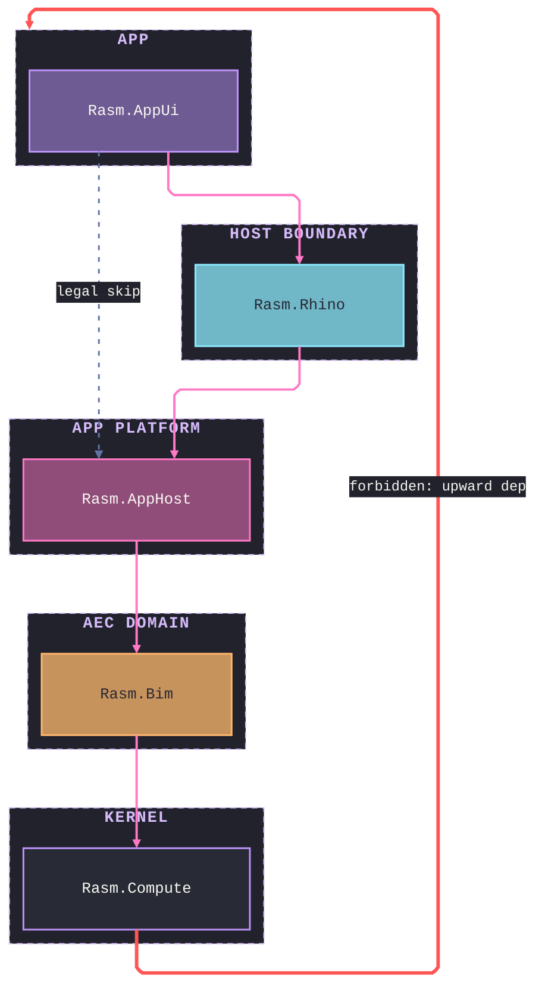

# [STRATA]

Draw which layer may depend on which. Template law bakes in the full dependency law, not just the stack — downward edges are legal including skips, so one dashed skip edge shows transitive reach is permitted on the Comment rail; exactly one upward edge exists, styled Dracula Red, labeled forbidden, and targeted at the stratum subgraph rather than a member node — the law forbids depending on the layer, and the cluster target lands the arrowhead on the layer boundary instead of threading the container title; and each stratum is a subgraph so membership, not position, carries the layer fact, with each stratum node filled from the ordinal accents so altitude reads as color. Use `flowchart TB` with 4-5 stratum subgraphs, solid adjacent-layer edges, at most one dashed legal skip, and the one red forbidden edge. A runtime walk order is a spine, never a stratum stack.

Refill by renaming strata to the real layer roster, keep edges downward with at most one demonstrative skip on the Comment rail, keep the single forbidden edge red, and keep one distinct ordinal fill per stratum — the ordinal `stratum*` classes are this archetype's stated exception to the canonical-class floor, so the validator's class warns are the accepted receipt — every `linkStyle` index is the edge's declaration position, so recount after any edge insertion. Frontmatter micro-scale `themeCSS` stamp, the ruled mono stack, and the `#21222C` edge-label backing are fixed law — a refill renames content, never strips the fidelity surface.
