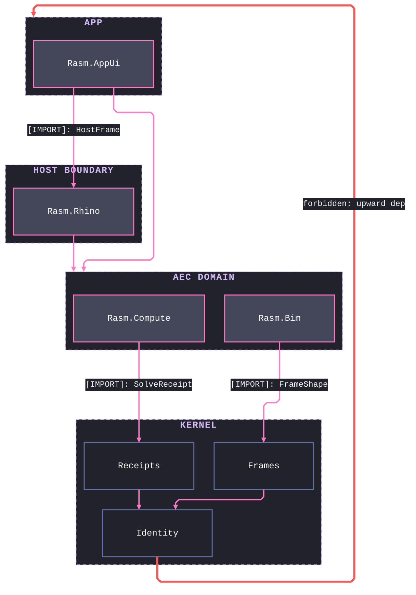

# [STRATA]

Draw which layer may depend on which. Template law bakes in the full dependency law, not just the stack — altitude reads from Y-position and subgraph membership, never from fill: each stratum is a `subgraph` so containment carries the layer fact, members ride the canonical classes with the foundation recessed as substrate, and the archetype spends exactly one accent, the Red forbidden edge. A stratum holds multiple owner nodes whenever the sourcing decision names them, under four member-resolution rules: an inter-stratum edge targets a member only when the sourcing choice names that member, and otherwise targets the stratum subgraph — a cluster-target edge lands its arrowhead on the layer boundary under ELK, which is the guarantee this archetype leans on; same-stratum peers receive no rung, because a same-level cross is a wire or prose fact, never a dependency; foundation members chain internally through their real interior dependencies, never sitting as an edge-free inventory the orphan law rejects; and an import-truth strata draws every real import solid with each labeled edge naming at most ONE sourced type in the `[KIND]: TypeName` vocabulary, while the demonstrative dashed single-skip belongs to the permission-variant alone, where one node per stratum and one dashed legal skip state the rule rather than the census. Exactly one upward edge exists, styled Red and labeled forbidden, targeted at the stratum subgraph — the law forbids depending on the layer, not a member; every richer prohibition (no interior import, no re-mint) rides prose and membership, never a second colored edge. When a cluster-target skip re-ranks the top stratum to the bottom, ELK's cycle breaking is the cause and no `cycleBreakingStrategy` value rescues it — the repair is an invisible `~~~` rank pin from a top-stratum member to a lower-stratum member. Use `flowchart TB` over the real layer roster. A runtime walk order is a spine, never a stratum stack.

Refill by renaming strata to the real layer roster and members to the real owners the sourcing decision names, keep every import edge downward and solid with its one sourced type, keep the single forbidden edge red on its cluster target, and re-wire the foundation's interior chain to the real dependencies — every rail binds through `eN@` ids and `class eN edge<Rail>`, which survive insertions without recounts, and a top stratum that lands at the bottom takes the invisible `~~~` rank pin. A permission-variant refill collapses each stratum to one node, drops the member labels, and marks the one demonstrative legal skip dashed.
