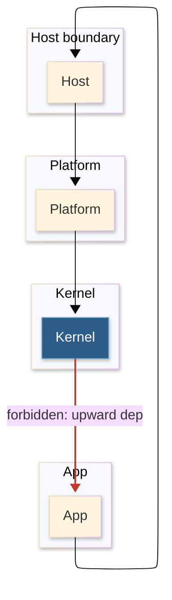

# [STRATA]

Draw which layer may depend on which. Use `flowchart TB` with 4-5 stratum subgraphs stacked top to bottom, edges permitted only downward, and one forbidden upward edge styled red and labeled prohibited. The red `linkStyle` on the offending edge is the law made visible: dependency flows down, never up.

