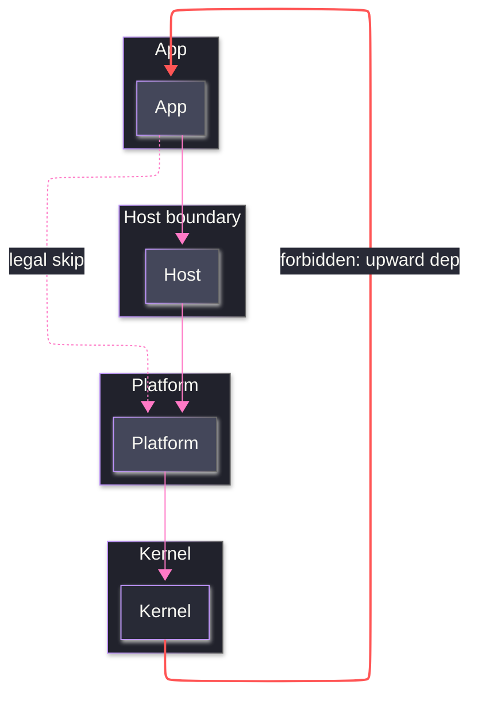

# [STRATA]

Draw which layer may depend on which. The template bakes in the full dependency law, not just the stack — downward edges are legal including skips, so one dashed skip edge shows transitive reach is permitted; exactly one upward edge exists, styled Dracula Red and labeled forbidden, making the violated law visible instead of implicit; and each stratum is a subgraph so membership, not position, carries the layer fact. Use `flowchart TB` with 4-5 stratum subgraphs, solid adjacent-layer edges, at most one dashed legal skip, and the one red forbidden edge. The 6-stratum ceiling binds at review — the validator's flowchart family ceiling cannot see strata. A runtime walk order is a spine, never a stratum stack.

Refill by renaming strata to the real layer roster, keep edges downward with at most one demonstrative skip, and keep the single forbidden edge red — its `linkStyle` index is the edge's declaration position, so recount after any edge insertion.
